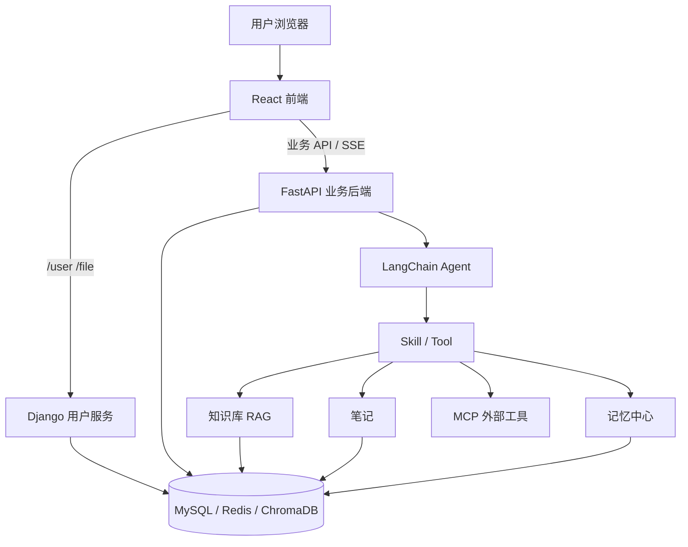

# Doki助手 — 个人 Agent 工作台

<div align="center">
  
  
  
  
  
</div>

Doki助手定位为面向个人知识流和日常任务的 AI Agent 工作台。它以对话为入口，把模型选择、Skill/Tool 调用、知识库、笔记、记忆中心和翻译能力放进同一套运行时里，让资料检索、长期记忆、写作辅助和任务处理可以围绕同一个用户上下文协同工作。项目基于原 `LangChain-RAG-FastAPI-Service` fork 而来，目前作为独立的个人知识与 Agent 平台方向维护。

---

## 项目变迁

本项目从一个基础 RAG 服务继续扩展，当前主要经历了三个阶段：

| | 阶段一 | 阶段二 | 阶段三（当前） |
|--|--------|--------|----------------|
| **定位** | 基础 RAG 对话服务 | 笔记 + RAG 工具 | 个人 Agent 工作台 |
| **能力** | 文档上传、向量检索、AI 问答 | 笔记管理、RAG、AI 写作 | 多模型配置、Skill/Tool、记忆中心、知识库、笔记、翻译、运行时控制 |
| **重点** | 跑通 RAG 主链路 | 让笔记参与知识检索 | 将对话、知识、记忆和工具组织到同一套 Agent 系统中 |

当前 fork 保留原项目许可证与 Git 贡献历史，但后续开发路线不再严格跟随上游。

> [查看完整项目发展记录](./docs/project_develop.md)

## 目录

- [项目简介](#项目简介)
- [核心特性](#核心特性)
- [项目架构](#项目架构)
- [Agent、Skill 与 Tool](#agentskill-与-tool)
- [知识库与笔记](#知识库与笔记)
- [记忆中心](#记忆中心)
- [权限与运行时控制](#权限与运行时控制)
- [快速开始](#快速开始)
- [技术栈](#技术栈)
- [项目结构](#项目结构)
- [文档](#文档)
- [开发路线](#开发路线)
- [来源与许可](#来源与许可)

## 项目简介

Doki助手基于 **FastAPI + LangChain + React** 构建，能力围绕四条主线展开：

- **Agent 运行时** — 对话由 LangChain tool calling Agent 驱动，前端可选模型、prompt 模式、Skill、上下文和 RAG 策略，后端通过 SSE 流式返回。
- **个人知识系统** — 知识库负责文档上传、解析切片、向量检索和重排序；笔记负责编辑、分类、搜索和 AI 写作；两者共同进入 RAG 召回。
- **长期上下文** — 会话历史、摘要压缩、记忆中心和模型配置按 `user_id` 隔离存储，记忆中心统一管理复习、待办、提醒等事项并暴露给 Agent。
- **辅助工作流** — 实时翻译、Skill/Tool 管理、MCP 外部工具接入、工具风险元数据和管理员权限控制。

## 核心特性

- **AI 对话**：支持多 prompt 模式、模型选择、Skill 选择、上下文策略和 RAG 检索策略。
- **会话持久化**：MySQL 存储对话历史，支持会话列表、消息删除和回答刷新覆盖。
- **长上下文压缩**：Auto 模式下，长会话会使用“摘要 + 最近窗口”的方式构造上下文。
- **知识库管理**：文档上传、源文件保存、解析切片、向量检索、重排序和切片详情查看。
- **笔记系统**：笔记编辑、分类标签、搜索、AI 辅助写作、相关知识片段推荐。
- **记忆中心**：统一管理复习、待办、提醒、长期事项和备忘。
- **Skill/Tool 注册**：通过 `skill.yaml`、`SKILL.md`、`tool.yaml`、`TOOL.md`、`tool.py` 组织 Agent 能力。
- **MCP 外部工具**：支持通过 `mcp.yaml` 配置 stdio、SSE 或 streamable HTTP MCP server，发现外部 tools 并合并进统一工具库。
- **Tool 风险元数据**：工具支持风险等级、确认要求、超时秒数和最大输出字符数。
- **高风险删除阻断**：`delete_memory` 已标记为高风险，当前不会被 Agent 静默执行。
- **多模型配置**：用户可添加个人模型配置，未选择时回退到默认模型。
- **多语言界面**：前端支持中英文切换。

## 项目架构

系统采用前后端分离架构，由三个服务组成：

- **React 前端** — 工作台页面，开发环境下 Vite proxy 按路径转发请求。
- **Django 用户服务** — 登录、注册、用户资料和文件入口。
- **FastAPI 业务后端** — Agent 对话、知识库、笔记、记忆中心、模型配置和翻译。

对话请求进入后端后由 LangChain Agent 驱动，按本轮启用的 Skill/Tool 访问知识库、笔记、记忆中心和可选的 MCP 外部工具。数据落在 MySQL（会话与业务数据）、Redis（缓存、限流、token 黑名单）和 ChromaDB（向量索引）。



### 模型调用

对话和翻译走统一的模型调用层。用户可在前端模型设置页添加 OpenAI-compatible API、自部署兼容服务、第三方中转站或 Ollama 本地模型；未选择时回退到 `backend/.env` 配置的默认模型（阿里云百炼或 Ollama）。

知识库链路中的 Embedding（Ollama 本地）和 Reranker（本地 CrossEncoder）独立管理，可在知识库页面切换。

## Agent、Skill 与 Tool

AI 对话由 `LangChain AgentExecutor + Tools` 驱动。后端会根据前端传入的模型配置、Skill 选择、上下文策略和 RAG 检索策略构造本轮 Agent。

执行链路：

```text
前端发送消息
  -> POST /chat/agent/query/stream
  -> JWT 鉴权得到 user_id
  -> 读取模型配置
  -> 在候选 Skill 内做预路由
  -> resolve_skills 得到 Skill prompt 与 Tool 实例
  -> 拼接 system prompt
  -> 加载摘要和近期上下文
  -> AgentExecutor 执行
  -> SSE 推送 thinking / waiting_confirmation / response / done / error
  -> 保存或覆盖数据库消息
```

当前 Tool 元数据示例：

```yaml
risk_level: low | medium | high
requires_confirmation: true | false
timeout_seconds: 30
max_output_chars: 10000
```

### 本地 Tool 与 MCP Tool

本地 Tool 是后端进程内的 Python 工具模块，目录结构位于：

```text
backend/app/agent/tools/<tool_id>/
  tool.yaml
  TOOL.md
  tool.py
```

后端启动或 registry reload 时会扫描本地工具目录，直接 import `tool.py`，并把返回的 LangChain `BaseTool` 放入统一工具库。本地工具适合访问项目内部服务，例如知识库、笔记、记忆中心和当前用户上下文。

MCP Tool 是外部 MCP server 暴露的工具，配置位于：

```text
backend/app/config/mcp.yaml
```

后端通过 `tools/list` 发现 MCP 工具，再把它们包装成内部 `ToolDefinition`。Agent 调用时会通过 MCP `tools/call` 发送给外部 server 执行。MCP 适合接入浏览器、文件系统、桌面应用、第三方服务或非 Python 语言实现的工具。

两类工具进入 Agent 后共用同一条运行链路：

```text
本地 Tool / MCP Tool
  -> ToolDefinition
  -> Skill 绑定或显式 tool_ids
  -> GuardedTool
  -> AgentExecutor
```

因此两者都会受风险等级、二次确认、超时、输出截断、调用次数预算和 SSE 工具事件约束。区别在于本地 Tool 在 FastAPI 进程内执行，MCP Tool 由外部 MCP server 执行。

## 知识库与笔记

知识库支持多格式文档上传、源文件保存、解析、切片和向量化。Embedding 与 Reranker 由知识库配置管理，当前分别使用 Ollama 本地 embedding 模型和本地 CrossEncoder reranker。

RAG 执行链路：

```text
上传文档
  -> 保存源文件和文档元数据
  -> 解析 txt/pdf/md/pptx/docx
  -> 切片
  -> 使用当前 embedding 模型写入 Chroma
  -> 用户提问时召回知识库 / 笔记候选
  -> 使用当前 reranker 对候选片段重新排序
  -> 拼接上下文并交给 LLM 生成回答
```

笔记会进入检索和关联推荐体系，可以与知识库一起参与后续对话和写作辅助。

## 记忆中心

记忆中心统一管理五类事项：

| 类型 | 说明 |
|------|------|
| `review` | 复习和回顾 |
| `todo` | 待办 |
| `reminder` | 提醒 |
| `long_term` | 长期事项 |
| `memo` | 普通备忘 |

相关 Agent tools 支持创建、查询、更新、完成、延期、归档和复习题生成。删除工具已经被标记为高风险，当前会进入确认等待状态并阻断静默删除。

## 权限与运行时控制

当前已具备：

- 前端 HTTP 与 SSE 携带 JWT。
- 主业务路由按当前 `user_id` 隔离。
- Skill/Tool 读取接口要求登录。
- Skill/Tool 创建、更新、删除要求管理员。
- 管理员名单维护在 `backend/app/config/security.yaml`。
- `/chat/sessions` 只返回当前用户会话。
- `/chat/reorder` 要求登录并保留限流。
- Agent 运行预算维护在 `backend/app/config/agent.yaml`。
- SSE thinking 事件包含运行 ID、工具调用摘要、停止原因等信息。
- MCP server 和工具发现接口要求登录，刷新 MCP 工具要求管理员。

当前仍在推进：

- MCP 管理页的 refresh、test、启用/禁用和诊断能力。
- Tool smoke test 与结构化错误分类。
- 数据库角色权限。
- 更精确的摘要覆盖边界。

## 快速开始

更完整的本地运行、环境变量和验证方式见 [开发与运行说明](./docs/development_setup.md)。

### 环境要求

| 环境 | 版本推荐 |
|------|----------|
| Python | 3.12 |
| uv | 0.11+ |
| Node.js | 18+ |
| MySQL | 8.x |
| Redis | 7.x |

### 安装依赖

后端：

```powershell
cd backend
uv sync
```

如果更新了后端依赖或需要重建锁文件：

```powershell
cd backend
uv lock
uv sync
uv pip compile pyproject.toml -o requirements.txt
```

前端：

```powershell
cd front
npm install
```

用户服务：

```powershell
cd DjangoUserService
uv sync
uv run python manage.py migrate
```

### 启动服务

Windows 一键启动（默认单个 Windows Terminal 窗口多 Tab）：

```powershell
powershell -ExecutionPolicy Bypass -File .\scripts\start-all.ps1
```

可选启动模式：

- `-Mode Terminal`（默认）：所有服务进同一个 Windows Terminal 窗口的多个 Tab。
- `-Mode Window`：每个服务一个独立 PowerShell 窗口（旧行为；无 `wt.exe` 时自动回退到此模式）。
- VS Code 用户可改用 `Terminal → Run Task → doki: start all`，在集成终端内零弹窗启动（见 `.vscode/tasks.json`）。

三种方式都按 Redis/Ollama → Django → FastAPI → 前端 的顺序逐个等待就绪再启动下一个。

手动启动：

| 服务 | 命令 | 端口 |
|------|------|------|
| FastAPI 后端 | `cd backend && uv run uvicorn main:app --host 127.0.0.1 --port 18000 --reload` | 18000 |
| React 前端 | `cd front && npm run dev -- --host 127.0.0.1 --port 18080` | 18080 |
| Django 用户服务 | `cd DjangoUserService && uv run python manage.py runserver 127.0.0.1:18001` | 18001 |

> 端口选在 Windows 动态端口区（默认 1024–15000，受 Hyper-V/Docker/WSL2 影响）之外，避免重启后被系统动态保留段征用而无法绑定。

## 技术栈

### 后端技术

| 技术 | 说明 |
|------|------|
| FastAPI | 业务后端与 Agent API |
| LangChain | AgentExecutor 与 Tool Calling |
| MCP SDK | 外部 MCP server 的工具发现与调用 |
| SQLAlchemy | MySQL ORM |
| ChromaDB | 知识库和笔记向量索引 |
| Redis | 缓存和限流辅助 |
| Django | 用户服务 |
| Ollama | 本地模型和 Embedding |
| Sentence-Transformers | 本地 Reranker |

### 前端技术

| 技术 | 说明 |
|------|------|
| React 19 | 前端框架 |
| TypeScript | 类型系统 |
| Vite | 构建工具 |
| Tailwind CSS | 样式 |
| Zustand | 状态管理 |
| Tiptap | 笔记编辑器 |
| React Router | 路由 |
| i18next | 国际化 |

## 项目结构

```text
├── backend/                     # FastAPI 后端
│   ├── app/
│   │   ├── agent/               # Agent、Skill、Tool、MCP 适配
│   │   ├── config/              # agent/security/chroma/rag/prompt/mcp 配置
│   │   ├── db/                  # MySQL / Redis 配置
│   │   ├── models/              # SQLAlchemy 模型
│   │   ├── rag/                 # 文档解析、切片、向量库、检索器
│   │   ├── router/              # API 路由
│   │   ├── services/            # 业务服务
│   │   └── utils/               # 工具函数
│   └── main.py
├── front/                       # React 前端
│   └── src/
│       ├── api/                 # API 请求层
│       ├── components/          # 组件
│       ├── hooks/               # hooks
│       ├── pages/               # 页面
│       ├── stores/              # Zustand 状态
│       └── types/               # 类型定义
├── DjangoUserService/           # Django 用户服务
├── docs/                        # 项目文档
├── scripts/                     # 启动和维护脚本
└── images/                      # 截图资源
```

## 文档

- [开发与运行说明](./docs/development_setup.md)
- [项目发展与当前架构](./docs/project_develop.md)
- [下一阶段开发计划](./docs/roadmap_next.md)
- [Agent 运行时现状](./docs/agent_runtime_improvements.md)
- [MCP 外部工具接入方案](./docs/mcp_integration_plan.md)
- [记忆中心实现](./docs/memory_center_implementation.md)
- [ModelScope 与 Reranker 配置](./docs/modelscope_model.md)
- [故障排除](./docs/troubleshooting.md)

## 开发路线

当前下一阶段优先级：

1. 数据库角色权限。
2. 更精确的上下文摘要边界。
3. 记忆中心主动提醒和对话后事项提炼。
4. Tool 测试、诊断和结构化错误分类。
5. MCP 管理页与高风险外部工具治理。
6. 字幕/会议翻译与桌面端验证。

详细方案见 [下一阶段开发计划](./docs/roadmap_next.md)。

## 来源与许可

Doki助手基于原 `LangChain-RAG-FastAPI-Service` fork 而来，并保留原项目 MIT License 与 Git 贡献历史。

当前 fork 作为独立方向维护。原作者和贡献者仍通过 Git 历史和许可证获得署名。

本项目使用 MIT License，详见 [LICENSE](./LICENSE)。
