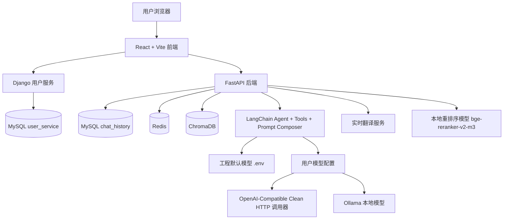

# LangChain-RAG-FastAPI-Service — 多功能智能 Agent 平台

<div align="center">
<a href="https://github.com/RMA-MUN/LangChain-RAG-FastAPI-Service/stargazers">
  
</a>
<a href="https://github.com/RMA-MUN/LangChain-RAG-FastAPI-Service/network/members">
  
</a>
  
</div>


AI 驱动的个人知识与任务协作平台，融合 **多模型接入 + Agent 对话 + 实时翻译 + 笔记管理 + RAG 知识库 + 可扩展工具链**，让系统从“会问答的笔记工具”升级为“可持续演进的智能 Agent 平台”。

---

## 项目变迁

本项目从一个**基础 RAG 对话系统**逐步演进，经历了三次比较明显的形态变化：

| | 阶段一（base-rag 分支） | 阶段二（master 早期） | 阶段三（当前 master） |
|--|------------------------|--------------------|--------------------|
| **定位** | 纯 RAG 对话服务 | 智能笔记助手 | 多功能智能 Agent 平台 |
| **能力** | 文档上传 → 向量检索 → AI 问答 | 笔记管理 + RAG + 间隔重复 + AI 写作 | 多模型接入 + 模型选择 + 实时翻译 + Agent 工具编排 + 笔记/RAG 协同 |
| **适合谁** | 想学习 RAG 的开发者 | 需要笔记与知识管理的人 | 想做个人 AI 工作台、Agent 平台或多场景智能应用的人 |

**RAG 仍然是知识底座，Agent 负责编排。** 基础 RAG 代码已永久保留在 `base-rag` 分支供学习使用，如果只需要纯 RAG 服务，切换到 `base-rag` 即可。

> 📄 [查看完整项目变迁 →](./docs/project_develop.md)

## 📋 目录

- [项目简介](#项目简介)
- [项目变迁](#项目变迁)
- [核心特性](#核心特性)
- [项目架构](#项目架构)
- [项目演示](#项目演示)
- [快速开始](#快速开始)
- [技术栈](#技术栈)
- [项目结构](#项目结构)
- [API 文档](#api文档)
- [配置说明](#配置说明)
- [部署指南](#部署指南)
- [开发指南](#开发指南)
- [故障排除](#故障排除)
- [联系方式](#联系方式)

## 项目简介

基于 **FastAPI + LangChain** 构建的智能 Agent 平台，当前核心能力包括：

- **多模型接入**：支持工程默认配置、OpenAI-compatible 模型和 Ollama 本地模型
- **模型选择**：用户可按账号保存自己的模型配置，并在对话和翻译页切换
- **AI 对话**：支持多种 prompt 模式，保留默认角色，同时可切换不同风格
- **实时翻译**：支持双语实时对话式翻译和整篇翻译两种模式
- **笔记管理**：Markdown 编辑器、智能标签（LLM 自动分类）、语义搜索、Markdown 导出
- **RAG 知识库**：多格式文档上传（txt/pdf/md/pptx/docx），基于向量检索的精准问答
- **间隔重复回顾**：艾宾浩斯遗忘曲线算法，对抗遗忘
- **AI 写作辅助**：联机补全、续写/扩写/摘要、关联笔记推荐

系统支持会话持久化（MySQL）、向量检索（ChromaDB）、JWT 用户隔离，前端采用React+Tailwind CSS构建现代化界面。

## 核心特性

- **📝 笔记管理**：Markdown 编辑器，支持新建、编辑、删除、分类筛选、分页列表
- **🏷️ 智能标签**：保存笔记后 LLM 异步生成标签和分类（工作/学习/生活/项目），无需手动归类
- **🔍 语义搜索**：基于向量嵌入的笔记全文搜索，告别关键词匹配
- **🔄 间隔重复回顾**：艾宾浩斯遗忘曲线（1/2/4/7/15/30 天）
- **✍️ AI 联机补全**：打字停顿后模型实时补全，Tab 键快速采纳
- **🤖 AI 写作助手**：续写、扩写、摘要生成，SSE 流式输出
- **🔗 跨源关联推荐**：编辑笔记时，从笔记库和知识库双向检索 Top k 相关文档
- **💬 智能问答**：基于 RAG 技术的 Agent 对话，支持文档引用来源展示
- **🧠 多模型接入**：工程默认模型兜底，用户可接入 OpenAI-compatible API 或 Ollama 本地模型
- **💾 会话持久化**：MySQL 存储对话历史，随时回溯
- **📄 文档管理**：支持 TXT / PDF / MD / PPTX / DOCX 上传，可视化切片详情
- **🌐 多语言支持**：前端 i18n，中英文界面切换
- **⛑️ 安全隔离**：用户级知识库隔离，RAG 检索只能访问本人数据

## 项目架构

系统采用前后端分离 + 独立用户服务 + 模型配置服务的架构：



### 模型调用架构

模型系统分为两层：

- **工程默认模型**：由 `backend/.env` 中的 `LLM_TYPE`、`ALIYUN_*`、`OLLAMA_*` 决定，固定作为前端模型列表第一项，用作兜底配置。用户不需要创建任何模型配置也能直接使用 AI 对话。
- **用户模型配置**：用户可在前端 `模型选择` 页面添加自己的模型配置，存入 FastAPI 后端的 `user_model_configs` 表。AI 对话页可按会话选择某个用户模型；未选择时走工程默认模型。

当前支持三类调用路径：

| 类型 | 用途 | 调用方式 |
|------|------|----------|
| 工程默认配置 | 系统兜底模型 | 读取 `.env`，使用阿里云百炼或 Ollama |
| 通用模型 | OpenAI Chat Completions 兼容中转站/API | 使用项目内置 Clean HTTP 调用器，请求 `{base_url}/chat/completions` |
| Ollama 本地 | 本机轻量模型部署 | 使用 `ChatOllama`，默认地址 `http://localhost:11434` |

通用模型没有直接使用 OpenAI SDK 默认请求链路，而是通过 `backend/app/utils/clean_openai_chat.py` 发起干净的 `httpx` 请求，避免部分中转站拦截 `AsyncOpenAI/Python`、`X-Stainless-*` 等 SDK 默认请求头。

### 模型选择页面

`模型选择` 页面提供按用户隔离的模型管理：

- 列表第一条固定显示工程 `.env` 默认模型，不可编辑、不可删除、不可设默认。
- 用户新增的模型从第二条开始展示，即使被标记为默认，也不会移动到第一条。
- `通用` 类型需要填写供应商、模型名称、Base URL 和 API SK。
- `Ollama 本地` 类型默认使用 `http://localhost:11434`，隐藏供应商和 API SK，前端可通过 `GET /model-config/ollama/models` 读取本机 `/api/tags` 并以下拉菜单选择已安装模型。
- 模型测试接口返回结构化诊断结果，便于区分认证失败、服务不可达、模型不存在、供应商拦截等问题。

### Agent 与 RAG 流程

AI 对话由 `LangChain AgentExecutor + Tools` 驱动。Agent 会根据前端传入的 `model_config_id` 决定使用用户模型；未传入时使用工程默认模型。工具层封装了笔记创建、笔记搜索、统计查询、今日回顾、RAG 总结、关联笔记等能力。

知识库和笔记检索使用 ChromaDB 存储向量，MySQL 存储业务数据和会话历史，Redis 用于缓存和限流辅助。文档进入知识库后会经历解析、切片、向量化、混合检索、重排序等流程，再交给 LLM 生成回答。实时翻译和对话模式则通过统一的模型选择与 prompt 组合层进行路由。

## 项目演示

| 功能模块 | 界面展示 |
|---------|:--------|
| 笔记编辑 |  |
| 笔记列表 |  |
| AI 聊天 |  |
| 知识库 |  |

## 快速开始

### 环境要求

| 环境 | 版本推荐 |
|------|----------|
| Python | 3.12+ |
| uv | 0.11.9 |
| Node.js | 16+ |

### 克隆项目

```bash
git clone https://github.com/RMA-MUN/LangChain-RAG-FastAPI-Service.git
cd LangChain-RAG-FastAPI-Service
```

### 安装依赖

#### 后端依赖
```bash
cd backend
uv sync
```

#### 前端依赖
```bash
cd front
npm install
```

### 环境配置

#### 创建后端环境变量文件

在 `backend` 目录下创建 `.env` 文件，参考 `.env.example` 文件填写配置：

```env
# ==================== LLM 大模型配置 ====================
# LLM类型：ALIYUN | OLLAMA
LLM_TYPE=ALIYUN

# ==================== Ollama 配置 (LLM_TYPE=OLLAMA) ====================
OLLAMA_BASE_URL=http://localhost:11434
OLLAMA_MODEL_NAME=qwen3.5:0.8b

# ==================== 阿里云百炼配置 (LLM_TYPE=ALIYUN) ====================
ALIYUN_ACCESS_KEY=your_api_key
ALIYUN_BASE_URL=https://dashscope.aliyuncs.com/compatible-mode/v1
CHAT_MODEL_NAME=qwen3-max

# ==================== 向量嵌入模型配置 ====================
EMBED_MODEL_TYPE=OLLAMA
TEXT_EMBEDDING_MODEL_NAME=qwen3-embedding:0.6b
ALIYUN_EMBED_MODEL_NAME=qwen3-embedding

# ==================== 数据库配置 ====================
MYSQL_USER=root
MYSQL_PASSWORD=root
MYSQL_HOST=localhost
MYSQL_PORT=3306
MYSQL_DATABASE=chat_history

REDIS_HOST=localhost
REDIS_PORT=6379
REDIS_DB=0

# ==================== 服务配置 ====================
DJANGO_API_URL=http://127.0.0.1:8001

# ==================== LangSmith 调试追踪 ====================
LANGCHAIN_TRACING_V2=true
LANGCHAIN_API_KEY=your_langsmith_api_key
LANGCHAIN_PROJECT=my-fastapi-langchain-project

# ==================== 重排序模型配置 ====================
RERANKER_MODEL_PATH=./models/bge-reranker-v2-m3

# ==================== JWT 身份验证配置 ====================
SECRET_KEY=MY_JWT_SECRET_KEY
ALGORITHM=HS256
```

#### 创建用户服务环境变量文件

在 `DjangoUserService` 目录下创建 `.env` 文件：

```env
# JWT 配置
JWT_SECRET_KEY=YOUR_JWT_SECRET_KEY

# 数据库配置
DB_PORT=3306
DB_NAME=user_service
DB_USER=root
DB_PASSWORD=root
DB_HOST=localhost

# Celery 配置
CELERY_BROKER_URL=redis://localhost:6379/0
CELERY_RESULT_BACKEND=redis://localhost:6379/0
CELERY_TASK_TIME_LIMIT=300
CELERY_TASK_SOFT_TIME_LIMIT=250
CELERY_RESULT_EXPIRES=3600

# Redis 配置
REDIS_CACHE_URL=redis://localhost:6379/1
```

配置好 env 文件后，执行 Django ORM 迁移：

```bash
python manage.py makemigrations
python manage.py migrate
```

### 向量数据库配置

修改 `backend/app/config/chroma.yaml` 文件：

```yaml
collection_name: rag_collection
persist_directory: data/chromadb
k: 3

data_path: data
md5_hex_store: data/md5_hex_store/md5_hex_store.txt
allow_knowledge_file_types: ["txt", "pdf", "md", "pptx", "docx"]

chunk_size: 200
chunk_overlap: 20
separators: ["\n\n", "\n", "。", "！", "？", "!", "?", " ", ""]
```

### 启动服务

| 服务 | 命令 | 端口 |
|------|------|------|
| 后端服务 | `cd backend && uvicorn main:app --reload` | 8000 |
| 前端服务 | `cd front && npm run dev` | 3000 |
| 用户服务 | `cd DjangoUserService && uv run python manage.py runserver 8001` | 8001 |
| MySQL | `net start mysql` | 3306 |
| Redis | `redis-server` 或 `net start redis` | 6379 |
| Ollama | `ollama serve` | 11434 |

## 技术栈

### 后端技术

| 技术 | 说明 |
|------|------|
| FastAPI | 高性能异步 Web 框架 |
| LangChain | 大语言模型应用开发框架（AgentExecutor + Tools） |
| ChromaDB | 轻量级向量数据库（rag_collection + notes_collection） |
| SQLAlchemy | 异步 ORM，管理 MySQL |
| Django | 用户认证和管理系统 |
| MySQL | 关系型数据库（chat_history / notes / reviews） |
| Redis | 缓存 |
| DashScope API | 大语言模型服务（Qwen3-Max） |
| Ollama | 本地模型部署，支持读取 `/api/tags` 选择已安装模型 |
| Clean OpenAI-Compatible Caller | 基于 httpx 的干净 Chat Completions 调用器，兼容 OpenAI 格式中转站 |
| Hugging Face / ModelScope | 重排序模型（BAAI/bge-reranker-v2-m3） |
| Sentence-Transformers | 句子嵌入模型 |

### 前端技术

| 技术 | 说明 |
|------|------|
| React 19 | 现代化前端框架 |
| TypeScript | 类型安全 |
| Vite | 极速构建工具 |
| Tailwind CSS | 原子化 CSS 框架 |
| Radix UI | 无头 UI 组件库 |
| Tiptap | 富文本 Markdown 编辑器 |
| React Router DOM | 路由管理（路由守卫 + JWT 校验） |
| Zustand | 轻量状态管理 |
| i18next | 国际化（中/英） |
| Axios | HTTP 客户端 |
| react-markdown + rehype-highlight | Markdown 渲染与代码高亮 |
| dompurify | HTML 安全过滤 |

## 项目结构

```
├── backend/                     # FastAPI 后端服务
│   ├── app/
│   │   ├── agent/               # Agent 智能代理模块
│   │   │   └── agent.py         # AgentFactory + Tool + Prompt 组合
│   │   ├── config/              # 配置文件（chroma.yaml 等）
│   │   ├── core/                # 核心工具（限流、响应封装、日志）
│   │   ├── db/                  # 数据库配置（MySQL + Redis）
│   │   ├── models/              # SQLAlchemy ORM 模型
│   │   │   ├── note.py          # 笔记模型
│   │   │   ├── review_record.py # 回顾记录模型
│   │   │   ├── chat_history.py  # 对话历史模型
│   │   │   └── model_config.py  # 用户模型配置
│   │   ├── prompt/              # 提示词模板（对话 / 翻译 / 写作 / RAG）
│   │   ├── rag/                 # RAG 核心功能
│   │   │   ├── rag_service.py   # RAG 服务（HyDE + 混合检索）
│   │   │   ├── reorder_service.py
│   │   │   ├── vector_store.py  # ChromaDB 封装
│   │   │   ├── text_spliter.py  # 文档切片
│   │   │   ├── document_handler/# 文档解析（txt/pdf/md/pptx/docx）
│   │   │   ├── retrievers/      # 自定义检索器
│   │   │   └── task_queue.py    # 后台处理队列
│   │   ├── router/              # API 路由
│   │   │   ├── chat.py          # 聊天 & Agent 路由
│   │   │   ├── translate.py     # 实时翻译路由
│   │   │   ├── model_config_router.py # 用户模型配置与测试
│   │   │   ├── note_router.py   # 笔记 CRUD & AI 路由
│   │   │   ├── review_router.py # 间隔重复回顾路由
│   │   │   ├── knowledge_router.py
│   │   │   ├── user.py
│   │   │   └── health.py
│   │   ├── schemas/             # Pydantic 数据模型
│   │   ├── services/            # 业务服务层
│   │   │   ├── note_service.py  # 笔记服务（CRUD + 向量化 + AI 写作）
│   │   │   ├── model_config_service.py # 模型配置服务
│   │   │   ├── translate_service.py # 实时翻译服务
│   │   │   └── review_service.py# 回顾服务（艾宾浩斯算法）
│   │   └── utils/               # 工具函数
│   │       ├── clean_openai_chat.py # OpenAI-compatible 干净调用器
│   │       ├── model_provider.py    # 模型工厂与路由
│   │       └── prompt_loader.py     # 提示词加载器
│   ├── data/                    # 数据存储目录
│   ├── main.py                  # 应用入口
│   └── pyproject.toml
├── front/                       # React 前端项目
│   ├── src/
│   │   ├── api/                 # API 请求层
│   │   │   ├── auth.ts          # 认证接口
│   │   │   ├── chat.ts          # 聊天接口
│   │   │   ├── translate.ts     # 实时翻译接口
│   │   │   ├── notes.ts         # 笔记接口
│   │   │   ├── knowledge.ts     # 知识库接口
│   │   │   ├── modelConfig.ts   # 模型配置接口
│   │   │   ├── review.ts        # 回顾接口
│   │   │   └── sessions.ts      # 会话接口
│   │   ├── components/          # 组件
│   │   │   ├── common/          # 通用组件（TagBadge, ConfirmDialog, EmptyState 等）
│   │   │   ├── knowledge/       # 知识库组件
│   │   │   ├── layout/          # 布局组件（Sidebar）
│   │   │   ├── note/            # 笔记组件（OutlinePanel, RelatedFragments）
│   │   │   └── TiptapEditor.tsx # 富文本编辑器
│   │   ├── hooks/               # 自定义 Hooks
│   │   │   └── useSSE.ts        # SSE 流式处理
│   │   ├── i18n/                # 国际化（中/英）
│   │   ├── layouts/             # 页面布局（AuthLayout, MainLayout）
│   │   ├── pages/               # 页面
│   │   │   ├── NoteEditor.tsx   # 笔记编辑器
│   │   │   ├── NoteList.tsx     # 笔记列表
│   │   │   ├── DailyReview.tsx  # 每日回顾
│   │   │   ├── AIChat.tsx       # AI 聊天
│   │   │   ├── ModelSettings.tsx# 模型选择与用户模型配置
│   │   │   ├── RealtimeTranslate.tsx # 实时翻译页面
│   │   │   ├── Sessions.tsx     # 会话管理
│   │   │   ├── KnowledgeBase.tsx# 知识库管理
│   │   │   ├── Login.tsx / Register.tsx
│   │   │   ├── Profile.tsx / Settings.tsx
│   │   │   └── AboutUs.tsx
│   │   ├── router/index.tsx     # 路由配置
│   │   ├── stores/              # Zustand 状态管理
│   │   │   ├── useUserStore.ts
│   │   │   ├── useSessionStore.ts
│   │   │   ├── useThemeStore.ts
│   │   │   └── useLanguageStore.ts
│   │   ├── types/api.ts         # TypeScript 类型定义
│   │   ├── App.tsx              # 应用入口组件
│   │   └── main.tsx             # 应用入口
│   └── package.json
├── DjangoUserService/           # Django 用户服务
│   ├── apps/
│   │   ├── user/               # 用户注册/登录/认证
│   │   ├── file/               # 头像上传
│   │   └── utils/              # 工具函数
│   └── api.md                  # 用户服务 API 文档
├── docs/                        # 项目文档
│   ├── modelscope_model.md     # 模型下载和配置
│   └── troubleshooting.md      # 故障排除
├── images/                      # 截图资源
└── plan.md                     # 项目规划
```

## API 文档

### FastAPI 后端 API

完整的 OpenAPI 规范文件：[backend/openapi.json](./backend/openapi.json)
		启动服务后访问交互式文档：[http://localhost:8000/docs](http://localhost:8000/docs)

### Django 用户服务 API

详细文档：[DjangoUserService/api.md](./DjangoUserService/api.md)
		交互式文档（启动后）：[http://localhost:8001/docs/](http://localhost:8001/docs/)

## 配置说明

### LLM 模型切换

系统支持 **工程默认模型 + 用户模型配置** 两层模型来源：

- **工程默认模型**：由 `backend/.env` 中的 `LLM_TYPE` 决定，作为 AI 对话和模型列表第一项兜底配置。
- **用户模型配置**：登录用户可在前端 `模型选择` 页面新增模型，按用户隔离保存，可在 AI 对话页下拉选择。

工程默认模型支持：

- **LLM_TYPE=ALIYUN**：使用阿里云百炼兼容模式模型。
- **LLM_TYPE=OLLAMA**：使用本地 Ollama 模型。

用户模型配置支持：

| 类型 | 填写方式 |
|------|----------|
| 通用 | 填写供应商、模型名称、Base URL、API SK；Base URL 可填根地址或 `/v1` 地址，后端会规范化到 OpenAI Chat Completions 路径 |
| Ollama 本地 | 默认地址 `http://localhost:11434`，点击刷新读取本地 `/api/tags`，从下拉菜单选择已安装模型，API SK 留空 |

Ollama 常用轻量模型示例：

```bash
ollama pull qwen3:0.6b
ollama pull qwen3:1.7b
ollama list
```

### 重排序模型

下载 BAAI/bge-reranker-v2-m3 模型并配置 `RERANKER_MODEL_PATH` 路径，参考 [模型配置指南](./docs/modelscope_model.md)。

## 故障排除

详细的故障排除指南请参考：[故障排除](./docs/troubleshooting.md)

常见问题：

- **API Key 错误**：检查 ALIYUN_ACCESS_KEY 是否正确配置
- **数据库连接失败**：确认 MySQL / Redis 服务已启动
- **ChromaDB 异常**：检查 `chroma.yaml` 中的路径配置
- **重排序模型加载失败**：确认 `RERANKER_MODEL_PATH` 指向正确的模型路径
- **Ollama 连接失败**：确认 `ollama serve` 已运行且模型已拉取

## 联系方式

如有任何问题或建议，欢迎提交 GitHub Issues 或联系作者：

- Email: n3032747608@163.com
- QQ: 3032747608

## Star History


 <picture>
   <source media="(prefers-color-scheme: dark)" srcset="https://api.star-history.com/chart?repos=RMA-MUN/LangChain-RAG-FastAPI-Service&type=date&theme=dark&legend=top-left" />
   <source media="(prefers-color-scheme: light)" srcset="https://api.star-history.com/chart?repos=RMA-MUN/LangChain-RAG-FastAPI-Service&type=date&legend=top-left" />
   
 </picture>


## License

本项目基于MIT开源协议， [点击跳转LICENSE](LICENSE) 
