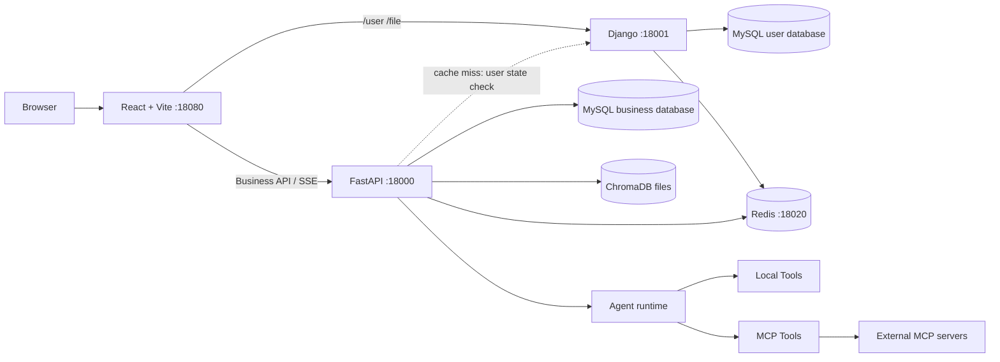

# Doki 助手

Doki 助手是一个面向个人知识管理和日常任务的 AI Agent 工作台。系统以聊天为入口，将模型配置、Skill/Tool、知识库、笔记、记忆中心、翻译和 MCP 外部工具组织在同一套用户上下文中。

当前仓库是开发版单仓库、多进程系统，由 React 前端、Django 用户服务和 FastAPI 业务后端三个进程组成。项目仍以本地开发为主，尚未提供生产部署编排；三进程是当前态，不是目标架构。

2026-08-24 最终复核确认：安全、认证、部署可靠性、版本化 migration 和 API/SSE 合同基础工作包 `1-6` 已完成；继续增加普通产品功能前仍须执行[架构重写计划](./docs/architecture_rewrite_plan.md)的 `AR-0` 至 `AR-6`。标准 Skill 单轨改造已经形成 A 级和有限 B 级开发支持，授权、RunBinding、私有能力过滤、多实例 revision 对账和旧运行目录退出均已落地，但尚未通过 `SKILL-GATE`；C 级隔离执行、durable import、per-user scope 和完整真实 E2E 仍未完成。工作包 `7-10` 在 `SKILL-GATE` 与 `ARCH-GATE` 前继续冻结。

## 当前能力

- Agent 对话：支持模型选择、回答风格、Skill 预路由、显式 Tool、上下文策略和 SSE 流式响应。
- 会话管理：MySQL 持久化会话与消息，支持删除、重新生成和上下文摘要。
- 知识库：上传并解析 `txt/pdf/md/pptx/docx`，使用 ChromaDB 检索，可切换 Embedding 和 Reranker。
- 笔记：编辑、分类、标签、置顶、批处理、AI 辅助写作和相关片段推荐。
- 记忆中心：管理 `review/todo/reminder/long_term/memo` 五类事项，并向 Agent 暴露受控工具。
- Skill/Tool：开发分支已使用标准 `SKILL.md` package、不可变版本、MySQL 元数据和仓库外对象存储；支持安全 ZIP 检查/审批、可视化 draft/publish/settings、资源增删改与撤销、回滚/导出、A 级 Prompt 注入和受统一调用预算约束的 B 级只读资源。CapabilityGrant、SkillRunBinding、private Skill/Tool 过滤、Registry revision/outbox reconcile 和统一 stale `503` 已进入运行链。该能力仍是门禁前的 A 级与有限 B 级支持，不等于任意可执行 Skill 均受支持。
- MCP：支持 stdio、SSE 和 streamable HTTP server；发现的工具进入统一 ToolRegistry。
- 工具保护：统一限制调用次数、执行超时和输出长度；高风险工具需要用户确认。
- 模型配置：支持系统默认模型、用户 OpenAI-compatible 配置和 Ollama 本地模型。
- 实时翻译：提供对话式流式翻译。
- 多语言与主题：前端支持中英文和明暗主题。

## 当前系统架构（过渡态）



服务职责：

| 服务 | 目录 | 职责 |
|------|------|------|
| React 前端 | `front/` | 页面、状态、API 客户端、SSE 消费、国际化 |
| Django 用户服务 | `DjangoUserService/` | 注册、登录、JWT、用户资料、头像上传 |
| FastAPI 业务后端 | `backend/` | Agent、RAG、笔记、记忆、模型、Skill/Tool、MCP、翻译 |

开发环境由 Vite proxy 按路径把请求转发给两个后端。代理定义见 `front/vite.config.ts`。

目标是通过 `ARCH-GATE` 后收敛为一个代码库、一个关系数据写权威和一个 FastAPI 模块化业务单体，同时保留 API 与 worker 的独立故障域、受约束的 Storage adapter 和可重建的 Chroma projection。当前图中的 Django 鉴权依赖、双 MySQL 和三进程启动方式在重写完成前仍保留，差异和阶段见 [当前架构](./docs/project_develop.md) 与 [架构重写计划](./docs/architecture_rewrite_plan.md)。

## Agent 运行链路

当前 Agent 运行时已经完成拆分，不存在旧版的 `backend/app/agent/agent.py` 主文件。

```text
POST /chat/agent/query/stream
  -> router/chat.py：鉴权、参数和 StreamingResponse
  -> services/agent_run_service.py：模型、Prompt、Skill 路由和 Tool 解析
  -> agent/context_builder.py：历史、摘要和上下文窗口
  -> agent/factory.py：创建 LangChain AgentExecutor
  -> agent/runtime/event_pump.py：消费 astream_events
  -> agent/runtime/sse_driver.py：运行预算、SSE 和收尾
  -> agent/streaming.py：query/regenerate/confirm 编排
  -> MySQL 保存或覆盖消息
```

SSE 事件类型包括 `thinking`、`waiting_confirmation`、`response`、`done` 和 `error`，事件固定携带 `schema_version: "1.0"`。运行预算来自 `backend/app/config/agent.yaml`。

## 环境要求

| 组件 | 当前要求 |
|------|----------|
| FastAPI Python | 3.12，`backend/pyproject.toml` 要求 `>=3.12,<3.13` |
| Django Python | 仓库 `.python-version` 固定 3.13；项目声明支持 `>=3.10` |
| uv | 可读取并同步当前 `uv.lock` 的版本 |
| Node.js | `^20.19.0` 或 `>=22.12.0`，由 Vite 8 的 engines 决定 |
| MySQL | 8.x |
| Redis | 7.x，项目默认端口 `18020` |
| Ollama | 使用本地聊天模型或默认本地 Embedding 时需要 |

两个 Python 项目都设置了 `python-downloads = "never"`。运行 `uv sync` 前，需要先在本机安装对应 Python 版本。

## 快速开始

完整说明见 [开发与运行说明](./docs/development_setup.md)。

### 1. 准备数据库和环境变量

以下双 MySQL、Django 环境变量和三进程启动命令是 `ARCH-GATE` 前的过渡开发基线。架构重写阶段不会自动连接或迁移现有 MySQL；任何接管、迁移或删除都必须按 [架构重写计划](./docs/architecture_rewrite_plan.md) 的备份、dry-run、对账和恢复门执行。

先创建两个 MySQL database，例如：

```sql
CREATE DATABASE chat_history CHARACTER SET utf8mb4 COLLATE utf8mb4_unicode_ci;
CREATE DATABASE user_service CHARACTER SET utf8mb4 COLLATE utf8mb4_unicode_ci;
```

复制配置模板：

```powershell
Copy-Item backend\.env.example backend\.env
Copy-Item DjangoUserService\.env.example DjangoUserService\.env
.\scripts\migrate-local-config.ps1
```

至少完成以下配置：

- `backend/.env`：`ENV`、`DEBUG_MODE`、LLM、Embedding、MySQL、Redis、`SECRET_KEY`、`MODEL_CONFIG_ENCRYPTION_KEY`；生产必须设置 `DEBUG_MODE=false`。
- `DjangoUserService/.env`：MySQL、Redis、`JWT_SECRET_KEY`。
- `backend/.env` 的 `SECRET_KEY` 必须与 Django 的 `JWT_SECRET_KEY` 相同。
- 新安装可为 `MODEL_CONFIG_ENCRYPTION_KEY` 使用独立强密钥；已有模型配置密文的环境必须先使用当前 `SECRET_KEY` 的相同值，再按开发文档执行轮换。
- Django 当前固定使用 HS256，因此 FastAPI 的 `ALGORITHM` 应保持 `HS256`。

### 2. 安装依赖

```powershell
cd backend
uv sync --extra dev
uv run alembic upgrade head

cd ..\DjangoUserService
uv sync
uv run python manage.py migrate

cd ..\front
npm ci
```

`alembic upgrade head` 适用于空库或已经由 Alembic 管理的数据库。已有但没有 `alembic_version` 的 FastAPI 数据库必须先备份并核对 baseline；只有结构完全一致时才可由运维人员显式执行 `alembic stamp 20260817_0001`。应用启动不会代替 migration 命令修改 schema。

### 3. 启动

从仓库根目录执行：

```powershell
.\start-all.bat
```

或：

```powershell
powershell -ExecutionPolicy Bypass -File .\scripts\start-all.ps1
```

脚本按 Redis/Ollama、Django、FastAPI、前端的顺序启动并等待端口就绪。默认使用 Windows Terminal 多标签页；可通过 `-Mode Window` 改为独立窗口。

访问地址：

- 前端：<http://127.0.0.1:18080>
- FastAPI OpenAPI：<http://127.0.0.1:18000/docs>
- Django Swagger：<http://127.0.0.1:18001/docs/>

端口是否可用取决于机器当前的监听和系统保留端口范围。遇到 Windows 10013 错误时按 [故障排除](./docs/troubleshooting.md#windows-端口绑定错误-10013) 检查，不要假定某个固定区间一定安全。

### 手动启动

```powershell
# Django
cd DjangoUserService
uv run python manage.py runserver 127.0.0.1:18001

# FastAPI
cd backend
uv run uvicorn main:app --host 127.0.0.1 --port 18000 --reload

# Frontend
cd front
npm run dev -- --host 127.0.0.1 --port 18080
```

## 配置来源

| 配置 | 来源 |
|------|------|
| 系统默认 LLM、Embedding/Reranker、数据库、Redis、JWT | `backend/.env` |
| 用户 Embedding 选择 | FastAPI MySQL database |
| 当前 Reranker 选择 | `backend/data/reranker_config.json`，不存在时回退 `.env` |
| Django 数据库、Redis、JWT | `DjangoUserService/.env` |
| Agent 运行预算 | `backend/app/config/agent.yaml` |
| Chroma 路径、切片和文件类型 | `backend/app/config/chroma.yaml` |
| Prompt 文件映射 | `backend/app/config/prompt.yaml` |
| 管理员兜底名单 | `backend/app/config/security.local.yaml` 和 `ADMIN_USER_IDS/ADMIN_USERNAMES`；模板为 `security.example.yaml` |
| MCP server 与 tool overrides | `backend/app/config/mcp.local.yaml`；模板为 `mcp.example.yaml` |

`backend/app/config/rag.yaml` 目前仅保留迁移提示，不再承载有效模型配置。

## 项目结构

```text
├── backend/
│   ├── app/
│   │   ├── agent/          # AgentFactory、上下文、SSE、Skill/Tool、MCP
│   │   ├── cache/          # 缓存辅助
│   │   ├── config/         # Agent、Chroma、Prompt、安全、MCP 配置
│   │   ├── core/           # 初始化、日志、限流、异常和响应
│   │   ├── db/             # MySQL 与 Redis
│   │   ├── models/         # SQLAlchemy 模型
│   │   ├── rag/            # 文档处理、向量检索和重排
│   │   ├── router/         # FastAPI 路由
│   │   ├── schemas/        # Pydantic schema
│   │   ├── services/       # 业务服务和运行准备
│   │   └── utils/          # 模型、认证、文件和视觉辅助
│   ├── tests/
│   ├── main.py
│   └── pyproject.toml
├── front/
│   ├── src/
│   │   ├── api/            # API client 与 endpoint
│   │   ├── components/     # 通用和业务组件
│   │   ├── features/chat/  # SSE hook、类型、存储和测试
│   │   ├── pages/          # 页面
│   │   ├── router/         # React Router
│   │   └── stores/         # Zustand stores
│   └── package.json
├── DjangoUserService/
│   ├── apps/user/          # 用户、JWT、认证
│   ├── apps/file/          # 头像上传
│   └── manage.py
├── benchmarks/             # cases、fixtures、runner、schema、baseline、results
├── docs/                   # 当前文档
├── project_changes/        # 历史方案和执行记录，不作为当前事实来源
├── scripts/                # 启动与环境维护脚本
└── images/                 # README 与界面图片资源
```

## 验证

```powershell
# 后端测试
cd backend
uv run pytest
uv run ruff check main.py app tests scripts
uv run python scripts/export_openapi.py --check

# 离线 smoke benchmark
uv run python ..\benchmarks\runners\run_benchmarks.py --suite smoke --offline --fail-under 0.9

# 完整离线回归 benchmark（117 个矩阵 case）
uv run python ..\benchmarks\runners\run_benchmarks.py --mode offline --tag regression --fail-on-veto

# 前端测试与构建
cd ..\front
npm run test
npm run lint -- --max-warnings 0
npm run build
```

本轮最终基线为 Backend `216 passed`、Django `19 passed`、Frontend `6 files / 28 tests passed`；Ruff、compileall、`uv lock`、requirements、OpenAPI、lint/build 均通过。Alembic 单一 head 为 `20260824_0002`，upgrade/downgrade offline SQL 通过；offline smoke 为 `4/4`、regression 为 `117/117` 且 hard veto 为 0。文档检查为 `143 files / 132 local links`，`git diff --check` 通过。数据库验证没有连接或修改现有 MySQL。

## 文档

从 [文档索引](./docs/README.md) 开始阅读。常用入口：

- [开发与运行说明](./docs/development_setup.md)
- [当前架构](./docs/project_develop.md)
- [架构重写计划](./docs/architecture_rewrite_plan.md)
- [Agent 运行时](./docs/agent_runtime_improvements.md)
- [MCP 接入与管理](./docs/mcp_integration_plan.md)
- [标准 Skill 接入需求规格](./docs/standard_skill_integration_requirements.md)
- [Benchmark 开发者指南](./docs/benchmark_engineering_plan.md)
- [改进执行计划](./docs/improvement_execution_plan.md)
- [全量重构开发计划](./docs/roadmap_next.md)
- [安全与可靠性加固计划](./docs/security_hardening_plan.md)
- [故障排除](./docs/troubleshooting.md)
- [Django 用户服务 API](./DjangoUserService/api.md)

## 当前限制

- 当前仍以受信任机器上的本地开发为主，不应在未完成部署演练时直接向公网或不受信任用户开放。Django/FastAPI 只接受明确的 `ENV` 枚举并使用 CORS allowlist；production profile 对 DEBUG、host/origin、Redis 和弱密钥 fail fast，但这不等于已有生产部署方案。
- 路径 containment、安全 Markdown、access/refresh 生命周期、固定账号移除和 API/SSE 合同已完成。统一服务端 egress 策略、反向代理/TLS、依赖与 secret scanning、监控告警及恢复演练仍在 [安全与可靠性加固计划](./docs/security_hardening_plan.md) 中跟踪。
- Django migration 与 FastAPI Alembic baseline 已进入版本控制；应用启动只验证 revision，不生成 migration 或执行通用 schema DDL。现有数据库接管仍必须先备份、核对并由运维人员显式执行。
- 仓库已有基础 CI 和 production profile 校验，但没有完整 Docker Compose、反向代理、TLS、正式部署与回滚清单。
- 管理员权限仍以配置文件和环境变量为主，尚未迁移到数据库角色与审计表。
- MCP 配置写回 YAML，不是数据库配置中心。
- 旧 `backend/app/agent/skills` 的 20 个运行文件已经删除，并由静态测试阻止重新引入；标准 seed package 保存在 `backend/app/skills/seed_packages`。当前可直接导入标准 ZIP package，前端可上传、替换、删除、撤销资源并提交增量 `resource_changes`；CapabilityGrant、SkillRunBinding、import `target_revision`、多实例 revision/outbox reconcile、private Skill/Tool 过滤和 B 级统一调用预算已经落地。前端允许 `format_compatible=true` 但 `runtime_ready=false` 的 C 包（包括含 `scripts/` 的包）以禁用状态安装和管理，但仍禁止启用或执行。仍缺 durable import worker、per-user scope、资源累计 token 预算以及真实 MySQL/API/第三方聊天 E2E；Node/npm 或 Python C 级 runner/沙箱仍不受支持。
- 前端部分页面仍较大；聊天已完成 SSE hook 和安全 Markdown，认证已统一到单一 Zustand store，但完整功能域拆分、头像及业务 E2E 仍待实施。
- 标准 Skill 单轨改造不属于冻结项，而是当前架构重写必须交付的核心修改；除该专项、P0 安全、数据完整性、启动阻断修复及门禁底座外，在 `ARCH-GATE` 前暂停其他产品功能。目标架构、Skill 退出旧能力的路径和阶段验收以[架构重写计划](./docs/architecture_rewrite_plan.md)、[标准 Skill 接入需求规格](./docs/standard_skill_integration_requirements.md)与[全量重构开发计划](./docs/roadmap_next.md)为准。

## License

项目基于原 `LangChain-RAG-FastAPI-Service` fork 演进，保留 Git 历史和 MIT License。详见 [LICENSE](./LICENSE)。
