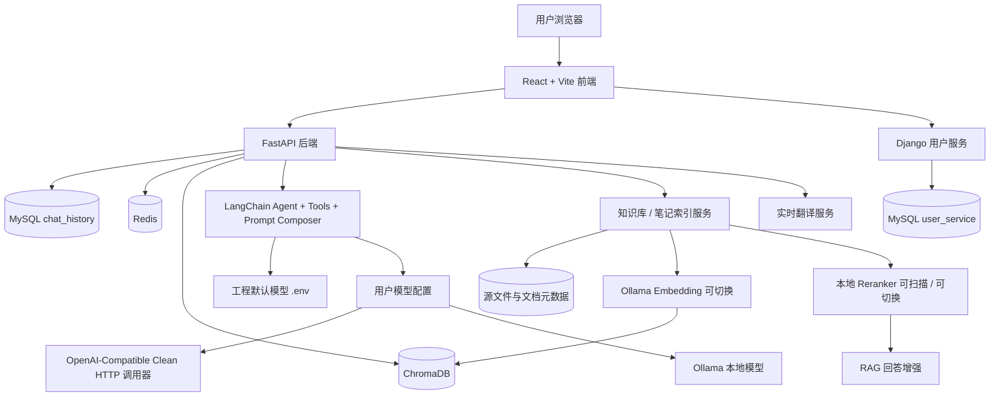

# LangChain-RAG-FastAPI-Service — 多功能智能 Agent 平台

<div align="center">
  
  
  
  
</div>


AI 驱动的个人知识与任务协作平台，融合 **多模型接入 + LangChain Tool Calling Agent + Skill/Tool 编排 + 记忆中心 + 笔记管理 + RAG 知识库 + 实时翻译**。当前项目已经从“会问答的笔记工具”升级为“可持续演进的个人 Agent 平台”。

---

## 项目变迁

本项目从一个**基础 RAG 对话系统**逐步演进，经历了三次比较明显的形态变化：

| | 阶段一（base-rag 分支） | 阶段二（master 早期） | 阶段三（当前 master） |
|--|------------------------|--------------------|--------------------|
| **定位** | 纯 RAG 对话服务 | 智能笔记助手 | 多功能智能 Agent 平台 |
| **能力** | 文档上传 → 向量检索 → AI 问答 | 笔记管理 + RAG + 间隔重复 + AI 写作 | 多模型接入 + 模型选择 + 实时翻译 + Agent 工具编排 + 笔记/RAG 协同 |
| **适合谁** | 想学习 RAG 的开发者 | 需要笔记与知识管理的人 | 想做个人 AI 工作台、Agent 平台或多场景智能应用的人 |

**RAG 仍然是知识底座，Agent 负责编排。** 基础 RAG 代码已永久保留在 `base-rag` 分支供学习使用，如果只需要纯 RAG 服务，切换到 `base-rag` 即可。

> 📄 [查看完整项目变迁 →](./docs/project_develop.md)

## 📋 目录

- [项目简介](#项目简介)
- [项目变迁](#项目变迁)
- [核心特性](#核心特性)
- [项目架构](#项目架构)
- [项目演示](#项目演示)
- [快速开始](#快速开始)
- [技术栈](#技术栈)
- [项目结构](#项目结构)
- [API 文档](#api文档)
- [配置说明](#配置说明)
- [部署指南](#部署指南)
- [开发指南](#开发指南)
- [故障排除](#故障排除)

## 项目简介

基于 **FastAPI + LangChain** 构建的智能 Agent 平台，当前核心能力包括：

- **多模型接入**：支持工程默认配置，也支持用户自行导入 OpenAI-compatible 外部模型和 Ollama 本地模型
- **模型选择**：用户可按账号保存外部模型配置，并在对话和翻译页切换
- **AI 对话**：支持多种 prompt 模式，保留默认角色，同时可切换不同风格
- **Skill/Tool 编排**：Agent 能力拆分为可扫描的 Skill 和 Tool 模块，前端可选择启用，后端会在已选 Skill 范围内做预路由
- **策略菜单**：AI 对话页支持上下文长度控制和 RAG 检索数量控制
- **实时翻译**：支持双语实时对话式翻译和整篇翻译两种模式
- **笔记管理**：Markdown 编辑器、智能标签（LLM 自动分类）、语义搜索、Markdown 导出
- **RAG 知识库**：多格式文档上传（txt/pdf/md/pptx/docx），支持动态控制知识库召回、笔记召回和摘要文档数量
- **记忆中心**：统一管理复习、待办、提醒、长期事项和普通备忘，并提供 Agent tools
- **AI 写作辅助**：联机补全、续写/扩写/摘要、关联笔记推荐

系统支持会话持久化（MySQL）、向量检索（ChromaDB）、JWT 用户隔离，前端采用 React + Tailwind CSS 构建现代化界面。

## 核心特性

- **📝 笔记管理**：Markdown 编辑器，支持新建、编辑、删除、分类筛选、分页列表
- **🏷️ 智能标签**：保存笔记后 LLM 异步生成标签和分类（工作/学习/生活/项目），无需手动归类
- **🔍 语义搜索**：基于向量嵌入的笔记全文搜索，告别关键词匹配
- **🔄 间隔重复回顾**：艾宾浩斯遗忘曲线（1/2/4/7/15/30 天）
- **✍️ AI 联机补全**：打字停顿后模型实时补全，Tab 键快速采纳
- **🤖 AI 写作助手**：续写、扩写、摘要生成，SSE 流式输出
- **🔗 跨源关联推荐**：编辑笔记时，从笔记库和知识库双向检索 Top k 相关文档
- **💬 智能问答**：基于 RAG 技术的 Agent 对话，支持文档引用来源展示
- **🧩 Skill/Tool 注册**：Skill 与 Tool 采用独立目录模块，支持前端查看、编辑、新增、删除和勾选启用
- **🧭 Skill 预路由**：后端按用户问题在已选 Skill 内挑选本轮相关能力，减少工具噪音
- **🎚️ 上下文与 RAG 策略**：对话页支持上下文 Auto/低/中/高/自定义/仅当前，以及 RAG Auto/低/中/高/自定义
- **🧾 消息级操作**：同一条回答支持刷新覆盖，消息删除会同步后端
- **🧠 记忆中心**：统一管理 review/todo/reminder/long_term/memo，并支持 Agent 创建、查询、更新和推进
- **🧠 多模型接入**：工程默认模型兜底，用户可自行导入 OpenAI-compatible API、第三方中转站、自部署兼容服务或 Ollama 本地模型
- **💾 会话持久化**：MySQL 存储对话历史，随时回溯
- **📄 文档管理**：支持 TXT / PDF / MD / PPTX / DOCX 上传，可视化切片详情
- **🌐 多语言支持**：前端 i18n，中英文界面切换
- **⛑️ 基础安全隔离**：JWT 登录鉴权和用户级数据隔离；完整角色权限与高风险工具确认仍在下一阶段计划中

## 项目架构

系统采用前后端分离 + 独立用户服务 + 模型配置服务的架构：



### 模型调用架构

模型系统分为两层：

- **工程默认模型**：由 `backend/.env` 中的 `LLM_TYPE`、`ALIYUN_*`、`OLLAMA_*` 决定，固定作为前端模型列表第一项，用作兜底配置。用户不需要创建任何模型配置也能直接使用 AI 对话。
- **用户自行导入模型**：用户可在前端 `模型选择` 页面添加自己的外部模型或本地模型配置，存入 FastAPI 后端的 `user_model_configs` 表。AI 对话页可按会话选择某个用户模型；未选择时走工程默认模型。

当前支持三类调用路径：

| 类型 | 用途 | 调用方式 |
|------|------|----------|
| 工程默认配置 | 系统兜底模型 | 读取 `.env`，使用阿里云百炼或 Ollama |
| 通用外部模型 | OpenAI Chat Completions 兼容 API、第三方中转站或自部署兼容服务 | 使用项目内置 Clean HTTP 调用器，请求 `{base_url}/chat/completions` |
| Ollama 本地 | 本机轻量模型部署 | 使用 `ChatOllama`，默认地址 `http://localhost:11434` |

通用模型没有直接使用 OpenAI SDK 默认请求链路，而是通过 `backend/app/utils/clean_openai_chat.py` 发起干净的 `httpx` 请求，避免部分中转站拦截 `AsyncOpenAI/Python`、`X-Stainless-*` 等 SDK 默认请求头。

### 模型选择页面

`模型选择` 页面提供按用户隔离的模型管理：

- 列表第一条固定显示工程 `.env` 默认模型，不可编辑、不可删除、不可设默认。
- 用户新增的模型从第二条开始展示，即使被标记为默认，也不会移动到第一条。
- `通用` 类型需要填写供应商、模型名称、Base URL 和 API SK。
- `Ollama 本地` 类型默认使用 `http://localhost:11434`，隐藏供应商和 API SK，前端可通过 `GET /model-config/ollama/models` 读取本机 `/api/tags` 并以下拉菜单选择已安装模型。
- 模型测试接口返回结构化诊断结果，便于区分认证失败、服务不可达、模型不存在、供应商拦截等问题。

### Agent、Skill 与 Tool 流程

AI 对话由 `LangChain AgentExecutor + Tools` 驱动。Agent 会根据前端传入的 `model_config_id` 决定使用用户模型；未传入时使用工程默认模型。能力层已经拆分为可扫描的 Skill 和 Tool：

- `Skill Registry` 扫描 `backend/app/agent/skills/*/skill.yaml` 与 `SKILL.md`，把系统上下文、知识库问答、笔记检索、笔记写入、复习回顾等能力注册为可选择 Skill。
- `Tool Registry` 扫描 `backend/app/agent/tools/*/tool.yaml`、`TOOL.md` 与 `tool.py`，把 RAG 总结、当前时间、用户信息、笔记搜索、笔记统计、今日回顾、标记回顾、创建笔记、关联推荐等工具注册为独立模块。
- 前端 AI 对话页在模式旁提供 Skill 下拉勾选，默认全开；如果用户没有显式修改选择，请求不会发送 `skill_ids/tool_ids`，后端会解析全部默认 Skill，保持初版 Agent 链路不变。
- 左侧 `Skill` 与 `工具库` 页面支持查看、编辑、新增和删除文件模块。当前阶段先写入本地模块文件，暂不持久化到数据库。

完整执行链路是：

```text
前端发送消息
  -> POST /chat/agent/query/stream
  -> JWT 鉴权得到 user_id
  -> 根据模型配置选择 LLM
  -> 在用户已选 Skill 范围内做预路由
  -> resolve_skills 得到 Skill prompt 与 Tool 实例
  -> 拼接 main_prompt / Skill 指令 / 可用工具列表 / AI 模式 prompt
  -> 根据策略裁剪上下文并传入 RAG 检索设置
  -> LangChain create_tool_calling_agent + AgentExecutor 执行
  -> SSE 推送 thinking / response / done
  -> 保存或覆盖数据库消息
```

当前最终回答是 Agent 完成后按 chunk 推送；thinking 已能展示部分执行过程，但结构化工具事件、计时、预算和高风险确认仍在下一阶段计划中。

知识库和笔记检索使用 ChromaDB 存储向量，MySQL 存储业务数据和会话历史，Redis 用于缓存和限流辅助。文档进入知识库后会经历解析、切片、向量化、混合检索、重排序等流程，再交给 LLM 生成回答。实时翻译和对话模式则通过统一的模型选择与 prompt 组合层进行路由。

### 知识库、Embedding 与 Reranker

知识库管理页现在同时负责文档导入、Embedding 模型选择和 Reranker 模型选择：

- 文档上传支持 TXT / PDF / MD / PPTX / DOCX，并在前端显示导入队列、单文件进度和处理状态。
- 源文件会保存并记录元数据，前端可以查看切片详情，也可以下载原始文件，保证知识可追溯。
- Embedding 使用 Ollama 本地模型，前端可读取 `/api/tags` 后选择模型；切换 embedding 会重建当前用户的知识库索引和笔记索引。
- Reranker 使用本地 CrossEncoder 模型目录，后端扫描 `backend/models` 下包含 `config.json` 和完整权重文件的模型；切换 reranker 只影响召回后的排序，不重建 Chroma 向量库。
- 当前推荐本地目录包括 `backend/models/bge-reranker-v2-m3` 和 `backend/models/qwen3-reranker-4b`，前端知识库页会自动读取可用列表并保持当前选择。

RAG 执行链路：

```text
上传文档
  -> 保存源文件和文档元数据
  -> 解析 txt/pdf/md/pptx/docx
  -> 切片
  -> 使用当前 embedding 模型写入 Chroma
  -> 用户提问时召回知识库 / 笔记候选
  -> 使用当前 reranker 对候选片段重新排序
  -> 拼接上下文并交给 LLM 生成回答
```

AI 对话页的 `策略` 菜单还可以动态控制 RAG 召回规模：

| 模式 | 知识库召回 | 笔记召回 | 摘要文档 |
|------|------------|----------|----------|
| 低 | 4 | 2 | 2 |
| 中 | 6 | 3 | 3 |
| 高 | 10 | 5 | 5 |
| 自定义 | 1-20 | 1-20 | 1-8 |
| Auto | 根据问题长度和“总结/对比/分析/全部/详细/综合”等意图自动选择 | | |

### 权限与安全现状

当前版本具备基础安全能力：

- 前端普通 API 与 SSE 都会携带 JWT。
- 后端主要业务路由通过 `get_current_user_id` 获取当前用户。
- 聊天、知识库、笔记、记忆中心、模型配置等主链路按 `user_id` 隔离。
- `skills`、`tools` 管理接口要求管理员权限；管理员名单维护在 `backend/app/config/security.yaml`，也可通过 `ADMIN_USER_IDS` / `ADMIN_USERNAMES` 追加部署环境管理员。
- `/chat/sessions` 只返回当前用户会话，`/chat/reorder` 已要求登录并保留限流。
- 删除类前端操作大多有确认弹窗。

当前仍需补齐：

- 仍不是完整多租户权限系统，尚未提供数据库角色、团队租户、细粒度操作权限和审计后台。
- Agent 写入和删除类工具缺少统一风险等级与二次确认。

这些被列为下一阶段 P0，详见 [下一阶段开发计划](./docs/roadmap_next.md)。

管理员名单维护方式：

```yaml
admin:
  user_ids:
    - stable-django-user-uuid
  usernames:
    - STliuEN
```

推荐长期使用 `user_ids`，因为用户名可能变更；修改配置后重启 FastAPI 后端生效。


## 快速开始

### 环境要求

| 环境 | 版本推荐 |
|------|----------|
| Python | 3.12+ |
| uv | 0.11.9 |
| Node.js | 16+ |

### 进入项目目录

```bash
cd LangChain-RAG-FastAPI-Service
```

### 安装依赖

#### 后端依赖
```bash
cd backend
uv sync
```

#### 前端依赖
```bash
cd front
npm install
```

### 环境配置

#### 创建后端环境变量文件

在 `backend` 目录下创建 `.env` 文件，参考 `.env.example` 文件填写配置：

```env
# ==================== LLM 大模型配置 ====================
# LLM类型：ALIYUN | OLLAMA
LLM_TYPE=ALIYUN

# ==================== Ollama 配置 (LLM_TYPE=OLLAMA) ====================
OLLAMA_BASE_URL=http://localhost:11434
OLLAMA_MODEL_NAME=qwen3:0.6b

# ==================== 阿里云百炼配置 (LLM_TYPE=ALIYUN) ====================
ALIYUN_ACCESS_KEY_SECRET=your_api_key
ALIYUN_BASE_URL=https://dashscope.aliyuncs.com/compatible-mode/v1
CHAT_MODEL_NAME=qwen3-max

# ==================== 向量嵌入模型配置 ====================
EMBED_MODEL_TYPE=OLLAMA
TEXT_EMBEDDING_MODEL_NAME=qwen3-embedding:0.6b
ALIYUN_EMBED_MODEL_NAME=qwen3-embedding

# ==================== 数据库配置 ====================
MYSQL_USER=root
MYSQL_PASSWORD=root
MYSQL_HOST=localhost
MYSQL_PORT=3306
MYSQL_DATABASE=chat_history

REDIS_HOST=localhost
REDIS_PORT=6379
REDIS_DB=0

# ==================== 服务配置 ====================
DJANGO_API_URL=http://127.0.0.1:8001

# ==================== LangSmith 调试追踪 ====================
LANGCHAIN_TRACING_V2=true
LANGCHAIN_API_KEY=your_langsmith_api_key
LANGCHAIN_PROJECT=my-fastapi-langchain-project

# ==================== 重排序模型配置 ====================
RERANKER_MODEL_PATH=./models/qwen3-reranker-4b
RERANKER_MODEL_NAME=Qwen/Qwen3-Reranker-4B
RERANKER_DEVICE=auto
RERANKER_MAX_LENGTH=8192
RERANKER_BATCH_SIZE=1
RERANKER_TORCH_DTYPE=auto

# ==================== JWT 身份验证配置 ====================
SECRET_KEY=MY_JWT_SECRET_KEY
ALGORITHM=HS256
```

#### 创建用户服务环境变量文件

在 `DjangoUserService` 目录下创建 `.env` 文件：

```env
# JWT 配置
JWT_SECRET_KEY=YOUR_JWT_SECRET_KEY

# 数据库配置
DB_PORT=3306
DB_NAME=user_service
DB_USER=root
DB_PASSWORD=root
DB_HOST=localhost

# Celery 配置
CELERY_BROKER_URL=redis://localhost:6379/0
CELERY_RESULT_BACKEND=redis://localhost:6379/0
CELERY_TASK_TIME_LIMIT=300
CELERY_TASK_SOFT_TIME_LIMIT=250
CELERY_RESULT_EXPIRES=3600

# Redis 配置
REDIS_CACHE_URL=redis://localhost:6379/1
```

配置好 env 文件后，执行 Django ORM 迁移：

```bash
python manage.py makemigrations
python manage.py migrate
```

### 向量数据库配置

修改 `backend/app/config/chroma.yaml` 文件：

```yaml
collection_name: rag_collection
persist_directory: data/chromadb
k: 3

data_path: data
md5_hex_store: data/md5_hex_store/md5_hex_store.txt
allow_knowledge_file_types: ["txt", "pdf", "md", "pptx", "docx"]

chunk_size: 200
chunk_overlap: 20
separators: ["\n\n", "\n", "。", "！", "？", "!", "?", " ", ""]
```

### 启动服务

| 服务 | 命令 | 端口 |
|------|------|------|
| 后端服务 | `cd backend && uvicorn main:app --reload` | 8000 |
| 前端服务 | `cd front && npm run dev` | 3000 |
| 用户服务 | `cd DjangoUserService && uv run python manage.py runserver 8001` | 8001 |
| MySQL | `net start mysql` | 3306 |
| Redis | `redis-server` 或 `net start redis` | 6379 |
| Ollama | `ollama serve` | 11434 |

## 技术栈

### 后端技术

| 技术 | 说明 |
|------|------|
| FastAPI | 高性能异步 Web 框架 |
| LangChain | 大语言模型应用开发框架（AgentExecutor + Tools） |
| ChromaDB | 轻量级向量数据库（rag_collection + notes_collection） |
| SQLAlchemy | 异步 ORM，管理 MySQL |
| Django | 用户认证和管理系统 |
| MySQL | 关系型数据库（chat_history / notes / reviews） |
| Redis | 缓存 |
| DashScope API | 大语言模型服务（Qwen3-Max） |
| Ollama | 本地模型部署，支持读取 `/api/tags` 选择已安装模型 |
| Clean OpenAI-Compatible Caller | 基于 httpx 的干净 Chat Completions 调用器，兼容 OpenAI 格式中转站 |
| Hugging Face / ModelScope | 重排序模型（BAAI/bge-reranker-v2-m3） |
| Sentence-Transformers | 句子嵌入模型 |

### 前端技术

| 技术 | 说明 |
|------|------|
| React 19 | 现代化前端框架 |
| TypeScript | 类型安全 |
| Vite | 极速构建工具 |
| Tailwind CSS | 原子化 CSS 框架 |
| Radix UI | 无头 UI 组件库 |
| Tiptap | 富文本 Markdown 编辑器 |
| React Router DOM | 路由管理（路由守卫 + JWT 校验） |
| Zustand | 轻量状态管理 |
| i18next | 国际化（中/英） |
| Axios | HTTP 客户端 |
| react-markdown + rehype-highlight | Markdown 渲染与代码高亮 |
| dompurify | HTML 安全过滤 |

## 项目结构

```
├── backend/                     # FastAPI 后端服务
│   ├── app/
│   │   ├── agent/               # Agent 智能代理模块
│   │   │   ├── agent.py         # AgentFactory + Skill/Tool + Prompt 组合
│   │   │   ├── skill_registry.py# Skill Registry + Tool Registry 扫描解析
│   │   │   ├── tool_context.py  # Tool 执行上下文
│   │   │   ├── skills/          # 独立 Skill 模块（skill.yaml + SKILL.md）
│   │   │   └── tools/           # 独立 Tool 模块（tool.yaml + TOOL.md + tool.py）
│   │   ├── config/              # 配置文件（chroma.yaml 等）
│   │   ├── core/                # 核心工具（限流、响应封装、日志）
│   │   ├── db/                  # 数据库配置（MySQL + Redis）
│   │   ├── models/              # SQLAlchemy ORM 模型
│   │   │   ├── note.py          # 笔记模型
│   │   │   ├── review_record.py # 回顾记录模型
│   │   │   ├── chat_history.py  # 对话历史模型
│   │   │   ├── knowledge_document.py # 知识库源文件与文档元数据
│   │   │   ├── embedding_config.py # 用户 Embedding 配置
│   │   │   └── model_config.py  # 用户模型配置
│   │   ├── prompt/              # 提示词模板（对话 / 翻译 / 写作 / RAG）
│   │   ├── rag/                 # RAG 核心功能
│   │   │   ├── rag_service.py   # RAG 服务（HyDE + 混合检索）
│   │   │   ├── reorder_service.py
│   │   │   ├── vector_store.py  # ChromaDB 封装
│   │   │   ├── text_spliter.py  # 文档切片
│   │   │   ├── document_handler/# 文档解析（txt/pdf/md/pptx/docx）
│   │   │   ├── retrievers/      # 自定义检索器
│   │   │   └── task_queue.py    # 后台处理队列
│   │   ├── router/              # API 路由
│   │   │   ├── chat.py          # 聊天 & Agent 路由
│   │   │   ├── skill_router.py  # Skill 注册、编辑、删除
│   │   │   ├── tool_router.py   # Tool 注册、编辑、删除
│   │   │   ├── translate.py     # 实时翻译路由
│   │   │   ├── model_config_router.py # 用户模型配置与测试
│   │   │   ├── note_router.py   # 笔记 CRUD & AI 路由
│   │   │   ├── memory_router.py # 记忆中心路由
│   │   │   ├── knowledge_router.py
│   │   │   ├── user.py
│   │   │   └── health.py
│   │   ├── schemas/             # Pydantic 数据模型
│   │   ├── services/            # 业务服务层
│   │   │   ├── note_service.py  # 笔记服务（CRUD + 向量化 + AI 写作）
│   │   │   ├── model_config_service.py # 模型配置服务
│   │   │   ├── embedding_config_service.py # Embedding 配置与索引重建
│   │   │   ├── reranker_config_service.py # Reranker 本地扫描与切换
│   │   │   ├── knowledge_document_service.py # 知识库源文件与元数据服务
│   │   │   ├── translate_service.py # 实时翻译服务
│   │   │   └── memory_service.py# 记忆中心与复习调度服务
│   │   └── utils/               # 工具函数
│   │       ├── clean_openai_chat.py # OpenAI-compatible 干净调用器
│   │       ├── model_provider.py    # 模型工厂与路由
│   │       └── prompt_loader.py     # 提示词加载器
│   ├── data/                    # 数据存储目录
│   ├── main.py                  # 应用入口
│   └── pyproject.toml
├── front/                       # React 前端项目
│   ├── src/
│   │   ├── api/                 # API 请求层
│   │   │   ├── auth.ts          # 认证接口
│   │   │   ├── chat.ts          # 聊天接口
│   │   │   ├── translate.ts     # 实时翻译接口
│   │   │   ├── notes.ts         # 笔记接口
│   │   │   ├── knowledge.ts     # 知识库接口
│   │   │   ├── modelConfig.ts   # 模型配置接口
│   │   │   ├── memory.ts        # 记忆中心接口
│   │   │   └── sessions.ts      # 会话接口
│   │   ├── components/          # 组件
│   │   │   ├── common/          # 通用组件（TagBadge, ConfirmDialog, EmptyState 等）
│   │   │   ├── knowledge/       # 知识库组件
│   │   │   ├── layout/          # 布局组件（Sidebar）
│   │   │   ├── note/            # 笔记组件（OutlinePanel, RelatedFragments）
│   │   │   └── TiptapEditor.tsx # 富文本编辑器
│   │   ├── hooks/               # 自定义 Hooks
│   │   │   └── useSSE.ts        # SSE 流式处理
│   │   ├── i18n/                # 国际化（中/英）
│   │   ├── layouts/             # 页面布局（AuthLayout, MainLayout）
│   │   ├── pages/               # 页面
│   │   │   ├── NoteEditor.tsx   # 笔记编辑器
│   │   │   ├── NoteList.tsx     # 笔记列表
│   │   │   ├── MemoryCenter.tsx # 记忆中心
│   │   │   ├── AIChat.tsx       # AI 聊天
│   │   │   ├── SkillManager.tsx # Skill 管理与工具绑定
│   │   │   ├── ToolManager.tsx  # 工具库管理
│   │   │   ├── ModelSettings.tsx# 模型选择与用户模型配置
│   │   │   ├── RealtimeTranslate.tsx # 实时翻译页面
│   │   │   ├── Sessions.tsx     # 会话管理
│   │   │   ├── KnowledgeBase.tsx# 知识库管理
│   │   │   ├── Login.tsx / Register.tsx
│   │   │   ├── Profile.tsx / Settings.tsx
│   │   │   └── AboutUs.tsx
│   │   ├── router/index.tsx     # 路由配置
│   │   ├── stores/              # Zustand 状态管理
│   │   │   ├── useUserStore.ts
│   │   │   ├── useSessionStore.ts
│   │   │   ├── useThemeStore.ts
│   │   │   └── useLanguageStore.ts
│   │   ├── types/api.ts         # TypeScript 类型定义
│   │   ├── App.tsx              # 应用入口组件
│   │   └── main.tsx             # 应用入口
│   └── package.json
├── DjangoUserService/           # Django 用户服务
│   ├── apps/
│   │   ├── user/               # 用户注册/登录/认证
│   │   ├── file/               # 头像上传
│   │   └── utils/              # 工具函数
│   └── api.md                  # 用户服务 API 文档
├── docs/                        # 项目文档
│   ├── project_develop.md      # 项目发展、当前架构和 prompt 拼接方式
│   ├── roadmap_next.md         # 下一阶段开发计划
│   ├── agent_runtime_improvements.md # Agent 运行时改进拆解
│   ├── memory_center_implementation.md # 记忆中心当前实现与后续计划
│   ├── modelscope_model.md     # 模型下载和配置
│   └── troubleshooting.md      # 故障排除
├── images/                      # 截图资源
└── plan.md                     # 项目规划
```

## API 文档

### FastAPI 后端 API

完整的 OpenAPI 规范文件：[backend/openapi.json](./backend/openapi.json)
		启动服务后访问交互式文档：[http://localhost:8000/docs](http://localhost:8000/docs)

### Django 用户服务 API

详细文档：[DjangoUserService/api.md](./DjangoUserService/api.md)
		交互式文档（启动后）：[http://localhost:8001/docs/](http://localhost:8001/docs/)

## 配置说明

### LLM 模型切换

系统支持 **工程默认模型 + 用户自行导入模型** 两层模型来源：

- **工程默认模型**：由 `backend/.env` 中的 `LLM_TYPE` 决定，作为 AI 对话和模型列表第一项兜底配置。
- **用户自行导入模型**：登录用户可在前端 `模型选择` 页面新增外部模型或本地模型，按用户隔离保存，可在 AI 对话页下拉选择。

工程默认模型支持：

- **LLM_TYPE=ALIYUN**：使用阿里云百炼兼容模式模型。
- **LLM_TYPE=OLLAMA**：使用本地 Ollama 模型。

用户自行导入模型支持：

| 类型 | 适用场景 | 填写方式 |
|------|----------|----------|
| 通用外部模型 | OpenAI-compatible API、第三方中转站、自部署兼容服务 | 填写供应商、模型名称、Base URL、API SK；Base URL 可填根地址或 `/v1` 地址，后端会规范化到 OpenAI Chat Completions 路径 |
| Ollama 本地 | 本机或局域网 Ollama 模型 | 默认地址 `http://localhost:11434`，点击刷新读取本地 `/api/tags`，从下拉菜单选择已安装的对话模型，API SK 留空 |

通用外部模型示例：

```text
供应商: DeepSeek / OpenAI / SiliconFlow / 自部署服务
模型名称: deepseek-chat / gpt-4o-mini / qwen-plus
Base URL: https://api.example.com/v1
API SK: sk-...
```

Ollama 本地模型读取会绕过系统代理访问本机服务，并过滤 embedding-only 模型，避免把嵌入模型误选为对话模型。

Ollama 常用轻量模型示例：

```bash
ollama pull qwen3:0.6b
ollama pull qwen3:1.7b
ollama list
```

### Embedding 与知识库索引

Embedding 当前通过 Ollama 本地服务提供，默认模型可在 `.env` 中配置：

```env
TEXT_EMBEDDING_MODEL_TYPE=ollama
TEXT_EMBEDDING_MODEL_NAME=qwen3-embedding:0.6b
OLLAMA_BASE_URL=http://localhost:11434
```

知识库页面会读取 Ollama 已安装模型列表，并允许选择新的 embedding 模型。切换 embedding 后，后端会使用保存的源文件和笔记内容重建当前用户的知识库向量索引与笔记向量索引；源文件、文档状态、切片数量、embedding 模型信息会保存在数据库，Chroma 只作为可重建的向量索引层。

常用 embedding 模型示例：

```bash
ollama pull qwen3-embedding:0.6b
ollama list
```

### 重排序模型

默认可以使用本地 CrossEncoder 重排序模型。当前推荐在 RTX 5070 Ti 环境下手动下载 `Qwen/Qwen3-Reranker-4B` 到 `backend/models/qwen3-reranker-4b`，再通过 `.env` 指向本地目录。后端启动时会校验模型目录是否包含 `config.json` 和完整权重文件；如果发现 `._____temp`、`.lock` 等未完成下载残留，会清理后重新下载。配置与排障参考 [模型配置指南](./docs/modelscope_model.md)。

常用环境变量：

```env
RERANKER_MODEL_PATH=./models/qwen3-reranker-4b
RERANKER_MODEL_NAME=Qwen/Qwen3-Reranker-4B
RERANKER_MODEL_REVISION=master
RERANKER_DEVICE=auto
RERANKER_MAX_LENGTH=8192
RERANKER_BATCH_SIZE=1
RERANKER_TORCH_DTYPE=auto
RERANKER_MIN_WEIGHT_MB=50
```

`RERANKER_DEVICE=auto` 会优先尝试 CUDA；如果当前 PyTorch CUDA 构建不支持显卡架构，会自动回退 CPU，保证 RAG 主链路不中断。RTX 50 系列这类 `sm_120` 显卡需要使用支持 CUDA 13.x 的 PyTorch wheel，通常建议重建 `backend/.venv`。

重建后端 CUDA 13.2 环境：

```powershell
powershell -ExecutionPolicy Bypass -File .\scripts\rebuild-backend-cu132.ps1
```

切换 reranker 不需要重建 Chroma 向量库；reranker 只对已召回候选文档排序，不改变 embedding。

## 故障排除

详细的故障排除指南请参考：[故障排除](./docs/troubleshooting.md)

常见问题：

- **API Key 错误**：检查 ALIYUN_ACCESS_KEY_SECRET 是否正确配置
- **数据库连接失败**：确认 MySQL / Redis 服务已启动
- **ChromaDB 异常**：检查 `chroma.yaml` 中的路径配置
- **重排序模型加载失败**：确认 `RERANKER_MODEL_PATH` 指向包含 `config.json` 和 `model.safetensors` / `pytorch_model.bin` 的完整模型目录；如果是 ModelScope 中断下载残留，删除模型目录或重启服务触发重新下载
- **RTX 50 系列无法使用 CUDA**：当前 PyTorch wheel 可能不支持 `sm_120`，需要升级到 CUDA 13.x 构建并重建后端 `.venv`
- **Ollama 连接失败**：确认 `ollama serve` 已运行且模型已拉取

## 开发路线

当前下一阶段优先级：

1. 补齐权限控制和高风险工具确认。
2. Agent thinking 事件结构化、工具耗时和运行状态展示。
3. 长任务预算、停止和收束回答。
4. 上下文自动摘要压缩。
5. 记忆中心主动提醒和对话后事项提炼。
6. Tool 元数据、测试和诊断。
7. MCP 外部工具接入。

详细方案见 [docs/roadmap_next.md](./docs/roadmap_next.md)。

## License

本项目基于MIT开源协议， [点击跳转LICENSE](LICENSE) 
