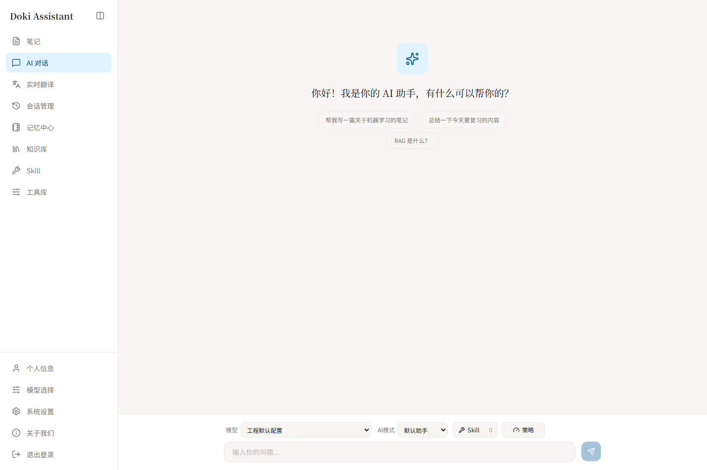
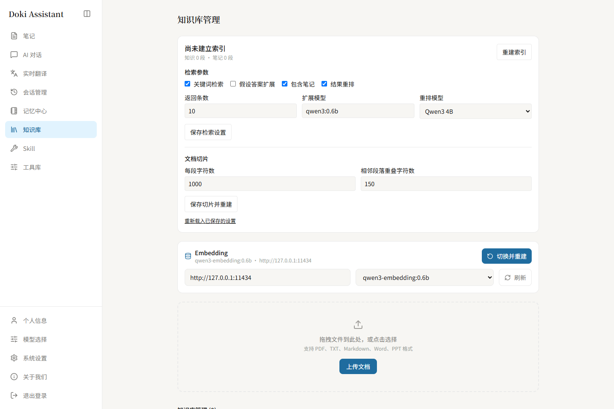

<h1 align="center">Doki Assistant</h1>

<p align="center"><strong>个人 AI 助手与知识工作台</strong></p>
<p align="center">整理资料，记录想法，让对话连接你的知识与工具。</p>

<p align="center">
  <a href="LICENSE"></a>
  
  
  
</p>

<p align="center">
  <a href="#功能一览">功能一览</a> &nbsp; / &nbsp;
  <a href="#界面预览">界面预览</a> &nbsp; / &nbsp;
  <a href="#开始使用">开始使用</a> &nbsp; / &nbsp;
  <a href="docs/README.md">项目文档</a>
</p>

---

Doki Assistant 是面向个人使用的 AI Agent 工作台。它把文档检索、笔记、记忆和工具调用放在同一个工作空间，让日常积累的资料能够参与对话，也让对话中的想法继续沉淀为笔记。

你可以接入 Ollama 本地模型，也可以配置 OpenAI-compatible 模型服务；通过标准 Skill 包组织助手能力，按需使用获授权的工具。

## 界面预览

**AI 对话** · 模型选择、回答模式与上下文策略集中在对话窗口。



<details>
<summary><strong>查看知识库与检索设置</strong></summary>

配置关键词检索、HyDE 扩展、结果重排、文档切片和 Embedding 模型。



</details>

## 功能一览

| 能力 | 你可以做什么 |
| --- | --- |
| **AI 对话** | 选择模型与回答风格，调整上下文策略，查看流式回答并继续历史会话。 |
| **个人知识库** | 导入 PDF、Word、PPT、Markdown 和文本，结合语义检索与关键词检索查找资料。 |
| **笔记写作** | 编辑富文本和 Markdown 内容，管理分类、标签与置顶笔记，使用 AI 辅助整理。 |
| **记忆中心** | 管理复习、待办、提醒、长期记忆和备忘，让助手围绕已有信息协助工作。 |
| **Skill 与工具** | 导入和管理标准 Skill 包，在授权范围内使用提示词、只读资源与本地工具。 |
| **模型配置** | 连接 Ollama 或 OpenAI-compatible 服务，分别选择对话、Embedding 和重排模型。 |
| **实时翻译** | 通过对话式界面获取流式翻译结果。 |
| **工作空间** | 按用户管理会话、知识、笔记和记忆，支持中英文界面与明暗主题。 |

## 开始使用

当前开发环境以 **Windows、Python 3.12、uv、Node.js 22.12+、MySQL** 为基础，按所选功能配置 Redis 和模型服务。

从仓库根目录安装开发依赖：

```powershell
uv sync --project backend --extra dev
npm --prefix front ci
```

接着按 [本地开发指南](docs/development.md) 配置并启动服务。已运行的本地工作区可访问：

| 入口 | 地址 |
| --- | --- |
| Doki 工作台 | <http://127.0.0.1:18080> |
| API 文档 | <http://127.0.0.1:18000/docs> |

## 技术栈

| 层级 | 技术 |
| --- | --- |
| 界面 | React 19 · TypeScript · Vite · Tailwind CSS · Zustand · Tiptap |
| 应用 | FastAPI · SQLAlchemy · Alembic |
| Agent 与检索 | LangChain · LangGraph · ChromaDB · BM25 |
| 数据 | MySQL 持久化 · Chroma 检索索引 · Redis 缓存与限流 |
| 模型 | Ollama · OpenAI-compatible API · 本地 Reranker |
| 文档解析 | PyMuPDF · pypdf · Unstructured |

## 项目结构

```text
backend/          API、Agent、RAG、Skill 与数据库
front/            React 前端与界面组件
contracts/        API 契约
benchmarks/       评测用例与运行器
scripts/          开发与维护脚本
docs/             使用、开发与架构文档
project_changes/  架构变迁与阶段记录
```

## 深入了解

| 文档 | 内容 |
| --- | --- |
| [本地开发](docs/development.md) | 环境准备、启动方式与开发检查 |
| [架构设计](docs/architecture-target-blueprint-2026-08-26.md) | 模块职责、数据流与存储设计 |
| [架构变迁](docs/architecture_rewrite_plan.md) | 重构过程与阶段记录 |
| [完整文档](docs/README.md) | 运维、交接与历史资料索引 |

## 参与贡献

欢迎通过 Issue 反馈问题或讨论改进，通过 Pull Request 提交代码。开发检查命令见 [本地开发指南](docs/development.md#开发检查)。

## 许可

本项目由 LangChain-RAG-FastAPI-Service 演进而来，保留原项目 Git 历史，采用 [MIT License](LICENSE)。
