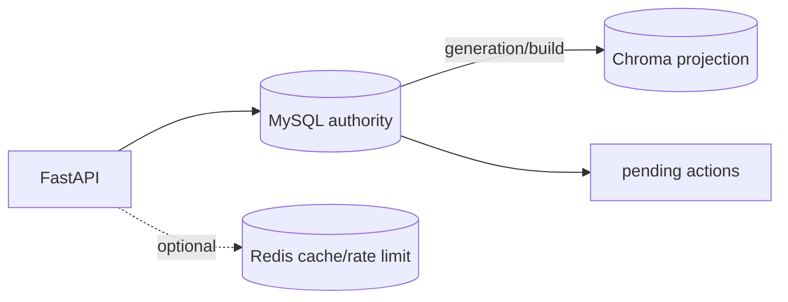

# 项目文档索引

本文档目录描述当前有效的架构和运行规则。历史资料保存在 `docs/archive/` 和 `project_changes/`，仅用于追溯。

## 当前状态

E8/AR-6 于 2026-09-15 关闭，关闭对象是本地单机 SQL 权威迁移与最终验收链路。

旧兼容模块仍在源码树中，但不是 E8 业务权威。生产部署和历史资源清理属于独立场景，不构成本项目收口条件。

## 阅读顺序

1. [目标架构蓝图](architecture-target-blueprint-2026-08-26.md)
2. [架构重写计划](architecture_rewrite_plan.md)
3. [执行交接](architecture-execution-handoff-2026-08-26.md)
4. [E8 计划](../project_changes/2026-09-15-e8-ar6-preparation/plan.md)
5. [E8 运行手册](../project_changes/2026-09-15-e8-ar6-preparation/e8-runbook.md)
6. [E8 依赖图](../project_changes/2026-09-15-e8-ar6-preparation/dependency-map.md)
7. [E8 验收记录](../project_changes/2026-09-15-e8-ar6-preparation/test-record.md)

## 阶段入口

[E3](../backend/ops/e3/README.md) · [E4](../backend/ops/e4/README.md) · [E5](../backend/ops/e5/README.md) · [E6/E7](../backend/ops/e6_e7/README.md)

当前运行事实以最终 JSON 证据、代码和 live 环境为准；历史 README 的旧状态不覆盖 E8 判定。
