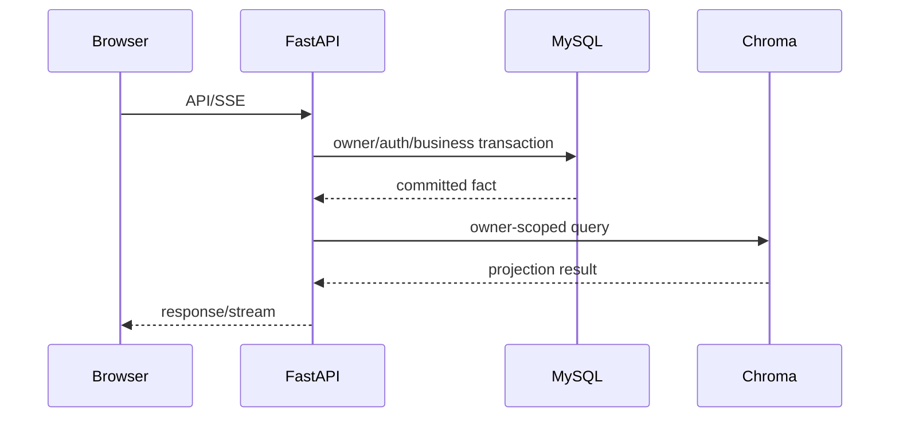

# 目标架构蓝图

## 架构原则

本地单机部署采用单 FastAPI 业务入口、单 MySQL 业务权威和可重建 Chroma 投影。该蓝图描述 E8 运行边界，不承诺生产 HA。

| 对象 | 权威/用途 |
|---|---|
| 业务、权限、任务、审计、pending action、RAG generation | MySQL |
| 向量检索 | Chroma；由 SQL generation 重建 |
| 缓存、限流 | Redis；可丢失、不可承载事实 |
| Agent、Skill、MCP | FastAPI 运行时，受 SQL 授权和审计约束 |

## 数据流

写请求先提交 SQL 事实及审计/任务状态，再返回 accepted 或成功结果。投影失败保留 SQL 事实，并进入可重建状态。

## 恢复

SQL 备份恢复 schema、业务事实和 generation；完成表、FK、digest、审计与 pending action 校验后，从 SQL 重建 Chroma，再通过 readiness、业务 smoke 和投影对账恢复服务。

E8 实测 RPO 为备份边界无已提交写入丢失，RTO 为 3.752 秒。

## 边界

旧 Vector、MD5、filesystem 和 Skill adapter 仅作兼容/维护代码；E8 业务不会从它们恢复事实。验收不使用 MySQL 全局 read_only，避免影响 new-api 等本机服务。生产 DNS/LB/TLS、共享存储、HA 和外部依赖不在本蓝图内；它们不影响 E-number 架构精简目标的完成。
