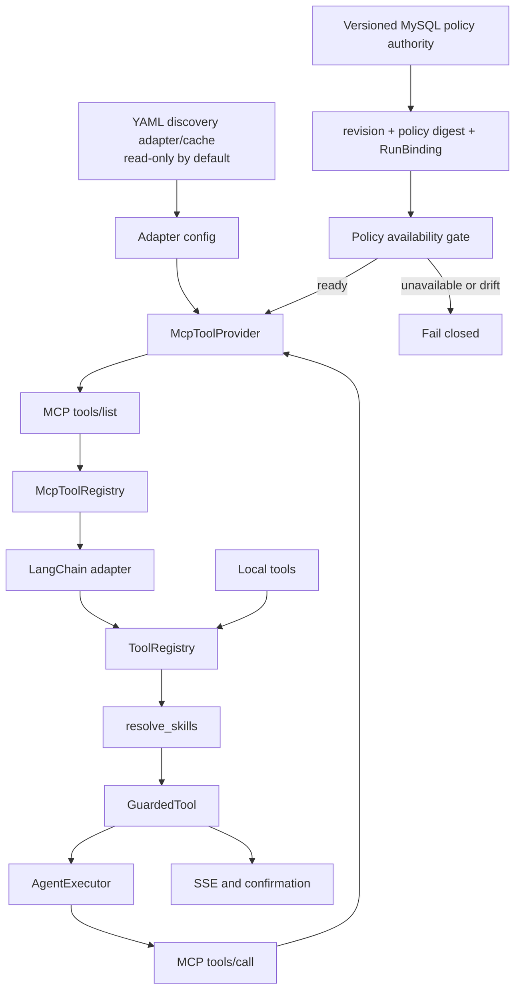

# MCP 接入与管理

MCP（Model Context Protocol）是 Doki 助手的外部 Tool 来源。本地 Tool 和 MCP Tool 最终都进入统一 ToolRegistry、Skill 解析和 GuardedTool，不存在两套 Agent 执行规则。

## 当前实现

```text
backend/app/config/mcp.example.yaml  # 仓库模板，默认禁用
backend/app/config/mcp.local.yaml    # 本地 discovery adapter/cache，Git 忽略，默认只读
backend/app/agent/mcp/
  config.py       YAML 读取；显式 adapter maintenance 写入（默认关闭）
  provider.py     transport、tools/list、tools/call、连接错误
  adapter.py      MCP schema -> Pydantic schema -> LangChain BaseTool
  registry.py     discovery cache、refresh、ensure_fresh、catalog
backend/app/router/mcp_router.py
backend/app/agent/skill_registry.py
backend/app/agent/tool_guard.py
front/src/pages/ToolManager.tsx
```

当前支持：

- `stdio`、`sse`、`http` 和 `streamable_http` transport。
- server 级 enabled、allow/deny、默认风险、确认、超时和输出限制。
- tool 级 label、description、enabled、风险、确认、超时和输出限制 override。
- 启动 discovery、管理员 refresh 和错误态惰性自愈。
- ToolManager 展示本地 Tool、MCP server 和 MCP Tool。
- 当前只保留 YAML discovery adapter/cache 读取；它不是 Tool/MCP policy 的最终权威。
- 策略权威尚未就绪时，MCP discovery、刷新、依赖策略的执行和管理写接口均 fail-closed。
- YAML 写入仅用于显式 adapter maintenance，不代表发布策略、授权或运行时变更；默认关闭。

当前没有独立的连接测试 API、数据库配置中心、secret store 或完整审计记录。

## 调用链路



边界：

- YAML 只提供 discovery adapter/cache 输入；不能单独授权 Tool/MCP 运行，也不能作为最终策略来源。
- 版本化 MySQL authority 应提供 revision、policy digest 和 RunBinding；当前尚未交付，因此运行时保持 fail-closed。
- provider 只负责 MCP 协议、连接和远程调用，不负责策略授权。
- registry 负责已发现工具的缓存和公开 catalog。
- adapter 负责参数 schema 和 LangChain Tool 适配。
- SkillRegistry 将本地 Tool 与 MCP Tool 合并。
- GuardedTool 负责执行预算、确认、超时和输出截断。

## 本地 Tool 与 MCP Tool

| 类型 | 来源 | 执行位置 | 典型用途 |
|------|------|----------|----------|
| 本地 Tool | `backend/app/agent/tools/<id>/` | FastAPI 进程 | 内部数据库、笔记、记忆、RAG |
| MCP Tool | YAML adapter/cache 发现的 server（最终须受版本化 policy authority 约束） | 外部进程或服务 | 外部系统、跨语言工具、桌面或网络能力 |

进入 Agent 后两者都转换为 `ToolDefinition`，再包装为 GuardedTool。MCP Tool 的 `source` 为 `mcp`，并保留 `provider_id` 和 `external_name`，便于事件和待确认动作恢复真实来源。

## 配置文件

配置入口（均为 adapter/cache 输入，不是最终策略存储）：

```text
backend/app/config/mcp.example.yaml
backend/app/config/mcp.local.yaml
```

路径选择为：设置 `MCP_CONFIG_PATH` 时只读取该显式路径；否则读取存在的 `mcp.local.yaml`，再否则读取 `mcp.example.yaml`。读取不存在的本地文件不会隐式创建或升级为策略。默认只读。只有显式设置 `MCP_ALLOW_LOCAL_CONFIG_WRITES=true` 且提供显式 `MCP_CONFIG_PATH`（或调用方传入显式维护路径）时，才允许 adapter maintenance 写入指定 YAML；这类写入不发布策略、不改变授权，也不构成运行时权威。仓库示例中的 server 全部默认禁用。

版本化 MySQL policy authority、revision、policy digest、RunBinding 和回滚证据属于 AR-3/AR-5 的阻断交付。在该 authority 可用前，依赖 MCP policy 的 discovery、刷新、工具目录和执行必须保持 fail-closed；旧 YAML 不能绕过此门禁。

server 字段：

| 字段 | 说明 |
|------|------|
| `id` | server 唯一 ID |
| `label` / `description` | UI 展示信息 |
| `enabled` | 是否参加 discovery |
| `transport` | `stdio`、`sse`、`http`、`streamable_http` |
| `command` / `args` / `env` | stdio 子进程配置 |
| `url` | SSE 或 streamable HTTP 地址 |
| `allow_tools` | 非空时只允许列出的外部工具名 |
| `deny_tools` | 显式拒绝的外部工具名 |
| `default_risk_level` | Tool 默认 `low/medium/high` |
| `default_requires_confirmation` | Tool 默认是否需要确认 |
| `timeout_seconds` | 默认单次执行超时 |
| `max_output_chars` | 默认输出截断长度 |
| `tool_overrides` | 针对外部工具名的覆盖 |

示例：

```yaml
servers:
  - id: example_stdio
    label: Example stdio server
    description: Read-only example
    enabled: true
    transport: stdio
    command: python
    args:
      - mcp_servers/example_server.py
    env: {}
    allow_tools:
      - lookup
    deny_tools: []
    default_risk_level: low
    default_requires_confirmation: false
    timeout_seconds: 10
    max_output_chars: 5000
    tool_overrides:
      lookup:
        label: Public lookup
        enabled: true
        risk_level: low
        requires_confirmation: false
        timeout_seconds: 8
        max_output_chars: 3000
```

默认值是保守的：未配置风险时为 `medium`，未配置确认时为 `true`。仓库示例包含两个开发/演示 server，但均为禁用状态；部署环境必须显式启用并逐项审查。

## Tool ID

内部 Tool ID 由 server ID 和 MCP 原始工具名规范化：

```text
mcp_<server_id>_<tool_name>
```

ID 转为小写，非字母数字字符替换为下划线，并限制为 64 个字符。LangChain Tool name 由 adapter 生成，管理 API 使用的是内部 Tool ID，不是 MCP 原始名称。

## Discovery 生命周期

### FastAPI 启动

`backend/main.py` 在 startup 中执行：

```text
mcp_tool_registry.refresh()
skill_registry.reload()
```

某个 server 失败不会阻止 FastAPI 启动；provider 记录 `last_error`，普通聊天仍可使用本地工具。

### 请求时自愈

`prepare_agent_run` 调用 `mcp_tool_registry.ensure_fresh()`。只有 registry 处于需要恢复的状态时才刷新，正常状态不会每轮执行 `tools/list`。

### 管理员刷新

```http
POST /api/mcp/servers/refresh
```

刷新完成后自动 reload SkillRegistry，让最新 MCP Tool 进入统一 catalog。

## 管理 API

所有读取接口要求登录；修改接口要求管理员。

| 方法 | 路径 | 权限 | 作用 |
|------|------|------|------|
| GET | `/api/mcp/servers` | 登录 | server 状态与 last_error |
| GET | `/api/mcp/tools` | 登录 | 已发现 MCP Tool |
| GET | `/api/mcp/permissions` | 登录 | 当前用户是否可管理 MCP |
| POST | `/api/mcp/servers/refresh` | 管理员 + policy authority | 重新 discovery；authority 不可用时 `503`，fail-closed |
| PATCH | `/api/mcp/servers/{server_id}` | 管理员 + policy authority | 更新 enabled、展示信息或 URL；当前 authority 不可用时 `503` |
| DELETE | `/api/mcp/servers/{server_id}` | 管理员 + policy authority | 删除 policy 中的 server；当前不从 YAML 直接删除 |
| PATCH | `/api/mcp/tools/{tool_id}` | 管理员 + policy authority | 写入版本化 tool policy；当前 authority 不可用时 `503` |
| DELETE | `/api/mcp/tools/{tool_id}` | 管理员 + policy authority | 写入版本化 deny policy；当前 authority 不可用时 `503` |

server 更新目前不支持通过 API 修改 stdio command、args、env 或 transport。若进行 adapter maintenance，这些字段仍可在显式 `MCP_CONFIG_PATH` 指向的 YAML 中人工维护；该文件不应被当作生产策略或授权变更入口。

删除 MCP Tool 的目标语义是把其外部名称加入版本化 deny policy，并移除对应 override；不会修改外部 MCP server。当前 policy authority 不可用时不会执行此变更。

## ToolManager

前端 `/tools` 页面：

- 将本地 Tool 与 MCP Tool 分组展示。
- 按 MCP server 展示工具。
- 普通用户只能读取可公开的 discovery/catalog 状态。
- 管理员界面保留更新入口，但在 policy authority 不可用时必须显示不可用并保留 `503` fail-closed 结果。
- 只有版本化 policy authority 就绪后，管理员才可提交 server/tool policy 变更；变更应带 revision、digest、授权和审计证据。

policy authority 就绪后的保存流程才可触发 refresh，并应绑定新 revision/digest。当前不能把 UI 保存成功、refresh 或写回 `mcp.local.yaml` 作为生产策略变更；显式 YAML adapter maintenance 不由普通 UI 写入。

## stdio 环境

stdio server 是 FastAPI 启动的独立子进程。adapter 配置中的：

```yaml
command: python
```

会按 FastAPI 进程的 PATH 查找 Python，不保证使用 `backend/.venv`。如果系统 Python 没有安装 `mcp`，discovery 会失败。

这些字段只描述 discovery adapter 的启动输入，不授予运行时策略权限。推荐方案：

- 从 `backend` 使用 `uv run uvicorn ...` 启动 FastAPI，并保证 PATH 解析正确。
- 或在本地配置中把 `command` 指向明确的 venv Python。
- 不要把只在某台机器存在的绝对路径提交到共享配置。
- 更可移植的长期方案是让配置支持命令模板或运行器引用。

## 测试 server

仓库包含：

```text
backend/mcp_servers/powershell_ls_server.py
backend/mcp_servers/public_info_server.py
```

前者提供有界的只读项目文件列表；后者提供公开信息查询和连通性检查。它们是开发/演示配置，不是生产安全背书。

手动刷新：

```powershell
cd backend
uv run python -c "import asyncio; from app.agent.mcp.registry import mcp_tool_registry; print([t.to_public_dict() for t in asyncio.run(mcp_tool_registry.refresh())])"
```

当前 `mcp_policy_authority_ready()` 尚未就绪，以上命令会按 fail-closed 约束清空/返回空 MCP catalog，并记录 policy authority 错误；它不能证明外部 server 连通性。只有版本化 policy authority 就绪后，`refresh` 才会执行真实的 `tools/list` discovery。

启动后读取状态：

```powershell
Invoke-RestMethod http://127.0.0.1:18000/api/mcp/servers -Headers @{Authorization="Bearer $token"}
```

当前没有专用 `test` endpoint。authority 就绪后，`refresh` 最多证明 server 可连接并完成 `tools/list`，不能证明每个 Tool 的真实调用成功；在 authority 不可用期间，连通性保持未验证。

## 风险和确认

MCP Tool 的风险配置目标（AR-3/AR-5 authority 交付后）按以下顺序确定：

1. tool override。
2. server default。
3. authority/schema 的保守默认值。

当前没有可用的最终 policy authority。YAML loader 的值只能作为 adapter 输入，不能单独决定风险、确认、allow/deny 或工具是否可执行；authority 缺失、revision/digest 漂移或 RunBinding 无法验证时，相关判定必须 fail-closed。

进入 Agent 后，GuardedTool 执行：

- 本轮调用次数检查。
- `requires_confirmation` 阻断。
- Redis pending action。
- 用户确认后的来源恢复。
- 单次执行超时。
- 输出截断。

文件系统写入、Shell、数据库写入、外部消息发送和付费 API 应默认 `requires_confirmation: true`。只读 annotation 只能作为风险判断信号，不能替代项目侧配置。

## 已知限制

- YAML 仅是共享 discovery adapter/cache，不支持按用户或环境分层，也不是最终权威。
- 版本化 MySQL policy authority、revision/digest、RunBinding、审计表和回滚版本尚未交付。
- stdio env 可能包含 secret，当前没有 secret manager。
- 没有独立 server/tool test API 和最近测试记录。
- 外部 server 的权限边界仍由部署者负责；MCP 协议本身不构成沙箱。
- 默认禁止多实例或 API 直接写 `mcp.local.yaml`；显式 adapter maintenance 仍需单操作者、隔离路径和外部并发控制，不能作为多实例策略收敛机制。

后续工作见[最终重构蓝图的分阶段执行计划](../../architecture-target-blueprint-2026-08-26.md#5-分阶段执行计划)；R4 职责摘要见[产品路线图](./roadmap_next.md#r0-r8-职责)。
