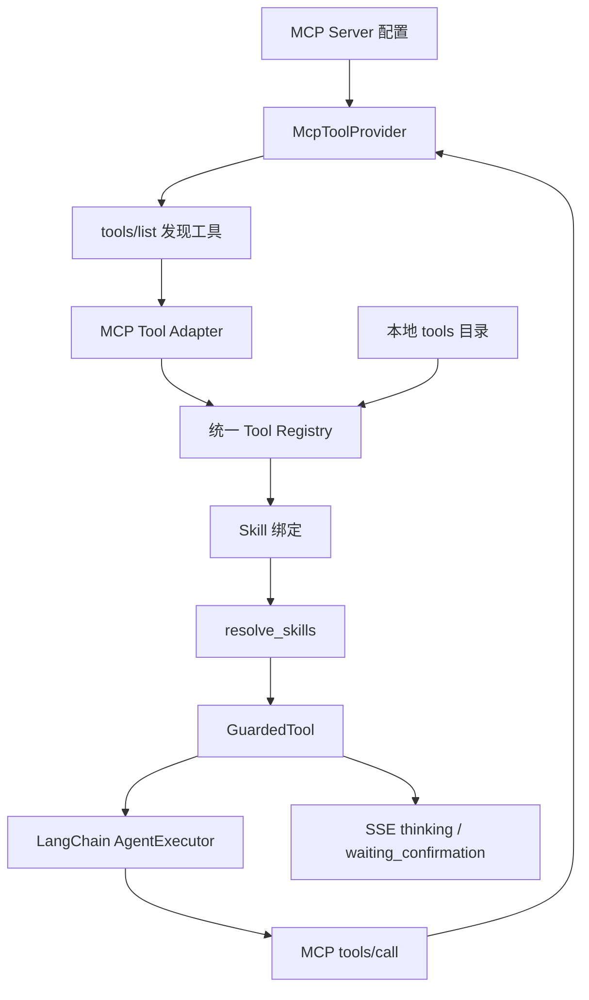

# MCP 外部工具接入开发方案

本文细化 `Doki助手` 后续接入 MCP（Model Context Protocol）的开发方案。目标不是把 MCP 替代当前 Skill/Tool 体系，而是把 MCP 作为新的外部工具来源接入现有 Agent 运行时，让外部工具同样经过权限、风险确认、预算、超时、输出截断和 SSE 观测。

## 目标边界

### 目标

- 支持配置一个或多个 MCP server。
- 支持发现 MCP server 暴露的 tools，并展示到工具库。
- 支持将 MCP tool 适配为内部 `ToolDefinition`。
- 支持 Skill 绑定 MCP tool。
- 支持 Agent 调用 MCP tool。
- MCP tool 统一走 `GuardedTool`，复用现有高风险确认、超时、输出截断和调用次数预算。
- MCP 工具调用过程进入现有 SSE thinking 事件。

### 非目标

- 不用 MCP 替代本地 `backend/app/agent/tools/*` 工具体系。
- 不在首版开放 Shell、文件系统、数据库写入类 MCP 工具。
- 不在首版实现复杂多租户 RBAC。
- 不在首版做 MCP marketplace 或自动安装第三方 server。
- 不让前端编辑 MCP 工具执行代码。

## 当前可复用基础

当前项目已经具备接入 MCP 的关键底座：

```text
backend/app/router/chat.py
  -> resolve_skills
  -> build_chat_system_prompt
  -> get_agent_stream_response

backend/app/agent/skill_registry.py
  -> ToolDefinition
  -> SkillDefinition
  -> resolve()

backend/app/agent/tool_guard.py
  -> GuardedTool
  -> max_tool_calls
  -> requires_confirmation
  -> timeout_seconds
  -> max_output_chars

backend/app/agent/agent.py
  -> AgentExecutor.astream_events(version="v2")
  -> tool_start / tool_end / tool_error thinking

front/src/pages/ToolManager.tsx
  -> 风险等级
  -> 二次确认
  -> 超时秒数
  -> 最大输出字符数
```

因此 MCP 的最佳接入点是 `ToolDefinition` 之前：先把外部 MCP tool 转成统一内部工具定义，再交给现有 `resolve_skills -> GuardedTool -> AgentExecutor` 链路。

## 总体架构



核心原则：

- 本地工具和 MCP 工具在 Agent 看来都是 LangChain `BaseTool`。
- 本地工具和 MCP 工具在前端看来都属于工具库，但需要显示来源。
- MCP server 的连接、发现和调用由独立 provider 层负责。
- 所有真正执行前的安全控制仍由 `GuardedTool` 负责。

## 后端改动细化

### 1. 新增 MCP 配置

建议新增：

```text
backend/app/config/mcp.yaml
```

配置示例：

```yaml
servers:
  - id: notes_helper
    label: Notes Helper
    enabled: false
    transport: stdio
    command: node
    args:
      - ./mcp-servers/notes-helper/index.js
    env: {}
    allow_tools: []
    deny_tools: []
    default_risk_level: medium
    default_requires_confirmation: true
    timeout_seconds: 30
    max_output_chars: 4000

  - id: browser_readonly
    label: Browser Readonly
    enabled: false
    transport: http
    url: http://127.0.0.1:9100/mcp
    allow_tools:
      - get_page_text
    deny_tools: []
    default_risk_level: medium
    default_requires_confirmation: false
    timeout_seconds: 30
    max_output_chars: 8000
```

首版建议只支持：

- `stdio`
- `http` 或 `sse` 二选一，按所选 MCP SDK 能力确定
- `enabled`
- `allow_tools`
- `deny_tools`
- 默认风险字段

后续再迁移到数据库配置。

### 2. 新增 MCP provider 层

建议新增目录：

```text
backend/app/agent/mcp/
  __init__.py
  config.py
  provider.py
  adapter.py
  registry.py
```

职责拆分：

| 文件 | 职责 |
|------|------|
| `config.py` | 读取和校验 `mcp.yaml` |
| `provider.py` | 管理 MCP client 连接、工具发现、工具调用 |
| `adapter.py` | 把 MCP tool schema 转成 LangChain `BaseTool` |
| `registry.py` | 缓存发现结果，提供 refresh 和 catalog |

建议核心接口：

```python
class McpToolProvider:
    async def list_tools(self, server_id: str) -> list[McpToolInfo]:
        ...

    async def call_tool(self, server_id: str, tool_name: str, arguments: dict) -> object:
        ...

    async def close(self) -> None:
        ...
```

首版可以按需连接，不必启动时连接所有 server。避免一个外部 server 卡住 FastAPI 启动。

### 3. 扩展 ToolDefinition 元数据

建议扩展 `ToolDefinition`：

```python
source: str = "local"  # local | mcp
provider_id: str | None = None
external_name: str | None = None
enabled: bool = True
read_only: bool = False
```

`to_public_dict()` 增加：

```json
{
  "source": "mcp",
  "provider_id": "notes_helper",
  "external_name": "search_notes",
  "enabled": false,
  "read_only": false
}
```

说明：

- `id` 仍是内部唯一 ID，建议格式：`mcp_{server_id}_{tool_name}`。
- `external_name` 保留 MCP 原始工具名。
- `provider_id` 指向 MCP server。
- `enabled=false` 时不可被 Skill 绑定，也不可被 Agent 调用。

### 4. 统一 ToolRegistry

当前 `ToolRegistry._load_tools()` 只扫描本地目录。建议拆成两类来源：

```text
LocalToolSource
McpToolSource
```

伪流程：

```text
ToolRegistry.reload()
  -> load local tools
  -> load enabled MCP tool metadata
  -> merge by id
  -> duplicate id hard fail
```

合并规则：

- 本地工具优先保留当前行为。
- MCP 工具 ID 必须加 `mcp_` 前缀，避免和本地工具冲突。
- MCP 工具默认不进入 default tool。
- MCP server disabled 时，其工具不返回给 `resolve_skills`，但管理接口可返回“已配置但不可用”的状态。

### 5. MCP tool 适配为 LangChain BaseTool

MCP tool 需要包装成 LangChain 可调用工具。建议做一个 `McpLangChainTool`：

```python
class McpLangChainTool(BaseTool):
    server_id: str
    external_name: str
    provider: McpToolProvider

    async def _arun(self, **kwargs) -> str:
        result = await self.provider.call_tool(
            self.server_id,
            self.external_name,
            kwargs,
        )
        return normalize_mcp_result(result)
```

注意点：

- 参数 schema 来自 MCP `inputSchema`，要转为 Pydantic schema。
- 结果需要标准化为字符串或结构化 JSON 字符串。
- MCP 返回的二进制、图片、资源链接首版可以降级为摘要描述，不直接透传到模型。
- 所有异常应转换成结构化错误，便于 SSE `tool_error` 展示。

### 6. 确认续跑支持 MCP

当前确认续跑在 `get_confirm_action_stream_response()` 中通过 `tool_registry.get(tool_id)` 找到原工具并执行。只要 MCP tool 进入统一 registry，这条链路可以复用。

需要补充：

- pending action 中记录 `source/provider_id/external_name`，方便审计和诊断。
- 确认后仍走原始 inner tool，而不是绕过 MCP provider。
- MCP 工具确认执行时也设置 `current_user_id/current_session_id` 上下文。

### 7. 新增 MCP 管理路由

建议新增：

```text
backend/app/router/mcp_router.py
```

首版接口：

| 方法 | 路径 | 权限 | 说明 |
|------|------|------|------|
| GET | `/api/mcp/servers` | 登录 | 查看 MCP server 状态 |
| POST | `/api/mcp/servers/refresh` | 管理员 | 重新发现所有启用 server 的工具 |
| POST | `/api/mcp/servers/{server_id}/refresh` | 管理员 | 重新发现单个 server |
| GET | `/api/mcp/tools` | 登录 | 查看 MCP 工具 catalog |
| POST | `/api/mcp/tools/{tool_id}/test` | 管理员 | 使用样例参数测试工具 |
| PATCH | `/api/mcp/tools/{tool_id}` | 管理员 | 更新启用状态、风险、确认、超时、输出限制 |

首版不建议开放通过 Web 创建任意 stdio command。stdio command 应先走配置文件，避免把远程命令执行入口暴露到页面。

### 8. FastAPI 生命周期

在 `backend/main.py` 中：

- startup 不强制连接所有 MCP server。
- shutdown 调用 provider close，清理子进程或连接。
- MCP refresh 接口按需触发连接和发现。

这样即使 MCP server 缺失，主聊天、知识库、记忆中心也能正常启动。

## 前端改动细化

### 1. API 类型扩展

在 `front/src/api/chat.ts` 的 `ChatTool` 和 `ToolDetail` 增加：

```ts
source?: 'local' | 'mcp'
provider_id?: string
external_name?: string
enabled?: boolean
read_only?: boolean
server_status?: 'enabled' | 'disabled' | 'offline' | 'error'
last_error?: string
```

### 2. endpoints 增加 MCP 路由

在 `front/src/api/endpoints.ts` 增加：

```ts
mcpServers: '/api/mcp/servers',
mcpRefreshAll: '/api/mcp/servers/refresh',
mcpRefreshServer: (id: string) => `/api/mcp/servers/${id}/refresh`,
mcpTools: '/api/mcp/tools',
mcpToolTest: (id: string) => `/api/mcp/tools/${id}/test`,
mcpToolUpdate: (id: string) => `/api/mcp/tools/${id}`,
```

### 3. ToolManager 展示来源和状态

工具库页面需要区分：

- 本地工具：可编辑 `TOOL.md` 和基础信息。
- MCP 工具：不可编辑执行代码，只能编辑启用状态、风险等级、确认要求、超时和输出限制。

建议 UI 字段：

```text
来源：本地 / MCP
Server：notes_helper
外部工具名：search_notes
状态：启用 / 禁用 / 离线 / 错误
只读：是 / 否
风险等级
需要确认
超时秒数
最大输出字符数
```

### 4. SkillManager 支持绑定 MCP tool

Skill 绑定工具时，工具列表展示来源标签：

```text
[本地] 搜索笔记
[MCP] Browser Readonly / get_page_text
```

禁用或离线的 MCP tool 不应可选；已经绑定但后来离线的工具要显示警告。

### 5. AIChat thinking 展示优化

MCP 工具事件沿用：

- `tool_start`
- `tool_end`
- `tool_error`
- `waiting_confirmation`

`details` 建议增加：

```json
{
  "source": "mcp",
  "provider_id": "notes_helper",
  "external_name": "search_notes"
}
```

前端 thinking 区可以显示来源，便于用户理解外部工具调用。

## 权限与安全策略

### 默认策略

- MCP server 默认 `enabled: false`。
- MCP tool 默认 `enabled: false`。
- 文件系统、Shell、数据库写入、浏览器自动化类工具默认禁用。
- 未进入 allowlist 的 MCP tool 不进入 Agent 可用工具。
- MCP tool 默认 `risk_level: medium`。
- 涉及写入、删除、外部发送、命令执行的 MCP tool 必须 `requires_confirmation: true`。

### 风险分级建议

| 类型 | risk_level | requires_confirmation |
|------|------------|-----------------------|
| 只读查询、状态读取 | low | false |
| 外部网页读取、跨服务查询 | medium | false 或 true |
| 创建、更新、删除本地数据 | high | true |
| 文件系统写入 | high | true |
| Shell / 进程执行 | high | true |
| 数据库写入 | high | true |
| 发送邮件、消息、Webhook | high | true |

### 审计建议

首版至少在日志中记录：

- `run_id`
- `user_id`
- `session_id`
- `tool_id`
- `source`
- `provider_id`
- `external_name`
- `risk_level`
- `requires_confirmation`
- `confirmed`
- `elapsed_ms`
- `status`

后续可升级为数据库审计表。

## 数据结构建议

首版可以用配置文件 + 运行时缓存。进入稳定期后建议增加数据库表：

```text
mcp_servers
  id
  label
  transport
  command / url
  enabled
  config_json
  created_at
  updated_at

mcp_tools
  id
  server_id
  external_name
  label
  description
  input_schema_json
  enabled
  risk_level
  requires_confirmation
  timeout_seconds
  max_output_chars
  last_seen_at
  last_error
  created_at
  updated_at
```

数据库化后，`mcp.yaml` 可只保留 bootstrap 配置。

## 分阶段实施计划

### 阶段 0：技术选型验证

任务：

- 确认 Python MCP client SDK。
- 跑通一个最小 readonly MCP server。
- 验证 stdio/http 连接方式。
- 验证 tool schema 到 Pydantic schema 的转换。

验收：

- 后端脚本能列出 MCP tools。
- 后端脚本能调用一个只读 MCP tool。
- MCP server 不存在时不会影响 FastAPI 启动。

### 阶段 1：只读发现和 catalog

任务：

- 新增 `mcp.yaml`。
- 新增 provider/config/registry。
- 新增 `/api/mcp/servers`、`/api/mcp/tools`、refresh 接口。
- Tool catalog 返回 MCP 工具来源字段。

验收：

- 前端或 API 能看到 MCP server 状态。
- 能刷新 MCP tool 列表。
- 本地 tools catalog 不受影响。

### 阶段 2：统一 ToolDefinition 适配

任务：

- 扩展 `ToolDefinition` 来源字段。
- 实现 `McpLangChainTool`。
- `ToolRegistry` 合并本地工具和启用的 MCP 工具。
- MCP tool 默认 disabled，不参与默认 Skill。

验收：

- `resolve_skills(..., tool_ids=[mcp_tool_id])` 能得到 LangChain tool。
- 禁用 MCP tool 不可被 resolve。
- 本地工具测试不变。

### 阶段 3：Skill 绑定和 Agent 调用

任务：

- SkillManager 支持选择 MCP tool。
- chat 请求可传 MCP tool id。
- Agent 可以调用 MCP tool。
- thinking 事件带 `source/provider_id/external_name`。

验收：

- 用户选择绑定了 MCP tool 的 Skill 后，Agent 能调用只读 MCP tool。
- MCP 工具调用显示 `tool_start/tool_end/tool_error`。
- MCP 调用失败时，SSE 返回结构化错误，不中断整个服务。

### 阶段 4：风险控制和确认闭环

任务：

- MCP tool 元数据支持风险、确认、超时、输出截断。
- 高风险 MCP tool 走 `waiting_confirmation`。
- 确认后通过 `/chat/agent/confirm` 执行 MCP tool。
- pending action 记录 MCP 来源信息。

验收：

- 高风险 MCP tool 不会静默执行。
- 用户确认后才调用外部 MCP server。
- 拒绝后不调用 MCP server。
- 超时和输出截断生效。

### 阶段 5：管理页和诊断

任务：

- ToolManager 增加来源、server 状态、启用状态。
- 增加 refresh 和 test 按钮。
- 增加 last_error 展示。
- 增加只读/高风险标签。

验收：

- 管理员能刷新 MCP 工具。
- 管理员能测试 MCP 工具。
- 普通用户只能查看可用工具和选择 Skill。
- 离线 server 不影响本地工具。

## 测试计划

### 后端单元测试

- `mcp.yaml` 解析和默认值。
- server disabled 时不发现工具。
- allowlist / denylist 过滤。
- MCP tool id 生成和冲突检测。
- MCP schema 到 Pydantic schema 转换。
- MCP result 标准化。
- MCP 调用异常转结构化错误。

### 后端集成测试

- refresh 后 catalog 包含 MCP tool。
- disabled MCP tool 不进入 `resolve_skills`。
- enabled MCP tool 可以被 Agent 调用。
- 高风险 MCP tool 触发 pending action。
- confirm 后执行原 MCP tool。
- MCP server 超时后返回 `tool_error`。

### 前端测试

- ToolManager 正确显示本地/MCP 来源。
- MCP 工具禁用时不可绑定。
- MCP 工具离线时显示警告。
- waiting confirmation 仍能确认/取消。

### 回归测试

- 本地工具 catalog 不变。
- 记忆中心高风险删除确认不变。
- RAG 工具调用不变。
- 未配置 MCP 时聊天主链路可用。

## 验收清单

- 未配置 MCP 时，项目行为与当前一致。
- MCP server 关闭时，FastAPI 可正常启动。
- MCP tool 可发现、可禁用、可选择、可观察。
- MCP tool 可绑定 Skill，并被 Agent 调用。
- 高风险 MCP tool 必须二次确认。
- MCP tool 调用受 `max_tool_calls`、`timeout_seconds`、`max_output_chars` 约束。
- MCP 工具错误不会破坏 SSE 流。
- 文件系统、Shell、数据库类 MCP 工具默认关闭。

## 推荐落地顺序

1. 先做只读 provider 和 refresh catalog。
2. 再做 `ToolDefinition` 来源字段和 registry 合并。
3. 再接入 Agent 调用只读 MCP tool。
4. 再补高风险确认和 pending action 来源字段。
5. 最后做前端管理、测试调用和诊断。

这条顺序可以保证每一步都能独立回归，并且不会在早期把高风险外部能力直接暴露给 Agent。
