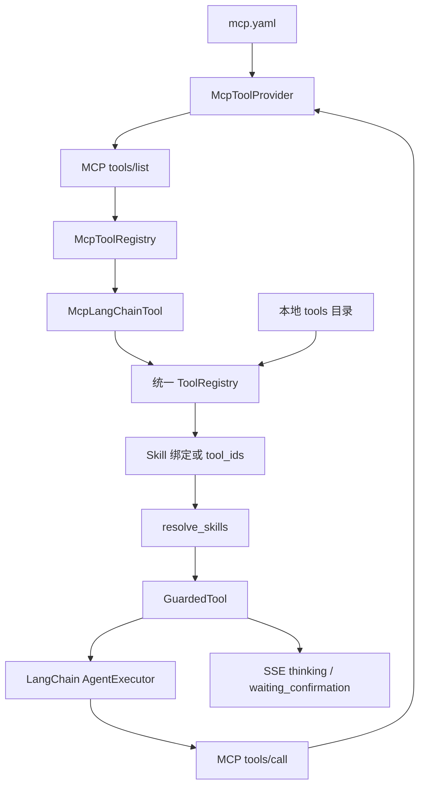

# MCP 外部工具接入现状与使用指南

本文记录当前 MCP（Model Context Protocol）接入方式、与本地 Tool 的差异、测试 MCP server 写法以及后续剩余工作。当前目标不是用 MCP 替代本地 `backend/app/agent/tools/*`，而是把 MCP 作为新的外部工具来源接入现有 Agent 运行时。

## 当前状态

已落地：

- `backend/app/config/mcp.yaml`：MCP server bootstrap 配置，默认 `servers: []`。
- `backend/app/agent/mcp/config.py`：读取和校验 MCP 配置。
- `backend/app/agent/mcp/provider.py`：通过 MCP `tools/list` 发现工具，通过 `tools/call` 调用工具。
- `backend/app/agent/mcp/adapter.py`：把 MCP tool schema 转为 Pydantic args schema，并包装成 LangChain `BaseTool`。
- `backend/app/agent/mcp/registry.py`：缓存发现到的 MCP tools，提供 refresh 和 catalog。
- `backend/app/router/mcp_router.py`：提供 `/api/mcp/servers`、`/api/mcp/tools`、`POST /api/mcp/servers/refresh`。
- `backend/app/agent/skill_registry.py`：合并本地 tools 和已发现的 MCP tools。
- `backend/app/agent/tool_guard.py`：MCP tools 和本地 tools 一样进入调用次数、确认、超时和输出截断控制。

当前边界：

- MCP server 仍由 `mcp.yaml` 管理，尚未数据库化。
- 当前是 server 级 `enabled` 和 `allow_tools` / `deny_tools`，尚未持久化 tool 级启用状态。
- ToolManager 已能只读展示 MCP 来源、server、外部工具名和错误信息，但完整 MCP refresh、test、启用/禁用 UI 尚未补齐。
- 高风险确认后的直接执行路径仍需进一步统一超时和输出截断策略。

## 总体架构



核心原则：

- 本地 Tool 和 MCP Tool 在 Agent 看来都是 LangChain `BaseTool`。
- 本地 Tool 和 MCP Tool 都进入统一 `ToolDefinition`。
- MCP 的连接、发现和调用由 provider 层负责。
- 工具真正执行前的预算、确认、超时和输出限制由 `GuardedTool` 负责。

## 本地 Tool 与 MCP Tool 的区别

| 类型 | 注册来源 | 执行位置 | 适合场景 |
|------|----------|----------|----------|
| 本地 Tool | `backend/app/agent/tools/<tool_id>/tool.yaml` | FastAPI 后端进程内 | 访问内部服务、数据库、知识库、笔记、记忆中心 |
| MCP Tool | `backend/app/config/mcp.yaml` 指向的 MCP server | 外部 MCP server | 浏览器、桌面应用、文件系统、第三方服务、跨语言工具 |

本地 Tool 目录结构：

```text
backend/app/agent/tools/<tool_id>/
  __init__.py
  tool.yaml
  TOOL.md
  tool.py
```

MCP Tool 配置入口：

```text
backend/app/config/mcp.yaml
```

进入 Agent 后二者共用同一条链路：

```text
本地 Tool / MCP Tool
  -> ToolDefinition
  -> Skill 绑定或显式 tool_ids
  -> GuardedTool
  -> AgentExecutor
```

## MCP 配置

配置文件：

```text
backend/app/config/mcp.yaml
```

字段说明：

| 字段 | 说明 |
|------|------|
| `id` | MCP server 内部 ID，用于生成工具 ID |
| `label` | 展示名 |
| `enabled` | 是否启用该 server |
| `transport` | `stdio`、`sse`、`http` 或 `streamable_http` |
| `command` / `args` | stdio server 启动命令 |
| `url` | SSE 或 streamable HTTP server 地址 |
| `allow_tools` | 只允许这些 MCP 原始工具名进入 catalog；空列表表示不限制 |
| `deny_tools` | 禁止这些 MCP 原始工具名进入 catalog |
| `default_risk_level` | MCP tools 默认风险等级 |
| `default_requires_confirmation` | 默认是否需要二次确认 |
| `timeout_seconds` | 单次工具调用超时 |
| `max_output_chars` | 工具输出最大字符数 |

示例：

```yaml
servers:
  - id: doki_test
    label: Doki Test MCP
    enabled: true
    transport: stdio
    command: python
    args:
      - mcp_servers/echo_server.py
    env: {}
    allow_tools:
      - echo
      - add
    deny_tools: []
    default_risk_level: low
    default_requires_confirmation: false
    timeout_seconds: 10
    max_output_chars: 2000
```

发现后的内部工具 ID 规则：

```text
mcp_<server_id>_<tool_name>
```

例如：

```text
mcp_doki_test_echo
mcp_doki_test_add
```

传给 LangChain 的 tool name 会再加 `_tool`：

```text
mcp_doki_test_echo_tool
```

## 写一个测试 MCP 工具

最省事的测试方式是 stdio server。新建：

```text
backend/mcp_servers/echo_server.py
```

内容：

```python
from mcp.server.fastmcp import FastMCP
from mcp.types import ToolAnnotations


mcp = FastMCP("Doki Test MCP")


@mcp.tool(
    description="Echo a message back for MCP integration testing.",
    annotations=ToolAnnotations(readOnlyHint=True),
)
def echo(message: str) -> str:
    return f"echo: {message}"


@mcp.tool(
    description="Add two integers for MCP integration testing.",
    annotations=ToolAnnotations(readOnlyHint=True),
)
def add(a: int, b: int) -> str:
    return str(a + b)


if __name__ == "__main__":
    mcp.run("stdio")
```

`readOnlyHint=True` 会被后端识别为只读工具。只读工具在 `default_requires_confirmation: true` 时也会被放宽为不需要确认。

然后配置 `mcp.yaml`：

```yaml
servers:
  - id: doki_test
    label: Doki Test MCP
    enabled: true
    transport: stdio
    command: python
    args:
      - mcp_servers/echo_server.py
    env: {}
    allow_tools:
      - echo
      - add
    deny_tools: []
    default_risk_level: low
    default_requires_confirmation: false
    timeout_seconds: 10
    max_output_chars: 2000
```

刷新发现：

```powershell
cd backend
uv run python -c "import asyncio; from app.agent.mcp.registry import mcp_tool_registry; print(asyncio.run(mcp_tool_registry.refresh()))"
```

启动后端后也可以通过 API 刷新：

```text
POST /api/mcp/servers/refresh
GET  /api/mcp/tools
```

在 chat 请求里显式使用工具：

```json
{
  "query": "调用 echo 测试一下，内容是 hello",
  "tool_ids": ["mcp_doki_test_echo"]
}
```

或在 SkillManager 中把 `mcp_doki_test_echo` 绑定到某个 Skill。

## 调用流程细节

发现：

```text
FastAPI startup 或 POST /api/mcp/servers/refresh
  -> McpToolRegistry.refresh()
  -> McpToolProvider.discover_tools()
  -> session.list_tools()
  -> allow_tools / deny_tools 过滤
  -> 生成 McpToolSpec
  -> skill_registry.reload()
  -> ToolRegistry 合并 MCP tools
```

调用：

```text
Agent 选择 mcp_doki_test_echo_tool
  -> GuardedTool._arun()
  -> 预算、确认、超时、输出限制
  -> McpLangChainTool._arun()
  -> McpToolProvider.call_tool()
  -> MCP session.call_tool()
  -> normalize_mcp_result()
```

stdio transport 当前每次发现和调用都会新建 MCP session。测试工具很适合这样跑；如果是重型工具或常驻服务，建议改用 `streamable_http`。

## API

| 方法 | 路径 | 权限 | 说明 |
|------|------|------|------|
| GET | `/api/mcp/servers` | 登录 | 查看配置中的 MCP server 状态 |
| GET | `/api/mcp/tools` | 登录 | 查看已发现的 MCP tools |
| POST | `/api/mcp/servers/refresh` | 管理员 | 重新发现所有启用 server 的 tools，并 reload Skill/Tool registry |

当前尚未实现：

- `POST /api/mcp/tools/{tool_id}/test`
- `PATCH /api/mcp/tools/{tool_id}`
- 单 server refresh
- Web 端创建 MCP server 配置

## 安全策略

默认建议：

- `mcp.yaml` 中未配置 server 时，系统行为与本地工具模式一致。
- MCP server 默认应保持 `enabled: false`，确认可信后再开启。
- 文件系统、Shell、数据库写入、浏览器自动化、外部发送类工具必须显式 allowlist。
- 写入、删除、命令执行和外部发送类工具应设置：

```yaml
default_risk_level: high
default_requires_confirmation: true
```

风险分级建议：

| 类型 | risk_level | requires_confirmation |
|------|------------|-----------------------|
| 只读查询、状态读取 | low | false |
| 外部网页读取、跨服务查询 | medium | false 或 true |
| 创建、更新、删除本地数据 | high | true |
| 文件系统写入 | high | true |
| Shell / 进程执行 | high | true |
| 数据库写入 | high | true |
| 发送邮件、消息、Webhook | high | true |

## 依赖与重建

后端依赖已经包含：

```toml
mcp>=1.9.0
uvicorn>=0.31.1,<0.50.0
```

当前锁定版本：

```text
mcp==1.28.0
uvicorn==0.49.0
```

重建命令：

```powershell
cd backend
uv lock
uv sync
uv pip compile pyproject.toml -o requirements.txt
uv run python -c "from importlib.metadata import version; import uvicorn; print('mcp', version('mcp')); print('uvicorn', uvicorn.__version__)"
```

## Skill 启用与意图路由

聊天页支持同时启用多个 Skill。多个 `skill_ids` 进入后端后，会先被解析成一组可用工具，再交给同一个 LangChain Agent 使用；当前实现不是为每个 Skill 启动独立 Agent，也不是并行执行多个 Skill。

当前请求链路：

```text
front selectedSkillIds
  -> /chat/agent/query/stream skill_ids
  -> route_skills(query, candidate_skill_ids)
  -> resolve_skills()
  -> 合并 Skill 绑定的 tools
  -> Agent 按需顺序调用工具
```

需要注意：

- 前端会把聊天页 Skill 选择保存到 `localStorage.ai_chat_skill_ids`。如果上次只勾选了 `mcp_smoke_test`，后续请求也只会发送该 Skill，直到用户重新勾选或清理本地存储。
- 后端 `intent_router.route_skills()` 会在已选 Skill 集合内做收窄。命中 `mcp`、连通测试、smoke test 等关键词时，本轮可能只保留 `mcp_smoke_test`。
- 显式传入 `tool_ids` 时，后端视为精确工具控制，会跳过 Skill 预路由。
- 如果日常对话不希望默认携带 MCP 连通性测试，可以把 `backend/app/agent/skills/mcp_smoke_test/skill.yaml` 中的 `default` 改为 `false`。

排查“只能调用 MCP 一个 Skill”时，优先检查：

1. 聊天页 Skill 面板是否只勾选了 MCP。
2. 浏览器 `localStorage.ai_chat_skill_ids` 是否只保存了 `["mcp_smoke_test"]`。
3. 用户输入是否命中了 MCP 连通性测试关键词。
4. 请求体是否传了显式 `tool_ids`。

## 当前 Smoke Test Server

当前项目内置了一个只读 smoke test server：

```text
backend/mcp_servers/powershell_ls_server.py
```

默认配置位于：

```text
backend/app/config/mcp.yaml
```

它暴露 `list_project_files`，用于验证 MCP stdio server 能否被发现和调用。该工具只允许列出项目目录内文件，不接受任意 PowerShell 命令，不做写入、删除或项目外路径访问。

推荐验证命令：

```powershell
cd backend
uv run python -c "import asyncio; from app.agent.mcp.registry import mcp_tool_registry; print([t.to_public_dict() for t in asyncio.run(mcp_tool_registry.refresh())])"
```

stdio server 的 `command: python` 会启动一个新的子进程。这个子进程使用的 Python 环境必须能 import `mcp`。如果直接运行后端 venv 的 `python`，但子进程 PATH 指向系统 Python，就可能出现：

```text
ModuleNotFoundError: No module named 'mcp'
```

解决方式：

- 优先通过 `uv run ...` 启动后端和验证命令，让子进程继承正确环境。
- 或把 `mcp.yaml` 中 stdio server 的 `command` 改为明确的虚拟环境 Python 路径。
- 或在 `env` 中补齐子进程所需环境变量。

## 后续计划

优先级：

1. ToolManager 增加 MCP refresh、test、last_error 和只读/高风险标签。
2. MCP tool 级启用/禁用、风险等级、确认要求、超时和输出限制持久化。
3. 高风险 MCP 工具确认后仍走统一 wrapper 或等价的超时/截断路径。
4. 单 server refresh 和 MCP tool test API。
5. MCP 调用审计记录，至少包含 `run_id/user_id/session_id/tool_id/source/provider_id/external_name/risk_level/status`。
6. 文件系统、Shell、数据库写入类 MCP server 的默认关闭和配置审查。

回归要求：

- 未配置 MCP 时聊天主链路可用。
- MCP server 离线时本地 tools catalog 和 Agent 不受影响。
- MCP 调用失败时返回结构化错误，不破坏 SSE 流。
- 本地工具和记忆中心高风险确认行为保持不变。
