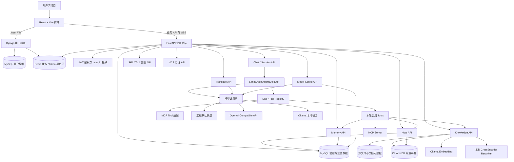

# 项目发展与当前架构

本文记录项目从基础 RAG 到个人 Agent 平台的演进，并按当前代码说明真实运行链路。

## 演进阶段

### 阶段一：基础 RAG 服务

最早版本是 FastAPI + LangChain + ChromaDB 的 RAG 演示：

```text
文档上传 -> 文档切片 -> 向量化 -> 检索 -> LLM 生成
```

这条基础链路保留在 `base-rag` 分支，适合学习最小 RAG 服务。

### 阶段二：RAG NoteBook

项目随后围绕“笔记写了以后如何再利用”扩展：

- Markdown 笔记管理
- LLM 自动标签
- 语义搜索
- 笔记与知识库关联推荐
- 复习/回顾
- AI 写作辅助

这一阶段的核心变化是：RAG 不再只服务上传文档问答，也开始成为笔记搜索、关联推荐和写作辅助的知识底座。

### 阶段三：个人 Agent 平台

当前 `master` 已经转向个人 Agent 工作台：

- 多模型配置与选择
- AI 对话模式
- Skill/Tool 注册和前端选择
- MCP 外部工具接入骨架
- Tool 风险元数据
- 管理员保护的 Skill/Tool 管理接口
- 结构化 Agent thinking 事件
- 运行预算和停止原因
- 会话摘要压缩
- 记忆中心
- 知识库 RAG
- 笔记系统
- 实时翻译
- 会话持久化

当前定位不是“单一笔记应用”，而是“以 RAG、记忆和工具调用为核心的个人 Agent 平台”。

## 当前系统架构

当前系统是前后端分离的 Web 工作台：

- React + Vite 提供工作台界面，并通过 Vite proxy 按路径转发到后端服务。
- Django 用户服务负责登录、注册、用户资料和文件入口，生成 JWT，并使用 Redis 做用户缓存和 token 黑名单。
- FastAPI 业务后端负责 Agent 对话、会话、知识库、笔记、记忆中心、模型配置、实时翻译、Skill/Tool 管理以及 MCP 外部工具发现和调用。
- FastAPI 不重新实现登录注册，而是解析 Django JWT 得到 `user_id`，再按 `user_id` 隔离会话、笔记、知识库、记忆和模型配置。



主要组件：

- `front/src/pages/AIChat.tsx`：对话页，负责模型、AI 模式、Skill、策略菜单、消息刷新和删除。
- `front/src/pages/KnowledgeBase.tsx`：知识库页面，负责文档导入、源文件查看、切片查看、Embedding 切换和 Reranker 切换。
- `front/src/pages/NoteList.tsx` / `front/src/pages/NoteEditor.tsx`：笔记列表、编辑、分类标签、AI 写作辅助和相关片段推荐。
- `front/src/pages/MemoryCenter.tsx`：记忆中心页面，管理复习、待办、提醒、长期事项和备忘。
- `front/src/pages/RealtimeTranslate.tsx`：实时翻译页面，支持对话式翻译和整篇文本翻译。
- `front/src/pages/ModelSettings.tsx`：用户模型配置、测试和 Ollama 模型读取。
- `front/src/pages/ToolManager.tsx`：工具库管理，支持风险等级、确认、超时和输出限制字段。
- `front/src/pages/ToolManager.tsx`：工具库管理，支持风险等级、确认、超时、输出限制和 MCP 来源展示。
- `front/vite.config.ts`：开发环境代理配置，将 `/user`、`/file` 转发到 Django，将业务 API 转发到 FastAPI。
- `backend/app/router/chat.py`：Agent 对话入口、prompt 拼接、skill 预路由和 SSE 返回。
- `backend/app/router/knowledge_router.py`：知识库上传、源文件、切片、Embedding 和 Reranker 配置接口。
- `backend/app/router/note_router.py`：笔记 CRUD、搜索、自动标签、相关片段和 AI 写作接口。
- `backend/app/router/model_config_router.py`：用户模型配置、系统默认模型、模型测试和 Ollama 模型列表接口。
- `backend/app/router/translate.py`：实时翻译接口。
- `backend/app/agent/agent.py`：创建 LangChain tool calling Agent，执行工具并推送结构化 thinking。
- `backend/app/agent/skill_registry.py`：扫描 Skill/Tool 文件模块，合并启用的 MCP tools，读取 Tool 风险元数据。
- `backend/app/agent/mcp/config.py`：读取 `backend/app/config/mcp.yaml`，解析 MCP server 配置。
- `backend/app/agent/mcp/provider.py`：负责 MCP tools/list 发现和 tools/call 调用。
- `backend/app/agent/mcp/adapter.py`：把 MCP tool schema 适配成 LangChain `BaseTool`。
- `backend/app/agent/mcp/registry.py`：缓存 MCP 工具发现结果，提供 refresh 和 catalog。
- `backend/app/router/mcp_router.py`：提供 `/api/mcp/servers`、`/api/mcp/tools`、`/api/mcp/servers/refresh`。
- `backend/app/agent/intent_router.py`：从用户已选 Skill 中做本轮预路由。
- `backend/app/services/database_session_manager.py`：会话、消息、上下文裁剪、摘要压缩、刷新覆盖和删除。
- `backend/app/config/security.yaml`：管理员名单配置。
- `backend/app/config/agent.yaml`：Agent 运行预算配置。
- `backend/app/rag/rag_service.py`：RAG 检索、笔记召回、摘要生成和动态检索数量。
- `backend/app/router/memory_router.py`：记忆中心 API。

## Prompt 拼接方式

当前 prompt 拼接在 `backend/app/router/chat.py#build_chat_system_prompt` 中完成。

系统提示词拼接顺序：

```text
1. main_prompt
2. 当前启用 Skill 的 SKILL.md 内容
3. 本次可用工具名称列表
4. 当前 AI 模式 prompt（非 main_prompt 时追加）
```

进入 AgentExecutor 的消息结构：

```text
system prompt
  -> conversation_summary（Auto 长会话时）
  -> recent_messages
  -> current_user_input
  -> agent_scratchpad
```

注意：

- `TOOL.md` 不直接拼进 `system_prompt`，而是覆盖 LangChain tool description，让模型在 tool calling schema 中看到工具说明。
- MCP tool 的描述来自外部 MCP server 的 `tools/list`，会被包装成 LangChain tool description。
- 用户未手动选择 Skill 时，后端使用 registry 中的默认 Skill。
- 用户手动选择 Skill 后，后端只在这些 Skill 内做预路由，不会自动引入未选择能力。
- 如果请求显式传 `tool_ids`，会按精确工具控制跳过 skill 预路由。

## Agent 执行流程

```text
前端发送消息
  -> POST /chat/agent/query/stream
  -> JWT 鉴权得到 user_id
  -> 读取模型配置
  -> 确认 prompt_type
  -> 解析候选 Skill
  -> intent_router 预路由
  -> resolve_skills 得到 Skill prompt 和 Tool 实例
  -> build_chat_system_prompt
  -> get_agent_stream_response
  -> Auto 长会话：summary + 最近 6 轮
  -> 非 Auto 或短会话：按策略裁剪历史
  -> create_tool_calling_agent
  -> AgentExecutor.astream_events(version="v2")
  -> thinking / waiting_confirmation / response / done SSE
  -> 保存 user + assistant 消息
```

当前回答流式方式：

- thinking 事件会在 Agent 执行时实时推送。
- 工具调用通过 `astream_events` 形成真实的 `tool_start / tool_end / tool_error` thinking 事件。
- MCP 工具调用与本地工具一样进入 `GuardedTool`，再由 provider 通过 MCP `tools/call` 执行外部 server。
- RAG 工具内部还会主动推送更细的检索 thinking。
- 最终回答由 `on_chat_model_stream` 按模型 token 级实时流式推送。

## 上下文策略

前端 `策略` 二级菜单包含：

- 上下文长度：`Auto / 低 / 中 / 高 / 自定义 / 仅当前`
- RAG 检索：`Auto / 低 / 中 / 高 / 自定义`

后端上下文逻辑：

- `current_only`：不带历史。
- `custom`：按最近对话轮数保留。
- `low/medium/high`：按粗略 token 预算保留历史。
- `auto`：短会话按预算裁剪；长会话优先使用“摘要 + 最近 6 轮”。

摘要字段保存在 `ChatSession.metadata_`：

```text
summary
summary_message_id
summary_updated_at
estimated_tokens
```

摘要失败时回退到原有裁剪逻辑，不阻断聊天。

## RAG 动态检索

前端会随对话请求发送：

```json
{
  "rag_retrieval": {
    "mode": "auto",
    "knowledge_k": 6,
    "note_k": 3,
    "summary_k": 3
  }
}
```

后端通过 tool context 传入 `RagService`：

```text
chat.py
  -> agent.py set_rag_retrieval_settings
  -> rag_summary_tool
  -> RagService(retrieval_settings=...)
```

当前预设：

- low：知识库 4，笔记 2，摘要 2
- medium：知识库 6，笔记 3，摘要 3
- high：知识库 10，笔记 5，摘要 5
- custom：知识库最多 20，笔记最多 20，摘要最多 8
- auto：根据问题长度和“总结/对比/分析/全部/详细/综合”等词选择 low/medium/high

## 记忆中心状态

记忆中心已经是当前主功能之一：

- 后端模型：`MemoryItem`
- 后端服务：`memory_service`
- 后端路由：`/memory/*`
- 前端页面：`MemoryCenter`
- Agent 工具：create/list/get/update/delete/complete/postpone/archive/reviewed 等
- Skill：memory read/write/cleanup 相关 Skill

记忆类型：

- `review`
- `todo`
- `reminder`
- `long_term`
- `memo`

当前 `delete_memory` 已标记为高风险，Agent 调用时会被 `GuardedTool` 在执行前拦截、进入 `waiting_confirmation`；用户经 `POST /chat/agent/confirm` 确认后才执行删除（pending action 持久化在 Redis，带 TTL 与 `user_id` 隔离）。

## MCP 外部工具状态

MCP 当前作为外部工具来源接入现有 Skill/Tool 体系，而不是替代本地工具。配置文件位于：

```text
backend/app/config/mcp.yaml
```

当前支持的 transport：

- `stdio`
- `sse`
- `http` / `streamable_http`

发现流程：

```text
backend/app/config/mcp.yaml
  -> McpToolProvider.discover_tools()
  -> McpToolRegistry.refresh()
  -> ToolRegistry._load_mcp_tools()
  -> resolve_skills()
  -> GuardedTool
  -> AgentExecutor
```

调用流程：

```text
Agent 调用 mcp_xxx_tool
  -> GuardedTool 处理预算、确认、超时和截断
  -> McpLangChainTool._arun()
  -> McpToolProvider.call_tool()
  -> MCP tools/call
```

本地 Tool 与 MCP Tool 的差别：

| 类型 | 注册来源 | 执行位置 | 适合场景 |
|------|----------|----------|----------|
| 本地 Tool | `backend/app/agent/tools/*` | FastAPI 后端进程内 | 访问内部服务、数据库、RAG、记忆中心 |
| MCP Tool | `backend/app/config/mcp.yaml` 指向的外部 server | 外部 MCP server | 浏览器、文件系统、桌面应用、第三方服务、跨语言工具 |

当前边界：

- MCP server 默认不配置，未配置时主聊天链路不受影响。
- MCP tools 不进入默认 Skill，需要通过 Skill 绑定或显式 `tool_ids` 使用。
- MCP 工具由外部 server 提供，前端工具库当前只读展示来源、server、外部名和错误信息。
- Web 端完整的 MCP server 管理、测试调用、启用/禁用和审计后台仍待补齐。

## 权限与安全现状

已有：

- JWT Bearer 鉴权。
- 主业务路由按当前 `user_id` 隔离。
- 前端 HTTP/SSE 自动带 token。
- Skill/Tool 读取接口要求登录。
- Skill/Tool 创建、更新、删除要求管理员。
- 管理员名单维护在 `backend/app/config/security.yaml`。
- `/chat/sessions` 只返回当前用户会话。
- `/chat/reorder` 要求登录并保留限流。
- Tool 风险元数据已进入 registry 和管理页。
- `GuardedTool` 统一包装所有工具，高风险操作执行前拦截并走确认闭环。
- MCP refresh 接口要求管理员，MCP 工具进入 Agent 后复用 `GuardedTool` 风险控制。

不足：

- 还不是完整多租户 RBAC。
- 管理员仍来自配置文件和环境变量，不是数据库角色。
- 高风险操作不能只依赖 prompt 约束。

## 后续方向

详细计划见 [下一阶段开发计划](./roadmap_next.md)。当前推荐顺序：

1. 权限模型升级为数据库角色。
2. 上下文摘要边界和重复摘要控制。
3. 记忆中心主动提醒和事项提炼。
4. MCP 管理页、测试调用和审计。
5. 运行状态持久化（run 状态、停止原因、工具调用列表）。
6. 字幕/会议翻译。
7. 桌面端验证。
