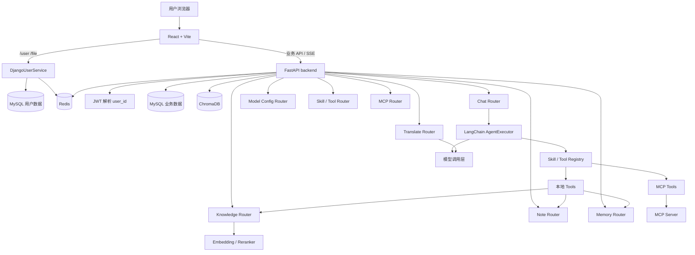

# 项目发展与当前架构

本文面向当前代码结构，说明 Doki 助手如何组织为个人 Agent 工作台。历史演进只保留必要背景；后续待办见 [下一阶段开发计划](./roadmap_next.md)。

## 当前定位

Doki 助手已经从基础 RAG 服务演进为个人 Agent 工作台。当前核心不是单一问答、单一笔记或单一翻译功能，而是把对话、知识库、笔记、记忆中心、模型配置和工具调用组织到同一套用户上下文中。

当前产品形态：

- 用户通过 React 工作台使用聊天、知识库、笔记、记忆、翻译和设置页面。
- Django 用户服务负责登录、注册、用户资料和文件入口。
- FastAPI 业务后端负责 Agent、RAG、笔记、记忆、模型配置、Skill/Tool 和 MCP。
- MySQL 保存用户、会话和业务数据。
- Redis 用于缓存、token 黑名单、限流辅助和待确认动作。
- ChromaDB 保存知识库和笔记向量索引。

## 简要演进

项目经历过三个方向：

1. 基础 RAG：文档上传、切片、向量检索和 LLM 回答。
2. RAG NoteBook：把笔记纳入搜索、关联推荐和写作辅助。
3. 个人 Agent 工作台：以对话为入口，统一 Skill/Tool、RAG、记忆、笔记和外部工具。

这些历史解释了当前代码里同时存在 RAG、笔记、Agent、MCP 和记忆中心的原因。后续维护重点是收敛边界，而不是继续把新逻辑塞进旧的大文件。

## 总体架构



服务分工：

- `front/`：React 工作台。负责页面、状态、API 请求、SSE 消费、主题和国际化。
- `DjangoUserService/`：用户与文件入口。负责登录注册、用户资料、JWT 和 `/file` 路由。
- `backend/`：FastAPI 主业务。负责 Agent、业务 API、RAG、笔记、记忆、模型配置和 MCP。

## 后端结构

FastAPI 后端主要目录：

```text
backend/app/
  agent/       # Agent、Skill、Tool、MCP 适配和工具运行保护
  cache/       # Redis 辅助
  config/      # agent/security/chroma/rag/prompt/mcp 配置
  core/        # 日志、限流、响应、异常、后台初始化
  db/          # MySQL / Redis 连接
  models/      # SQLAlchemy 模型
  prompt/      # Prompt 文本
  rag/         # 文档处理、向量库、检索和重排
  router/      # FastAPI 路由
  schemas/     # Pydantic schema
  services/    # 业务服务
  utils/       # 模型、文件、路径、加密、PDF/视觉等工具
```

当前分层意图：

- `router` 负责 HTTP/SSE 入口。
- `services` 负责业务规则和数据库操作。
- `agent` 负责 Agent 运行时、Skill/Tool 注册和工具保护。
- `rag` 负责文档索引、检索和重排。
- `utils` 放通用能力，但已经有部分模块偏业务，需要后续收敛。

当前主要维护风险：

- `backend/app/agent/agent.py` 职责过重，是 Agent 运行时重构的首要目标。
- `backend/app/router/chat.py` 同时承担路由和业务编排，需要迁移到服务层。
- `backend/app/router/knowledge_service.py`、`backend/app/rag/vector_store.py`、`backend/app/rag/rag_service.py` 体量偏大，需要进一步明确边界。
- 模块级单例较多，例如 `init_manager`、`skill_registry`、`tool_registry`、`session_manager`，测试和热重载成本较高。

## 前端结构

React 前端主要目录：

```text
front/src/
  api/          # axios client、endpoint、各业务 API 封装
  components/   # 通用组件和业务组件
  hooks/        # 通用 hooks
  i18n/         # 中英文文案
  layouts/      # 主布局和认证布局
  pages/        # 页面级组件
  router/       # 路由定义
  stores/       # Zustand 状态
  types/        # 共享类型
```

当前页面：

- `AIChat.tsx`：Agent 对话、模型选择、Prompt 模式、Skill/Tool 选择、上下文策略、SSE 和确认动作。
- `KnowledgeBase.tsx`：文档上传、知识库列表、源文件、切片、Embedding 和 Reranker 设置。
- `NoteList.tsx` / `NoteEditor.tsx`：笔记列表、编辑、标签、分类、AI 写作和相关片段。
- `MemoryCenter.tsx`：复习、待办、提醒、长期事项和备忘。
- `ModelSettings.tsx`：用户模型配置、Ollama 模型读取和连接测试。
- `SkillManager.tsx` / `ToolManager.tsx`：Skill/Tool 管理、风险字段和 MCP 来源展示。
- `RealtimeTranslate.tsx`：对话式翻译和文本翻译。

当前主要维护风险：

- `AIChat.tsx`、`NoteEditor.tsx`、`ToolManager.tsx`、`KnowledgeBase.tsx` 等页面较大，页面、状态、请求和渲染耦合明显。
- 前端目前按 `pages/api/stores/components` 横向分层，功能继续增长后更适合逐步引入 `features/<domain>`。
- SSE 消费、聊天设置、Skill catalog 和消息渲染应从页面中拆出。

## 用户与认证

认证由 Django 用户服务主导：

```text
React
  -> /user/login/
  -> DjangoUserService 生成 JWT
  -> 前端保存 token
  -> 后续 HTTP/SSE 请求携带 Bearer token
  -> FastAPI 解析 JWT 得到 user_id
```

FastAPI 不重新实现登录注册，而是通过 `backend/app/utils/auth_utils.py` 解析 Django JWT。业务数据按当前 `user_id` 隔离，包括会话、笔记、知识库、记忆和模型配置。

当前权限模型：

- 普通登录用户可以使用主业务能力。
- 管理员可以创建、更新、删除 Skill/Tool，并刷新 MCP 工具。
- 管理员名单主要来自 `backend/app/config/security.yaml` 和环境变量。

后续方向是数据库角色权限和审计，见路线图 P1。

## Agent 运行链路

当前主入口：

```text
front/src/pages/AIChat.tsx
  -> POST /chat/agent/query/stream
  -> backend/app/router/chat.py
  -> backend/app/agent/intent_router.py
  -> backend/app/agent/skill_registry.py
  -> backend/app/agent/agent.py
  -> LangChain AgentExecutor
  -> SSE thinking / waiting_confirmation / response / done / error
```

简化流程：

```text
用户消息
  -> JWT 鉴权 user_id
  -> 读取模型配置
  -> 解析 prompt_type、context、rag_retrieval、skill_ids、tool_ids
  -> 在候选 Skill 内预路由
  -> resolve_skills 得到 Skill prompt 和 Tool 实例
  -> 拼接 system prompt
  -> 加载摘要和近期上下文
  -> 创建 AgentExecutor
  -> astream_events 推送工具事件和模型输出
  -> 保存或覆盖数据库消息
```

上下文策略：

- `current_only`：不带历史。
- `low/medium/high`：按 token 预算裁剪。
- `custom`：按最近轮数和 token 限制。
- `auto`：短会话裁剪，长会话使用摘要加最近窗口。

运行时控制：

- 运行预算来自 `backend/app/config/agent.yaml`。
- 工具调用次数、超时和输出截断由 `GuardedTool` 处理。
- 高风险工具会进入 pending action，等待用户确认。
- SSE thinking 事件包含运行状态、工具调用和错误信息。

## Skill 与 Tool

本地 Skill 结构：

```text
backend/app/agent/skills/<skill_id>/
  skill.yaml
  SKILL.md
```

本地 Tool 结构：

```text
backend/app/agent/tools/<tool_id>/
  tool.yaml
  TOOL.md
  tool.py
```

注册流程：

```text
SkillRegistry
  -> 扫描 skills/*
  -> 扫描 tools/*
  -> 合并 MCP tools
  -> resolve_skills(skill_ids, tool_ids)
  -> GuardedTool.wrap()
  -> AgentExecutor
```

Tool 元数据包含：

```yaml
risk_level: low | medium | high
requires_confirmation: true | false
timeout_seconds: 30
max_output_chars: 10000
```

设计边界：

- `SKILL.md` 面向 Agent，描述何时使用能力。
- `TOOL.md` 面向 LangChain tool description，描述工具参数和行为。
- `tool.py` 只实现工具执行，不应塞路由或 UI 逻辑。
- 高风险工具必须使用风险元数据，而不是只靠 prompt 约束。

## MCP 外部工具

MCP 当前作为外部工具来源接入 Skill/Tool 体系，不替代本地 Tool。

配置入口：

```text
backend/app/config/mcp.yaml
```

主要模块：

```text
backend/app/agent/mcp/config.py
backend/app/agent/mcp/provider.py
backend/app/agent/mcp/adapter.py
backend/app/agent/mcp/registry.py
backend/app/router/mcp_router.py
```

发现与调用：

```text
mcp.yaml
  -> load_mcp_servers
  -> tools/list
  -> McpToolRegistry
  -> ToolRegistry 合并
  -> GuardedTool
  -> tools/call
```

边界：

- 未配置 MCP 时主聊天链路应正常工作。
- MCP server 离线时应降级到本地工具。
- 文件系统、Shell、数据库写入、外部发送类工具默认应保守启用。
- MCP 管理、测试、持久化和审计仍是后续重点。

## RAG 与知识库

知识库链路：

```text
上传文件
  -> 保存源文件和文档元数据
  -> 文档解析
  -> 切片
  -> Embedding
  -> 写入 Chroma
  -> 查询时召回
  -> Reranker 重排
  -> 拼接上下文
  -> LLM 生成
```

主要模块：

- `backend/app/router/knowledge_router.py`：知识库 HTTP/SSE 接口。
- `backend/app/router/knowledge_service.py`：上传、任务、源文件和切片相关编排。
- `backend/app/rag/vector_store.py`：Chroma 索引、retriever 和向量库操作。
- `backend/app/rag/rag_service.py`：对话时的知识库和笔记召回、重排和摘要。
- `backend/app/rag/document_handler/processor.py`：文档解析处理。
- `backend/app/utils/pdf_multimodal_loader.py`、`vision_service.py`：PDF 多模态和视觉解析辅助。

RAG 检索策略由前端随聊天请求传入：

```json
{
  "rag_retrieval": {
    "mode": "auto",
    "knowledge_k": 6,
    "note_k": 3,
    "summary_k": 3
  }
}
```

边界：

- 知识库文档和笔记都会进入向量检索，但需要保留来源类型。
- Embedding 和 Reranker 配置不应污染 Chat 路由。
- 文档上传任务和对话时 RAG 查询应能独立测试。

## 笔记系统

笔记模块承担三类职责：

- CRUD：创建、编辑、删除、分类、标签、置顶和下载。
- 知识化：自动标签、向量索引、相关片段推荐。
- Agent 工具：搜索笔记、创建笔记、相关笔记、笔记统计等。

主要模块：

- `backend/app/router/note_router.py`
- `backend/app/services/note_service.py`
- `backend/app/models/note.py`
- `front/src/pages/NoteList.tsx`
- `front/src/pages/NoteEditor.tsx`
- `front/src/components/note/`
- `backend/app/agent/tools/search_notes/`
- `backend/app/agent/tools/create_note/`
- `backend/app/agent/tools/related_notes/`

维护边界：

- 笔记 CRUD 逻辑应留在 `note_service`。
- 笔记作为 RAG 召回源时，应通过向量服务暴露，不应让 Agent 直接拼数据库细节。
- 编辑器 UI 与 AI 写作辅助应逐步拆分。

## 记忆中心

记忆中心统一管理：

- `review`
- `todo`
- `reminder`
- `long_term`
- `memo`

主要模块：

- `backend/app/models/memory_item.py`
- `backend/app/services/memory_service.py`
- `backend/app/router/memory_router.py`
- `front/src/pages/MemoryCenter.tsx`
- `backend/app/agent/tools/*memory*/`
- `backend/app/agent/skills/memory_*`

当前语义：

- `review` 用于复习和回顾。
- `todo` 用于待办。
- `reminder` 用于提醒。
- `long_term` 用于长期事项。
- `memo` 用于普通备忘。

安全边界：

- 删除记忆属于高风险工具，必须确认后执行。
- Agent 查询或修改记忆必须基于当前 `user_id`。
- 后续主动提炼事项必须先给用户确认，不应自动写入。

## 模型配置与调用层

模型配置入口：

- `front/src/pages/ModelSettings.tsx`
- `backend/app/router/model_config_router.py`
- `backend/app/services/model_config_service.py`
- `backend/app/utils/model_provider.py`

模型来源：

- 工程默认模型：来自 `.env`。
- 用户 OpenAI-compatible 配置。
- 用户 Ollama 本地模型配置。

使用场景：

- Agent 对话。
- 实时翻译。
- RAG HyDE 或摘要。
- 自动标签、自动补全、复习题生成等工具。

边界：

- 用户模型配置按 `user_id` 隔离。
- API key 加密保存，前端只显示脱敏结果。
- Embedding 和 Reranker 是知识库配置，不等同于聊天模型配置。

## 数据存储

```text
MySQL
  -> Django 用户数据
  -> ChatSession / ChatMessage
  -> Note / NoteTemplate
  -> MemoryItem
  -> KnowledgeSourceDocument
  -> UserModelConfig
  -> Embedding / Reranker 配置

Redis
  -> 用户缓存
  -> token 黑名单
  -> 限流辅助
  -> pending action

ChromaDB
  -> 知识库向量索引
  -> 笔记向量索引

本地文件
  -> 上传源文件
  -> 图片抽取结果
  -> routing calibration 缓存
```

数据边界：

- 所有用户业务数据必须带 `user_id`。
- 向量库 filter 必须包含当前用户。
- pending action 需要 user_id 隔离和一次性消费。

## 配置文件

关键配置：

```text
backend/app/config/agent.yaml      # Agent 运行预算
backend/app/config/security.yaml   # 管理员名单
backend/app/config/mcp.yaml        # MCP server 配置
backend/app/config/chroma.yaml     # Chroma 路径和集合配置
backend/app/config/rag.yaml        # RAG 配置
backend/app/config/prompt.yaml     # Prompt 文件映射
```

维护原则：

- 运行预算、风险控制和 MCP 配置应保持显式。
- 生产环境敏感信息不应写入仓库配置。
- 管理员配置后续应迁移到数据库角色，配置文件只保留兜底。

## 当前主要耦合点

这些不是功能缺失，而是可维护性风险：

1. `agent.py` 过大，运行时、上下文、SSE 和持久化耦合。
2. `chat.py` 过厚，路由层承担业务编排。
3. `AIChat.tsx` 过大，页面、状态、请求和渲染耦合。
4. `knowledge_service.py`、`vector_store.py`、`rag_service.py` 边界需要进一步清晰。
5. 模块级单例降低测试隔离性。
6. 权限模型仍偏配置化，缺少数据库角色和审计。
7. 工具事件和错误分类仍需统一。

这些事项已经转入 [下一阶段开发计划](./roadmap_next.md)，其中架构解耦为 P0。
