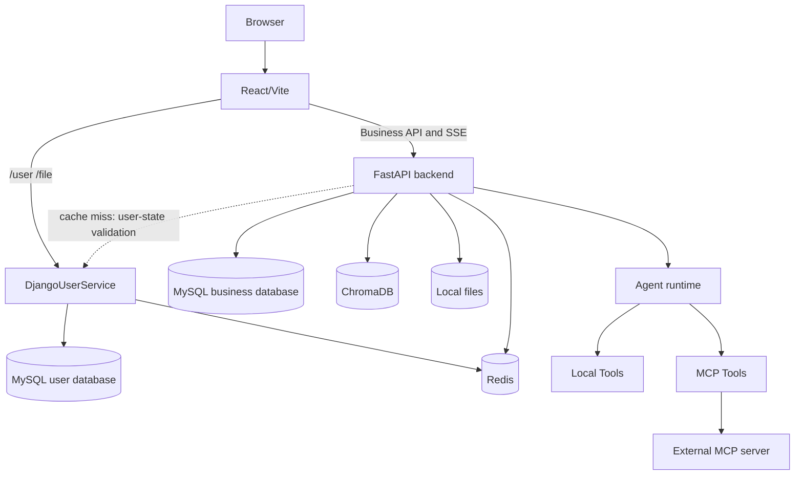

# 当前架构

本文只描述当前仓库中的服务、模块和运行边界，不代表目标架构。历史设计过程位于 `project_changes/`；架构阶段和未完成工作见[架构重写计划](./architecture_rewrite_plan.md)，产品队列见[产品路线图](./roadmap_next.md)。

## 系统边界

Doki 助手是一个由三个应用进程组成的本地开发系统：



| 服务 | 主要职责 | 不负责 |
|------|----------|--------|
| React | 页面、交互状态、API 调用、SSE 消费 | 业务持久化、JWT 签发 |
| Django | 用户、JWT、用户资料、头像文件 | Agent、RAG、笔记和记忆 |
| FastAPI | Agent 和全部业务模块 | 登录注册、JWT 签发 |

开发环境由 Vite proxy 聚合两个后端。虚线是当前 FastAPI 在认证状态缓存失效时对 Django 的临时依赖，计划在 `AR-2` 移除。生产环境目前没有对应的反向代理或部署定义。当前三进程拓扑是过渡态，目标拓扑见 [架构重写计划](./architecture_rewrite_plan.md)。

## 仓库结构

```text
backend/
  app/
    agent/          AgentFactory、上下文、流式运行、Skill/Tool、MCP
    cache/          Redis 缓存辅助
    config/         YAML 配置
    core/           初始化、日志、限流、响应和异常
    db/             MySQL、Redis 连接
    models/         SQLAlchemy 模型
    prompt/         Prompt 文本
    rag/            文档处理、向量索引、检索和重排
    router/         FastAPI 路由
    schemas/        Pydantic schema
    services/       业务服务和运行准备
    skills/         标准 package、seed、Storage、Registry 与 Skill 领域服务
    utils/          认证、模型、路径、文件、视觉等辅助
  alembic/
    versions/       已审查的 SQLAlchemy schema revision
  alembic.ini
  tests/
  main.py

front/
  src/
    api/            Axios client、endpoint 和业务 API
    components/     通用与业务组件
    features/chat/  聊天 SSE hook、类型、存储和测试
    hooks/          通用 hooks
    i18n/           中英文文案
    layouts/        主布局和认证布局
    pages/          页面级组件
    router/         React Router
    stores/         Zustand stores
    types/          共享类型

DjangoUserService/
  apps/user/        用户模型、序列化、JWT 和用户接口
  apps/file/        头像上传
  DjangoUserService/ settings、URL、ASGI/WSGI
  manage.py

benchmarks/
  cases/            YAML cases
  fixtures/         离线脚本和工具数据
  runners/          CLI、harness、scorer、report
  schemas/          case JSON Schema
  baselines/        smoke baseline
  results/          本地运行产物
```

## FastAPI 启动过程

入口是 `backend/main.py`。

FastAPI 使用 lifespan 管理启动和关闭，启动时依次执行：

1. 校验生产安全配置，并确认数据库 Alembic revision 等于代码要求的 revision。
2. 初始化数据库会话管理器。
3. 建立 Redis 连接池。
4. 后台启动聊天模型、Embedding、Chroma NoteService 和 Reranker 初始化。
5. 刷新 MCP 工具并 reload SkillRegistry。

启动过程不会执行 `create_all`、`ALTER TABLE` 或 Alembic upgrade。revision 缺失或不匹配时直接失败，由部署或开发人员显式运行 migration。

两个后端只接受 `dev/development`、`test/testing`、`prod/production` 环境名。未知值会在启动前失败；FastAPI 的生产异常响应还要求 `DEBUG_MODE=false`，防止向客户端返回原始路径或 traceback。

重型模型在后台初始化，因此 Uvicorn 端口可用不等于 Embedding 或 Reranker 已完成预热。`/health/ready` 当前只检查 MySQL 和 Redis。

lifespan 关闭阶段会关闭 MCP provider、Redis 连接池和 SQLAlchemy engine。

## FastAPI 分层

### Router

`backend/app/router/` 负责协议层：

- 接收 HTTP/SSE 参数。
- 注入 JWT、数据库会话和限流依赖。
- 调用 service 或 Agent 编排。
- JSON 接口返回经过 Pydantic 验证的 `ApiResponse[T]`，SSE 接口返回声明为 `text/event-stream` 的 `StreamingResponse`。

主要 namespace：

| Namespace | 模块 |
|-----------|------|
| `/chat` | Agent、会话、RAG query、重新生成、高风险确认 |
| `/knowledge` | 文档入库、向量数据、Embedding/Reranker 配置 |
| `/note` | 笔记 CRUD、批处理和 AI 辅助 |
| `/note-template` | 笔记模板 |
| `/memory` | 记忆和事项 |
| `/model-config` | 用户模型配置 |
| `/translate` | 流式翻译 |
| `/skills` | Skill catalog 和管理 |
| `/tools` | 本地 Tool catalog 和管理 |
| `/api/mcp` | MCP catalog、权限和管理 |
| `/health` | 存活与就绪检查 |

Vite 对 `/api/skills` 和 `/api/tools` 去掉 `/api` 后再转发，因此浏览器使用的路径与 FastAPI 原始路径不同。

### Services

`backend/app/services/` 保存跨路由复用的业务规则。关键服务包括：

- `agent_run_service.py`：模型配置、Prompt 模式、Skill 预路由、MCP 自愈、Tool 解析和 system prompt。
- `database_session_manager.py`：会话消息、摘要和消息变更。
- `session_query_service.py`：会话读取、删除、RAG query 和重排入口。
- `note_service.py`：笔记业务与向量索引。
- `memory_service.py`：记忆事项 CRUD 和状态变化。
- `model_config_service.py`：用户模型配置与系统默认模型。
- `embedding_config_service.py`、`reranker_config_service.py`：知识库模型配置。
- `pending_action_store.py`：Redis 中一次性消费的高风险待确认动作。

### Models 与数据库

FastAPI 使用 SQLAlchemy async engine 和 MySQL。业务模型包括：

- `ChatSession` / `ChatMessage`。
- `Note` / `NoteTemplate`。
- `MemoryItem`。
- `KnowledgeSourceDocument`。
- `UserModelConfig`。
- 用户 Embedding 配置记录。Reranker 当前保存到 `backend/data/reranker_config.json`，不在业务表中。

FastAPI 使用 Alembic 管理 schema，当前 baseline revision 为 `20260817_0001`，并包含知识源 `(user_id, md5)` 与用户 Embedding `user_id` 的唯一约束。migration 合同测试会把 baseline 中的唯一约束与 ORM metadata 对比。新空库或已纳管数据库通过 `uv run alembic upgrade head` 显式升级；已有无版本数据库必须先备份和比对 baseline，确认结构一致后才能 stamp。应用启动只读取 `alembic_version` 并验证 revision。

## Agent 运行时

旧版集中式 `backend/app/agent/agent.py` 已删除。当前职责拆分如下：

```text
backend/app/agent/
  factory.py             创建聊天模型和 AgentExecutor
  context_builder.py     历史、摘要、上下文窗口
  streaming.py           query、regenerate、confirm 的流式编排
  intent_router.py       Skill 预路由
  routing_calibration.py 路由阈值校准和缓存
  skill_registry.py      Skill、Local Tool、MCP Tool 注册与解析
  tool_guard.py          调用预算、确认、超时、输出截断
  tool_context.py        当前 user/session/run contextvars
  runtime/
    budget.py            读取 Agent 预算
    events.py            运行时事件结构
    event_pump.py        AgentExecutor astream_events 消费
    sse_driver.py        SSE、超时、停止和收尾
```

### Query 和 regenerate

```text
router/chat.py
  -> prepare_agent_run
      -> model config
      -> prompt mode
      -> route_skills
      -> MCP ensure_fresh
      -> resolve_skills
      -> build_chat_system_prompt
  -> streaming.py
      -> bind_run_context
      -> context_builder
      -> AgentFactory.create_agent_executor
      -> stream_agent_events
      -> drive_sse_stream
      -> save/replace message
```

Query 和 regenerate 共用 `prepare_agent_run`。二者分别构造新消息上下文和重新生成上下文，但使用同一 AgentFactory 与 SSE driver。

### SSE 合同

当前前端消费：

| 类型 | 作用 |
|------|------|
| `thinking` | 阶段、工具、耗时和运行状态 |
| `waiting_confirmation` | 高风险动作等待用户选择 |
| `response` | 最终回答增量 |
| `done` | 完成和 session 信息 |
| `error` | 运行错误 |

所有事件都携带固定的 `schema_version: "1.0"`。前端会拒绝不支持的 schema 版本；前端合同测试位于 `front/src/features/chat/__tests__/useChatStream.test.ts`，后端合同测试位于 `backend/tests/test_chat_stream_contract.py`。

## Skill 与 Tool

### Skill（当前实现：标准 package A 级和有限 B 级支持）

```text
MySQL Skill domain + canonical Storage object
  SKILL.md (YAML frontmatter + instructions)
  references/ / assets/ / scripts/ (immutable package resources)
```

标准 package 由统一 parser/validator 解析，版本和安装元数据写入 MySQL，原始 ZIP 以 content-addressed immutable object 保存在仓库外；管理 API/UI 通过 draft/import/publish/settings/rollback/export 生命周期操作，不写源码目录。标准 seed package 位于 `backend/app/skills/seed_packages`，启动时幂等安装并发布 Registry snapshot。旧 `backend/app/agent/skills` 的 20 个运行文件已经删除，静态测试禁止重新引入 `skill.yaml` loader、写入路径或双 Registry。

当前已经接通 A 级 Prompt 和有限 B 级资源：资源工具按本轮固定 version/digest 精确读取，纳入统一 Tool 调用预算；前端支持上传、替换、删除、撤销，并以增量 `resource_changes` 生成新版本。CapabilityGrant、持久 SkillRunBinding、import `target_revision`、private Skill/Tool 过滤和 Registry revision/outbox/reconcile 已有代码切片；它们还不是可靠性闭环。损坏 package 可能让同 revision Registry 进入 degraded 空快照而不触发 stale `503`，普通 Tool/MCP policy 也未固定到 RunBinding。管理员 catalog 可查看尚无 active version 的纯 draft，普通 catalog 与运行 Registry 不可见。

前端传入的 `skill_ids` 是候选上界，显式 `tool_ids` 可以跳过意图收窄，但二者都必须经过当前用户可见 Skill、CapabilityGrant 和 Tool policy 的有效交集，不能作为授权绕过入口。当前只实现 system/global 安装，per-user scope 尚未完成。

前端目前把 `format_compatible=true` 但 `runtime_ready=false` 的 C package（包括含 `scripts/` 的包）提交为 `enabled=false`、`default=false`；服务端尚未把新导入固定为 `installed_disabled` 不变量，因此不能把前端惯例当作安全门。当前也没有 durable import worker、独立 Node/Python runner/沙箱、跨资源读取累计 token 预算、角色分离/grant revoke、完整写审计或真实 MySQL/API/第三方 A/B 聊天 E2E；准确能力等级仍是门禁前的 A 级和有限 B 级开发切片。完整状态见[标准 Skill 接入需求规格](./standard_skill_integration_requirements.md)。

### 本地 Tool

```text
backend/app/agent/tools/<tool_id>/
  __init__.py
  tool.yaml
  TOOL.md
  tool.py
```

`tool.yaml` 定义 entrypoint、风险、确认、超时和输出长度。`TOOL.md` 进入工具说明，`tool.py` 返回 LangChain `BaseTool`。

### GuardedTool

本地 Tool 与 MCP Tool 在进入 Agent 前统一包装为 `GuardedTool`：

1. 增加本轮工具调用计数并检查预算。
2. 对 `requires_confirmation` 工具写入 Redis pending action 并阻断本次执行。
3. 使用 `asyncio.wait_for` 执行并限制超时。
4. 截断超过 `max_output_chars` 的结果。

pending action 默认 TTL 为 600 秒，按 `user_id` 校验，确认后一次性消费。

## MCP

MCP 是外部 Tool 来源，不替代本地 Tool。

```text
mcp.local.yaml
  -> McpToolProvider tools/list
  -> McpToolRegistry
  -> adapter to BaseTool
  -> ToolRegistry
  -> resolve_skills
  -> GuardedTool
  -> provider tools/call
```

当前支持：

- stdio、SSE、HTTP/streamable HTTP transport。
- server enable、label、description 和 URL 更新。
- tool label、description、enable、风险、确认、超时和输出限制 override。
- server/tool 删除写回 Git 忽略的 `mcp.local.yaml`。
- 普通用户只读，管理员 refresh 和修改。
- provider 错误状态和 Agent 请求时的惰性自愈。

完整说明见 [MCP 接入与管理](./mcp_integration_plan.md)。

## RAG 与知识库

```text
upload
  -> save source file and metadata
  -> parse document
  -> split chunks
  -> embedding
  -> Chroma index

query
  -> retrieve knowledge and note candidates
  -> rerank candidates
  -> build context
  -> LLM answer
```

模块边界：

- `router/knowledge_router.py`：HTTP/SSE 接口。
- `router/knowledge_service.py`：上传、源文件、任务和切片编排。
- `rag/document_handler/`：文档解析。
- `rag/vector_store.py`：Chroma 索引和 retriever。
- `rag/rag_service.py`：查询期召回、重排和上下文生成。
- `rag/reorder_service.py`：CrossEncoder Reranker。
- `utils/pdf_multimodal_loader.py`、`vision_service.py`：PDF 视觉处理。

有效配置分散在 `.env`、`config/chroma.yaml` 以及可写的 Embedding/Reranker 配置服务中。`config/rag.yaml` 已不生效。

## 前端

页面路由位于 `front/src/router/index.tsx`。主要页面：

- `/`、`/notes`、`/notes/:id`：笔记。
- `/chat`、`/chat/:sessionId`：Agent 对话。
- `/knowledge`：知识库。
- `/memory`：记忆中心。
- `/skills`、`/tools`：Skill/Tool/MCP 管理。
- `/model-settings`：模型配置。
- `/translate`：翻译。
- `/sessions`：会话列表。
- `/profile`、`/settings`：用户和界面设置。

认证状态由 `useUserStore` 单一管理，并由 Zustand persist 保存在 `localStorage["user-store"]`；其中包含 access token、refresh token、用户资料和登录标志。`jwt_token` 仅作为旧版本一次性兼容读取入口，不是当前状态来源。

Axios interceptor 为 HTTP 请求添加 access token。收到 `401` 时，它使用 refresh token 执行一次刷新并重试原请求；并发 `401` 共用同一个刷新请求，刷新成功后同时保存轮换后的 token 对，失败则完整清理认证状态并跳转登录页。流式请求由 `features/chat/hooks/useChatStream.ts` 处理，从同一 store 读取 access token。

当前只完成聊天功能域拆分的第一阶段：SSE hook、types 和 storage 已移入 `features/chat`，但 `AIChat.tsx`、`NoteEditor.tsx`、`ToolManager.tsx` 和 `KnowledgeBase.tsx` 仍是较大的页面组件。

## 用户与认证

```text
React -> Django /user/login/
      <- access token + refresh token
React -> FastAPI Authorization: Bearer <access token>
React -> Django /user/refresh-token/ {refresh_token}
      <- rotated access token + refresh token
FastAPI -> signature/claims/revocation/user-state validation -> user_id
```

- Django 签发 HS256 access/refresh token 对，默认有效期分别为 15 分钟和 30 天。
- 两类 token 都包含 `token_type`、`iss`、`aud`、`jti`、`sid`、`ver`、`iat`、`nbf` 与 `exp`；access token 不能刷新，refresh token 不能访问业务接口。
- refresh token 单次使用并原子轮换，重放、过期、已撤销、用户停用或 token version 失配都会被拒绝。
- FastAPI 使用共享的 `SECRET_KEY`、`ALGORITHM`、issuer 和 audience 校验 access token，并通过确定性 Redis key 检查撤销状态，不扫描 keyspace。
- FastAPI 当前通过短 TTL 缓存复核 Django 用户状态；Redis、撤销检查或用户状态服务不可用时 fail closed，返回 `503`。这是迁移前的临时跨进程依赖，`AR-2` 完成后移除。
- 注销撤销当前 access/refresh token；资料更新与密码重置返回新 token 对，密码重置递增 token version 使旧凭据整体失效。
- FastAPI 业务数据查询必须携带当前 `user_id`。
- 管理员来自 `security.local.yaml` 与 `ADMIN_USER_IDS/ADMIN_USERNAMES`；仓库只跟踪空名单模板 `security.example.yaml`。

旧版缺少 token 类型、issuer、audience 或 JTI 的 JWT 不再有效，升级后需要重新登录。Django 的 `REDIS_CACHE_URL` 与 FastAPI 的 `JWT_REDIS_URL` 必须指向同一撤销存储。

当前权限不是数据库角色模型，也没有完整管理审计。架构重写要求把用户与认证迁入 FastAPI，完成兼容迁移后退出 Django 运行链路；在 `ARCH-GATE` 前不得以新增产品功能绕过该迁移，详见 [架构重写计划](./architecture_rewrite_plan.md)。

## 数据位置

| 数据 | 当前位置/角色 | 重写目标 |
|------|---------------|----------|
| 用户与认证数据 | Django MySQL，当前权威 | 统一关系库 `users/auth_sessions/roles` |
| 会话、笔记、记忆、知识元数据、模型配置 | FastAPI MySQL，当前业务权威 | 同一关系库 schema，由统一 migration 管理 |
| 缓存、token 撤销记录、认证状态短缓存、pending action | Redis，短期状态 | Redis namespace/TTL 明确，不能作为业务事实 |
| 知识库和笔记向量 | `backend/data/chromadb`，派生索引 | Chroma adapter projection，可按版本重建 |
| 上传源文件和解析图片 | `backend/data/` 与 MySQL Blob 多路状态 | 一个 Storage canonical object，MySQL 保存元数据 |
| Django 头像 | `DjangoUserService/media/` | 统一 Storage object key |
| MD5、Reranker、路由/MCP 可写配置 | 本地 JSON/YAML 或环境变量 | 唯一约束、版本化配置表或明确只读部署配置 |
| Benchmark 结果 | `benchmarks/results/` | 测试产物，不属于业务事实 |

这些运行数据大多被 `.gitignore` 排除，不应作为可复现配置提交。

## 当前技术债

- 已有但尚未版本化的数据库仍需要人工备份、schema 审计和接管 runbook，不能直接 upgrade 或 stamp。
- 管理员权限仍是文件/环境变量名单。
- MCP 配置写回 Git 忽略的本地 YAML，缺少数据库配置和审计。
- 用户名允许重复，当前登录查询只取第一条匹配记录。
- RAG 关键文件仍较大，真实 MySQL/Redis/RAG 集成测试仍需要扩展。
- 前端多个页面仍承担请求、状态与渲染混合职责。
- 浏览器端到端流程尚未纳入持续集成。
- 生产部署、安全 header、TLS、secret manager 和发布回滚流程尚未定义；仓库已有基础 CI。

这些未完成项在[架构重写计划](./architecture_rewrite_plan.md)中维护唯一阶段状态，[产品路线图](./roadmap_next.md)只保留 R0-R8 职责和产品队列。当前先关闭 `AR-0 + SK-0`，再按通用 worker、身份/schema、Storage 和 A/B 对账依赖推进。本地产品工作包 `7-10` 在本地 A/B `SKILL-GATE` 与 `ARCH-GATE` 前暂停选择；C 级执行和公网/HA 分别由 `EXEC-SKILL-GATE` 与 `PUBLIC-HA-GATE` 控制。
