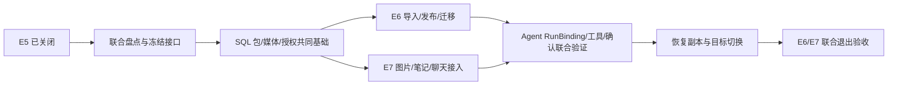

# E6 + E7 / AR-5 联合执行与收口

- 日期：2026-09-14 至 2026-09-15；状态：`已关闭`，最终依据见 [收口判定](./closure-review.md)。
- 负责人：Codex；架构及最终批准人：用户。
- 用户指令：“关闭e5,执行e6-e7的准备，两个伴生，一起执行”。本轮明确关闭 E5，建立 E6/E7 一个联合批次、一个 SQL 写权威和一套恢复/验收证据；不再要求 E6 整阶段先关闭才开展 E7。
- 本轮结果：SQL 包/媒体、生命周期、授权、RunBinding、任务与确认链已落地。用户指定的新安全管理员已创建并验证；目标 8 个本地 Skill 获批启用，2 个外部 MCP Skill 按范围保持 unsupported/disabled。纯 SQL 恢复、全新 Chroma、真实本机模型和 HTTP/SSE 验证已完成。
- [准备证据](./artifacts/preparation.json)、[接口与数据映射](./contracts.md)、[测试记录](./test-record.md)、[变更记录](./change-log.md)、[执行手册](../../backend/ops/e6_e7/README.md)。

## 1. 联合方式与范围

E6 负责标准 Skill 包的 SQL 权威、生命周期、授权和迁移；E7 负责知识/图片/笔记/聊天及运行中的 Skill 接入。两者共享 package/media repository、canonical user、grant/RunBinding、SQL UoW/job、审计、故障和恢复基线。内部保留必要技术先后：共享 schema/接口先固定，再同时接入 Skill 管理与业务调用，最后按共同恢复目标联合验收。

保持本机单实例、一个 MySQL 业务库、runner 并发 1。只支持 A/有限 B；C、scripts 执行、网络、secret、外部进程和 package MCP 仍返回 unsupported。本批不移除 Django/Redis 依赖、不部署最终单进程形态、不关闭 SKILL-GATE/ARCH-GATE，产品工作包 7–10 继续冻结。

“文件权威清理”指业务读写退出文件 fallback，先完成迁移/对账并形成处置清单；物理旧文件、中间材料、备份和失败资源按用户既定要求继续保留。不能把联合执行授权解释为现在删除全部旧目录。

## 2. 历史入口盘点（准备时快照）

目标仍为 `doki-e4-20260903-mysql`，容器 ID `35efc06e8a3b377ace2d9ac7e99f9d78ceb8c9a7a73464cc23701413f1d37182`，`127.0.0.1:33427/doki_e4`，UUID `0c0d3e33-a743-11f1-af41-ea47e0ceb469`。schema `20260914_0009_e5_rag_runtime`；E5 两用户 ready，知识/笔记 57/11 和 0/0。

| 对象 | 实际数量/状态 | 联合实施含义 |
|---|---|---|
| skills / versions / installations / aliases | 各 10；安装均 enabled | 迁移时保留稳定身份、版本和关联；enabled 不能自动等同于独立安全授权 |
| SQL skill_packages / uploads / imports | 均 0 | E2 表存在，真实 Skill 生命周期仍需接入；不能宣称包已 SQL 化 |
| 旧 Skill objects | 10 文件，5,627 bytes；10/10 package digest 校验通过 | 可作为明确冻结的单次迁移输入；原始 ZIP 不一定是最早上传原件，不能伪造来源 |
| SkillCapabilityGrant / AuthorizationGrant | 10 / 0 | 内容配置与 E3 安全授权尚未形成完整闭环；禁止迁移程序自动批准权限 |
| role bindings | 2 个 active 普通 user，无管理员绑定 | 副本使用测试角色验证四眼；实际目标管理员身份须由用户指定后才能 bootstrap，不能自动提升现有两个账号 |
| media_assets / extracted_images | SQL 0、当前图片目录 0 文件 | 真实旧图迁移是 0 行；必须用副本合成图/带图资料验证写入、隔离及恢复 |
| MD5 sidecar | 1 文件，2,133 bytes | 对照 canonical source/owner 后形成差异清单，禁止把 MD5 当唯一授权身份 |
| 原文/笔记/聊天 | 6 / 7 / 27 sessions、150 messages | E4/E5 已接管部分路径，E7 补齐图片、资源、Agent 和显式本地通道，不重复搬迁已对账数据 |

SQL、输入文件摘要和 new-api 前后观察相同；没有启动 consumer、修改授权、应用数据或服务器设置。现有 enabled 版本、缺独立 grant 是待处理实现事实，不是已观察到当前 live 越权。

## 3. 历史代码缺口与复用（现已实施）

| ID | 当前代码事实 | 必做动作 |
|---|---|---|
| J1 | `skills/storage.py` 与 service 的 import/publish/export/registry 仍依赖 objects ZIP；E2 synthetic repo 有 SQL BLOB 原语 | 接入生产 SQL 包仓储；原始上传、规范 ZIP、manifest 和资源 hash 同一事务关联，不调用 synthetic repo 冒充生产 |
| J2 | `SkillVersion.storage_key` 是不可变文件 key；SQL package 表与 version/import 未关联 | additive migration 增加明确 package/upload 引用、唯一约束和 legacy map；迁移后 runtime 只读 SQL |
| J3 | import/publish/settings/activate 会 `_upsert_capability_grant`；E3 approve/revoke 是独立接口 | 将 requested capabilities 与 approved grant 分离；在启用、Run、job、资源读取及延迟确认处校验同一 digest/revision/有效期，撤销 fail-closed |
| J4 | RunBinding 已持久化、确认服务会核对 registry/version；resource tools 直接读磁盘 | 将 SQL 包资源、实时 grant 与绑定接入普通工具调用/确认/后台任务，覆盖中途 revoke 和 SQL 故障 |
| J5 | `knowledge_router.py` image 接口直接 FileResponse；batch images 在 knowledge_service 读目录 | SQL media repository 与 canonical source 所有权关联；受控兼容 URL 只做 SQL 查找，不自动磁盘 fallback |
| J6 | E4 部分知识/笔记/聊天已走 BusinessSession，E5 返回前校验已落地 | 核对所有 API/UI/tool/流式保存，补图文引用、审计、删除/重建联动及失败合同；不绕过 E5 group gate |
| J7 | 旧 seed/alias、objects、sidecar 与调试入口仍并存 | 一次性显式 migrator、永久 legacy map、debug/import/export 开关和 SQL 审计；运行时无隐式重新安装或文件权威 |

具体文件定位、schema 提案和边界详见 contracts.md。实施时先增加接口和 schema，再替换调用方；不建立长期双写或两套规范化表示。

## 4. 联合工作包与依赖

| 顺序 | 工作包 | 文件/产物 | 退出条件 |
|---|---|---|---|
| P0（已完成） | E5 关闭确认、封存基线、只读盘点、相关测试 | 本批文档、prepare.py、112 文件基线 ZIP、105 项 JUnit | 目标/输入无变化、旧包 10/10 可解析、准备可复核 |
| P1 | 共享 SQL schema/repository 与导入规范 | projection_domain/skill_domain/media 模型、additive Alembic、生产包/媒体 repository | 空库/恢复库升级通过；raw 与 canonical digest 区分，事务失败无悬挂成功 |
| P2A（E6） | import/目录/ZIP/编辑/发布/回滚/导出 | skills package/service/storage、router/schema/UI | 同 digest 幂等、同版本冲突拒绝；新导入 disabled；坏包隔离不覆盖健康版本 |
| P2B（E7） | 原文/图片/笔记/聊天回接 | knowledge/router/service/media、Agent、UI | 写入 SQL、按 owner/source 校验；RAG 故障核心可用；关闭 debug 后无磁盘 fallback |
| P3（共用） | 授权/RunBinding/job/确认/资源读取 | auth authorization、agent_run/confirmation/tool_guard、resource_tools/jobs | 四眼 approve/revoke、过期/版本漂移/重启传播均 fail-closed，审计可串联 |
| P4 | Legacy dry-run、备份和恢复副本迁移 | 专用 E6E7 allowlist/preflight/migrate/reconcile、输入处置表 | 保留 10 个 Skill 稳定 ID；所有差异解释；0 旧图片也有独立媒体正负例 |
| P5 | 目标切换与联合回归 | 先备份→即时 guard→迁移→全量核验→正常停止 | 两阶段所有退出证据齐全；失败 restore-forward，禁止降级回旧文件权威 |
| P6 | 联合收口 | E6/E7 各自矩阵＋共同恢复/故障报告 | 两阶段同时判定，任何一方关键缺口未补不得合称已完成；E8 另行启动 |

联合准备和实施方向已由用户指定，无须重复询问是否合并。依赖允许并行开发；真实数据库 mutations、发布和迁移仍按顺序执行。

## 6. 最终执行判定（2026-09-15）

**最终判定：E5 保持关闭；E6/E7 在本机 A/有限 B 范围联合关闭。目标账号 `STliuEN` 持有 skill_admin，`STliuEN-security-admin` 持有 security_admin；8 个本地安装具备有效独立账号审批，2 个外部 MCP 安装保持禁用。JV01–JV09 的证据、测试替身边界和历史报告更正统一见 closure-review.md。**

应用验证的是两个不同账号的角色分离；本次由同一用户授权操作两个身份，不宣称两名自然人独立审查。历史图片为 0 是有效迁移结果；JV05 要求的带图资料正负例及 SQL-only 恢复已在隔离副本完成，目标事务夹具也完成回滚验证。E8、物理旧输入删除、SKILL-GATE/ARCH-GATE 和产品工作包 7–10 仍未启动或解冻。

## 5. 执行与恢复边界

1. 写操作前重新核对 target ID/UUID/端口/database、代码/输入摘要，保存二进制 SQL dump 和设置清单；先在新独立副本验证 restore/digest/FK/schema。E5 的旧 preflight 不可复用，本批必须有独立 stage/purpose/短期 preflight。
2. 不连接 host 3306、不设 MySQL 全局 read_only/super_read_only、不锁全库、不改 new-api 连接/权限、不停止既有主机服务。只暂停本应用涉及的 Skill/媒体写路径；SQL runner 保持并发 1。
3. 副本使用新卷/网络/Chroma/workdir，loopback 端口、资源上限，故障仅作用于副本。不得把原 E5 target 作为破坏性测试库。
4. 保存上传原始 ZIP、规范包/manifest、grant/binding/audit、知识原文/media、迁移 map；Chroma 从 SQL 重新建立。缺失包、digest 冲突、归属不明或源变化阻止该对象发布和最终切换。
5. 失败保留 job/import/revision 和错误；修复重试或在独立新目标 restore-forward，再从 SQL 复建。不得直接覆盖当前 populated 库或切回已过时的旧 runtime。
6. 所有旧输入/失败资源保留。处置清单仅标记 retain/migrated/conflict；实际删除留待全部阶段验收后的独立清理。

## 历史判定更正

2026-09-14 的 `artifacts/e6-e7-final-decision.json` 保留为历史记录，由 2026-09-15 的收口证据取代。旧报告将目标 `skill_imports` 写为 10，实际为 0；10 条迁移包与上传记录通过 migration map 关联，并非用户导入请求。旧自批/漂移及媒体报告存在断言不足，现由带明确正向控制、准确错误码和真实恢复的新证据替代。

最终证据不覆盖 E8 或 C 级执行，也不追认旧脚本的部分提交过程；失败报告、副本、旧文件及备份均保留。

