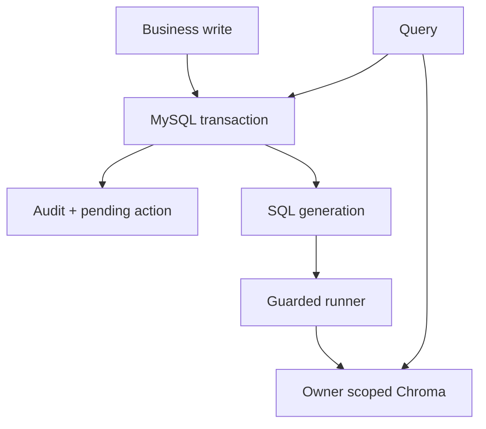

# E8 依赖图

| 组件 | 必需性 | 角色 |
|---|---|---|
| MySQL | 必需 | 业务、审计、任务、generation 权威 |
| FastAPI | 必需 | API、SSE、RAG |
| Chroma | RAG 查询时必需 | SQL generation 的可重建投影 |
| Redis | 可选 | 缓存、限流、连接池 |
| Ollama/模型 | 分支相关 | embedding、HyDE、reranker、生成 |
| new-api | 外部既有服务 | observe-only，E8 不修改 |

所有 projection 更新必须绑定 owner 和 generation。旧文件、MD5 或旧向量失败时，不得偷偷提供业务 fallback。
